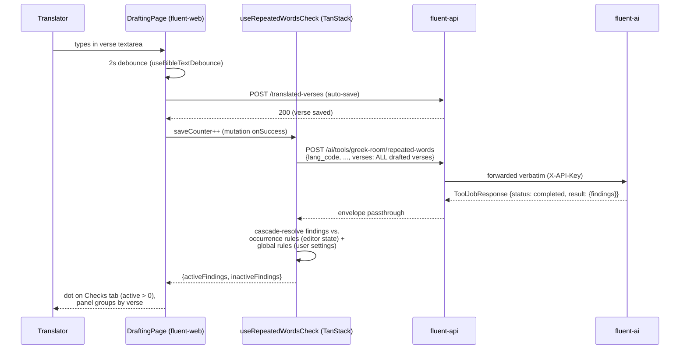

# Repeated Word Check UI — Proposal (Checks Tab, Checks Panel, and Suppression Persistence)

**Status:** Revised after first review round (PR [#305](https://github.com/eten-tech-foundation/fluent-web/pull/305)). Incorporates reviewer feedback — see the change log in §0.
**Reviewer shortcut:** a condensed, stands-on-its-own review summary lives in [`checks-ui-integration-summary.md`](checks-ui-integration-summary.md).
**Scope:** Implements the user-facing half of the Repeated Word Check feature: the **Checks tab** (#277) and **Checks view panel** (#278) on fluent-web, plus the small fluent-api additions both cards imply (suppression persistence). This is a single proposal covering both repos so reviewers see the whole design in one place; **implementation will ship as two PRs** (one per repo), and either may land first (§9.4).

**Related cards:**

- [fluent-api#172 — Build Repeated Word Check Service](https://github.com/eten-tech-foundation/fluent-api/issues/172) — the backend proxy endpoint (implemented; see companion docs below).
- [fluent-web#277 — Build Checks Tab](https://github.com/eten-tech-foundation/fluent-web/issues/277) — tab + notification dot.
- [fluent-web#278 — Build Checks View Panel](https://github.com/eten-tech-foundation/fluent-web/issues/278) — panel content + ignore actions.

**Companion documents (fluent-api repo):**

- [`ai-tools-integration-suggestion.md`](https://github.com/eten-tech-foundation/fluent-api/blob/main/docs/proposals/repeated-word-check/ai-tools-integration-suggestion.md) — the approved contract & design for `POST /ai/tools/greek-room/repeated-words` (decisions **D1–D12** referenced throughout this document).
- [`ai-tools-integration-operations.md`](https://github.com/eten-tech-foundation/fluent-api/blob/main/docs/proposals/repeated-word-check/ai-tools-integration-operations.md) — operations, env wiring, testing strategy for the proxy.
- [`ai-tools-integration-status.md`](https://github.com/eten-tech-foundation/fluent-api/blob/main/docs/proposals/repeated-word-check/ai-tools-integration-status.md) — implementation status of the proxy.

This document's own decisions are numbered **W1–W12** (W = web) to avoid collision with the fluent-api proposal's D-series.

---

## 0. Change log (first review round)

Revisions made in response to PR [#305](https://github.com/eten-tech-foundation/fluent-web/pull/305) review (reviewers: kaseywright, chadw-eten; product input via joelthe1/Ulf). The cards themselves were edited mid-review; this revision tracks the **current** card text and mocks (re-pulled 2026-06-16).

| Change                                                                                                                                                                                                                                | Driver                                                                                                                                                                                                                                                                                                                                                                     | Where                               |
| ------------------------------------------------------------------------------------------------------------------------------------------------------------------------------------------------------------------------------------- | -------------------------------------------------------------------------------------------------------------------------------------------------------------------------------------------------------------------------------------------------------------------------------------------------------------------------------------------------------------------------- | ----------------------------------- |
| Settings endpoint moves from `GET/PUT /users/settings` to a new **`self` domain**: `GET/PUT /self/settings`, guarded by `authenticateUser` alone.                                                                                     | kaseywright (CHANGES_REQUESTED): clean semantic separation, no redundant `{id}` param, no over-exposure risk, simpler middleware (no `requireSelf`/`requireUserAccess`/`UserPolicy`).                                                                                                                                                                                      | W7, §7.2, §8                        |
| Button labels become **"Ignore Here" / "Ignore Everywhere"**.                                                                                                                                                                         | joelthe1/Ulf (card #278 comment); chadw updated the #278 mocks to match.                                                                                                                                                                                                                                                                                                   | W6, §5, §6.5                        |
| **"Ignore Everywhere" now shows a confirmation dialog**, while remaining reversible via `[Undo ▾]`.                                                                                                                                   | card #278 ("Ignore Always should have a standard confirm dialog"). Kept the three-layer cascade & undo (no explicit directive against it; ambiguity of "undo" with surface/suppress entries at multiple layers is better resolved by the cascade — see §6.4/§6.5); added the dialog.                                                                                       | W6, §5.3, §6.5                      |
| **"Show Ignored" toggle**: now default **OFF** and **not persisted** (resets per session). Ignored items show the ignore-type label (e.g. _"Ignore Here"_, _"Ignore Everywhere"_, _"Default Ignore"_) + an **"Undo Ignore"** control. | card #278 was revised to specify exactly this; we drop our earlier default-ON/persisted proposal and the `showResolvedChecks` editor-state key.                                                                                                                                                                                                                            | W5, W6, W11, §5.3, §6.4, §6.6, §7.1 |
| §5.2 mock/text inconsistencies **S1 (zero-state dot)** and **S2 (language dropdown)** are **resolved**: chadw fixed the zero-state mock and removed the language dropdown from the #278 Checks mocks.                                 | chadw-eten ("Fixed." / "good idea… I have adjusted the mocks.").                                                                                                                                                                                                                                                                                                           | §5.2, §12                           |
| New requirement adopted: **highlight repeated words in the verse text** (underline/color).                                                                                                                                            | joelthe1/Ulf (card #278 comment). We will implement it; because it touches the verse-rendering pane (outside the left panel this proposal builds) and warrants its own design pass, it ships as a **separate, follow-on PR** so the tab/panel work can land independently. §5.3 item 4 records the intent; the visual/interaction details are specced just before that PR. | §5.3, §11                           |

---

## 1. Background

fluent-api now exposes Greek Room's _Repeated Words_ check at `POST /ai/tools/greek-room/repeated-words` (card #172). The endpoint is a thin authenticated proxy to fluent-ai: it accepts a chapter's verses and returns a `ToolJobResponse[RepeatedWordsResult]` envelope whose `findings[]` identify consecutive repeated words (`{snt_id, repeated_word, surf, start_position, legitimate, severity}`).

Cards #277 and #278 define how translators consume those findings in the drafting view:

- **#277:** a **Checks tab** is added to the drafting page's left panel alongside the existing Resources tab, with a **notification dot** on the tab header whenever the current chapter has one or more active flags. The dot is absent at zero flags and clears silently on the next auto-save once all flagged issues are resolved.
- **#278:** the **Checks panel** lists all repeated-word flags for the current chapter, grouped by verse, each with enough context to locate it, refreshed on every auto-save, with two actions per flagged occurrence: **"Ignore Here"** (user-level, this occurrence) and **"Ignore Everywhere"** (user-level, this word pair, across all the user's projects) — both "stored in Fluent's database." "Ignore Everywhere" carries a standard confirm dialog. A **"Show Ignored"** toggle (default off, not persisted) reveals previously ignored occurrences — dimmed, labeled by ignore type, each with an **"Undo Ignore"** action. A "No issues found" zero state is shown when the chapter is clean.

> The #278 card text and mocks were revised during the first review round (labels, the Show Ignored toggle, the confirm dialog). The wording above reflects the **current** card; the original used "Ignore This Time"/"Ignore Always". See §0.

Both cards carry mockups (drafting page, Judges 4, Gujarati IRV); §5 transcribes them.

### 1.1 What the cards imply beyond fluent-web

The ignore actions require server-side persistence that does not exist yet. #172's text ("the backend dependency for all Repeated Word Check UI work") is broad enough to cover suppression storage — the fluent-api proposal's **D1** deferred caching of _tool runs/findings_, which is a different concern from user suppression preferences (a requirement that did not exist until #277/#278 were authored). Accordingly, suppression persistence ships as an **extension of #172's scope** (decision **W1**), designed here and implemented in the fluent-api PR of this pair, which also amends the approved fluent-api proposal pair (the suggestion + operations docs) to record the scope extension. No new product card is needed.

### 1.2 Repos touched

| Repo                | Touched     | What changes                                                                                                                                                 |
| ------------------- | ----------- | ------------------------------------------------------------------------------------------------------------------------------------------------------------ |
| **fluent-web**      | yes (bulk)  | Left-panel tab container, Checks panel feature, check-trigger hook, suppression cascade, editor-state keys.                                                  |
| **fluent-api**      | yes (small) | New `user_settings` table + a new `self` domain exposing `GET/PUT /self/settings`; Zod-schema extension of the editor-state `resources` blob (no migration). |
| **fluent-ai**       | no          | The check itself is unchanged.                                                                                                                               |
| **fluent-platform** | no          | No new services or env vars.                                                                                                                                 |

---

## 2. Scope

**In scope (this proposal / the two implementation PRs):**

1. A tabbed left-panel header — **Resources | Checks** — replacing the current "Resources" heading in the drafting page's left panel, per the #277 mock (§5.1).
2. The **Checks panel** (#278): per-check accordion ("Repeated Words" first), verse-grouped occurrence snippets, ignore actions, zero state.
3. The **notification dot** (#277) on the Checks tab header, plus one proposed deviation: mirroring the dot on the panel-toggle button when the panel is closed (§5.3, sign-off item).
4. A chapter-wide **check trigger** fired on every successful verse auto-save (W3).
5. A three-layer **active/inactive cascade** unifying Greek Room's `legitimate` verdicts with user ignores, including undo (W5, W6).
6. **Persistence:** occurrence-level rules in the existing editor-state JSONB; global word-pair rules in a new `user_settings` table exposed at `GET/PUT /self/settings` (W2, W7).
7. **Graceful degradation** when the settings backend half is absent, and inline error surfacing when the check call fails (W8, W9).
8. Tests on both sides using each repo's established test infrastructure (§10).

**Explicitly out of scope (v1):**

- "Drop duplicate" one-click fix (excluded by card #278).
- Surfacing "Ignore Always" suppressions to the Greek Room team as feedback (excluded by card #278).
- Running checks in the read-only `/view` route or in review stages (W10; noted as future work §11).
- A "Manage ignored words" settings page (future work; the `user_settings` storage deliberately makes room for it, §11).
- Any change to the fluent-ai service or the fluent-api proxy endpoint contract.
- Async/polling mode for the check (the proxy returns `status: "completed"` synchronously today; the hook consumes the envelope so polling can be added later without reshaping the UI, per D3/D9).
- Checks other than Repeated Words (the accordion structure anticipates them; none are wired).

---

## 3. Decisions summary

Restated conclusions; supporting analysis in the cited sections.

| #       | Decision                                                                                                                                                                                                                                                                                                                                                                                                                                                                                                                                                                                 | Short rationale                                                                                                                                                                                                                                                                                                                                                                                                                         |
| ------- | ---------------------------------------------------------------------------------------------------------------------------------------------------------------------------------------------------------------------------------------------------------------------------------------------------------------------------------------------------------------------------------------------------------------------------------------------------------------------------------------------------------------------------------------------------------------------------------------- | --------------------------------------------------------------------------------------------------------------------------------------------------------------------------------------------------------------------------------------------------------------------------------------------------------------------------------------------------------------------------------------------------------------------------------------- |
| **W1**  | Suppression persistence ships as an extension of #172's scope; no new product card.                                                                                                                                                                                                                                                                                                                                                                                                                                                                                                      | #172's wording covers backend dependencies of the UI work; D1's deferral was about caching tool results, not user preferences. See §1.1.                                                                                                                                                                                                                                                                                                |
| **W2**  | Hybrid storage: "Ignore This Time" lives in the existing per-chapter editor-state JSONB (schema-key addition, no migration); "Ignore Always" lives in a new `user_settings` table (one row per user, single Zod-typed JSONB column). Findings are filtered **client-side**.                                                                                                                                                                                                                                                                                                              | Each rule is stored at exactly the scope it governs. Client-side filtering keeps the AI proxy a pure pass-through (D8/D9). `user_settings` deliberately establishes Fluent's user-global preference store: future settings become schema extensions, not migrations. See §7.                                                                                                                                                            |
| **W3**  | Chapter-wide check on every successful verse save: a TanStack `useQuery` keyed on `(chapterAssignmentId, saveCounter)`, where `saveCounter` increments in the verse-save mutation's `onSuccess`. The request sends **all currently drafted verses** of the chapter. No extra coalescing debounce.                                                                                                                                                                                                                                                                                        | The dot needs chapter-wide awareness; per-verse merging is more code for no user-visible gain. The existing 2 s per-verse save debounce already rate-limits; the check is <1 s. KISS — optimize if heavier checks arrive. See §6.2.                                                                                                                                                                                                     |
| **W4**  | `snt_id` = `"{bookCode} {chapter}:{verse}"` (USFM book code, e.g. `JDG 4:3`), matching the convention already used by the repo smoke tests. Occurrence identity for suppressions = `(snt_id, repeated_word, ordinal)` where ordinal is the index of the finding among same-`repeated_word` findings in the verse, ordered by `start_position`.                                                                                                                                                                                                                                           | Ordinals survive unrelated edits (positions don't); adding/removing an earlier same-pair occurrence conservatively re-flags, the safe failure direction. We count Greek Room's findings, never tokenize text ourselves, so Greek Room's equivalence policy is inherited consistently. See §6.3.                                                                                                                                         |
| **W5**  | Every finding resolves to **active/inactive** via a three-layer cascade — Greek Room verdict (`legitimate`), user-global word-pair rule, occurrence rule — where the **most specific non-silent verdict wins**. Rules are tri-state maps (`absent / 'suppress' / 'surface'`). The dot counts active findings only. Inactive findings are hidden by default and revealed by the **"Show Ignored" toggle** (default OFF, not persisted, per revised #278); when shown they render greyed with the ignore-type label.                                                                       | One mechanism explains machine-legitimate and user-ignored alike ("pre-ignored by Greek Room"). Specificity, not temporal order, keeps resolution deterministic. Greyed-not-removed (under the toggle) keeps undo discoverable. See §6.4.                                                                                                                                                                                               |
| **W6**  | Active findings show `[Ignore Here] [Ignore Everywhere]` (per revised card). `[Ignore Everywhere]` opens a **standard confirm dialog** before writing the global rule. Inactive findings show one `[Undo ▾]` split button: default click acts at the occurrence layer (delete own rule, or write an occurrence `surface` override); the chevron menu offers explicit global actions with consequence-naming labels. Any global write first purges the user's occurrence rules for that pair **in the current chapter's editor state only**.                                              | Default click never silently edits global state. The card asks for a confirm on the global action because it reads as irreversible; we add the dialog **and** keep the `[Undo ▾]` reversibility — the two are complementary (confirm guards the click; undo guards the mistake). Purge-local prevents the just-clicked panel from appearing to ignore the action; other chapters' specific pronouncements deliberately stand. See §6.5. |
| **W7**  | Settings endpoint lives in a **new `self` domain**: **`GET /self/settings` + `PUT /self/settings`**, session-implicit user (no user in URL), guarded by `authenticateUser` alone, full-replace upsert of one Zod-typed JSONB blob. File quartet `domains/self/settings/self-settings.{route,service,repository,types}.ts`.                                                                                                                                                                                                                                                               | Per kaseywright: a `self` domain gives clean semantic separation, avoids the redundant `{userId}` param (and the `requireSelf`/`UserPolicy` middleware that `/users/{id}/…` routes carry), and prevents accidental over-exposure (no `{id}` to misuse). Last-writer-wins on concurrent tabs is inherited from editor-state and accepted. See §8.                                                                                        |
| **W8**  | Graceful degradation by feature detection: if `GET /self/settings` 404s, the session records `globalIgnoresAvailable = false` and the `[Ignore Everywhere]` button plus global menu entries are **not rendered** (capability hidden, never a dead control). Unknown/absent JSONB keys parse as empty on both sides. Either repo's PR can land first.                                                                                                                                                                                                                                     | The UI must not assume the backend half exists. An invisible capability is honest; a dead button is a bug report. See §9.                                                                                                                                                                                                                                                                                                               |
| **W9**  | Check-call failure surfaces as a single inline `text-sm text-red-500` line at the top of the Checks panel ("Checks failed to refresh"); the panel keeps rendering the last successful findings (TanStack keeps `query.data` on refetch failure) and the dot reflects that last-known state. Failures log via the existing `Logger`. No toast/banner/popup.                                                                                                                                                                                                                               | Matches the drafting page's own inline-status precedent ("Auto-save failed"). Failure mode degrades to "results are one save behind." See §9.2.                                                                                                                                                                                                                                                                                         |
| **W10** | The check runs in drafting mode only — not in the read-only `/view` route — and is skipped (`enabled: false`) when no verse has content and while the settings feature-detection probe (§9.1) is unresolved.                                                                                                                                                                                                                                                                                                                                                                             | Card scope is the drafting view; empty chapters have nothing to check; the probe is one fast `GET`, and waiting for it means the first findings render is already cascade-correct. Review-stage checks are future work. See §6.2.                                                                                                                                                                                                       |
| **W11** | Left-panel architecture follows the mocks: a text-tab header row ("Resources \| Checks", blue underline active state, blue dot after "Checks"), dot visible from either tab; Checks content = per-check accordion sections with verse-grouped snippets, the two buttons, and a "Show Ignored" toggle at the bottom; zero state inside the accordion. Only `activeLeftTab` is persisted in editor state (the "Show Ignored" state resets per session, per revised #278). Proposed deviation for sign-off: when the whole panel is closed, the dot is mirrored on the panel-toggle button. | Mock-faithful where the mocks speak; the toggle-button dot preserves #277's intent (translator is notified) when the panel is hidden. See §5.                                                                                                                                                                                                                                                                                           |
| **W12** | One proposal document (this file) covering both repos; two implementation PRs (fluent-web, fluent-api), cross-referencing each other and the cards.                                                                                                                                                                                                                                                                                                                                                                                                                                      | Splitting the proposal doubles reviewer overhead for a design whose halves only make sense together. See §9.4.                                                                                                                                                                                                                                                                                                                          |

---

## 4. End-to-end picture



The response envelope is consumed whole (D9): the hook inspects `status` and `result`, so a future slow tool that returns `status: "queued"` can add polling without changing the UI contract.

## 5. UI design

### 5.1 What the mocks show

The cards' mockups (drafting page, Judges 4, Gujarati IRV project) define the visual target. The #278 mocks were updated during the first review round (§0); the description below tracks the **current** mocks:

- **Tab header (#277 mock):** the left panel's current `Resources` heading is replaced by a text-tab row — **"Resources | Checks"** — active tab in blue with a blue underline, inactive tab plain. The **notification dot is a solid blue filled circle immediately right of the "Checks" label**, and the mock shows it while the _Resources_ tab is active: the dot is visible from either tab whenever the panel is open.
- **Checks content (#278 mocks):** below the tab header, a card containing a **collapsible "Repeated Words" accordion section** (expanded by default). The accordion-per-check structure anticipates future sibling checks (the board already holds draft cards for Greek Room Wildebeest and Spell checks) without UI rework. Inside the section, findings are grouped by verse:
  - bold **"Verse N"** heading per verse that has findings (verses without findings get no group);
  - one row per occurrence: a one-line context snippet showing the repeated pair in context;
  - two solid-blue buttons side by side beneath each snippet: `[Ignore Here] [Ignore Everywhere]`;
  - a horizontal separator between verse groups;
  - a **"Show Ignored" toggle** at the bottom of the active list (off by default). When on, previously ignored occurrences appear below the active ones — dimmed, each labeled with its ignore type (_"Ignore Here"_, _"Ignore Everywhere"_, _"Default Ignore"_) and showing an **"Undo Ignore"** action in place of the two ignore buttons.
- **Zero state (#278 mock):** the "Repeated Words" section shows a centered bold **"No issues found"**.

### 5.2 Mock/text inconsistencies — resolved in first review round

1. **Dot in the zero state.** The original #278 zero-state mock showed the dot on the Checks tab, contradicting #277's text ("the dot is absent when there are no active flags — no zero state"). We proposed following the text; chadw fixed the mock. **Resolved:** no flags, no dot.
2. **Language dropdown above the Checks panel.** The original #278 mocks showed a language dropdown above the checks content, with no function for checks. We proposed omitting it; chadw agreed and removed it from the mocks. **Resolved:** no dropdown on the Checks tab.

### 5.3 Deviations from the card text — for product sign-off

1. **Ignored items grey-and-stay rather than disappear.** The card's "Show Ignored" toggle (revised #278) now matches our approach: ignored occurrences are revealed dimmed/subordinate, sorted after active items within their verse group, labeled with the ignore type, with an "Undo Ignore" control (§6.5). We follow the card: the toggle defaults **off** and does **not** persist across sessions. Greyed items never count toward the dot. (This deviation is now largely card-aligned and is listed for completeness.)
2. **Machine-"legitimate" findings are shown as inactive items.** Greek Room marks some repetitions `legitimate: true` (intentionally repeated words). The cards do not enumerate them explicitly, but the revised #278 "Show Ignored" mock includes a **"Default Ignore"** ignore-type — which is exactly this case. We render machine-legitimate findings in the same dimmed style with that label, surfaceable per-occurrence like any other ignored item (§6.4). This gives translators visibility into what the checker considered and a recourse when Greek Room is wrong in either direction.
3. **Dot mirrored on the panel-toggle button.** #277 places the dot on the Checks tab header, which is invisible when the whole left panel is closed (it's behind the `BookText` toggle button in the drafting header). To preserve the card's intent — the translator is notified — we mirror the dot on that toggle button whenever the panel is closed and active flags exist.
4. **Highlight repeated words in the verse text.** Product (joelthe1/Ulf, via #278 comment) asked that flagged repeated words be highlighted in the verse pane (underline or color). We will add this. Because it touches the verse-rendering pane — outside the left-panel tab/panel this proposal builds — and benefits from its own short design pass, it ships as a **follow-on PR** layered on this one, so the tab/panel work can be reviewed and merged independently. The visual/interaction specifics (underline vs. highlight, active-vs-ignored styling, click-to-locate) are worked out just before that PR.

None of these block implementation; they are listed in §12 for explicit confirmation in PR review.

---

## 6. fluent-web design

### 6.1 File layout

```text
fluent-web/src/
├── components/ui/                          # (existing; shadcn primitives incl. dropdown-menu, checkbox)
├── features/
│   ├── bible/components/DraftingPage.tsx    # MODIFIED: hosts LeftPanel instead of bare ResourcePanel;
│   │                                        #   saveCounter wiring; dot on BookText toggle
│   ├── bible/hooks/useResourceStatePersistence.ts  # MODIFIED: editor-state type gains new optional keys
│   ├── resources/components/ResourcePanel.tsx      # MODIFIED: "Resources" h3 heading removed (header
│   │                                        #   becomes the shared tab row); content otherwise untouched
│   └── checks/                              # NEW feature folder (mirrors features/resources)
│       ├── components/
│       │   ├── LeftPanel.tsx                # Tab container: header row (Resources | Checks + dot),
│       │   │                                #   renders ResourcePanel or ChecksPanel
│       │   ├── ChecksPanel.tsx              # Per-check accordion; verse groups; zero state;
│       │   │                                #   inline error line; "Show Ignored" toggle
│       │   └── FindingRow.tsx               # Snippet + actions (active: Ignore Here / Ignore
│       │                                    #   Everywhere [+ confirm dialog]; inactive: greyed +
│       │                                    #   ignore-type label + Undo split button)
│       ├── hooks/
│       │   ├── useRepeatedWordsCheck.ts     # useQuery keyed (chapterAssignmentId, saveCounter);
│       │   │                                #   builds request; returns raw findings
│       │   ├── useSuppressions.ts           # reads/writes occurrence rules (editor state) and
│       │   │                                #   global rules (user settings); feature detection
│       │   └── useResolvedFindings.ts       # pure cascade resolution -> {active[], inactive[]}
│       └── checks.types.ts                  # Request/response/envelope + rule types (snake_case
│                                            #   wire fields kept verbatim — see note below)
```

> **ℹ️ Intentional snake_case exception.** The wire types in `checks.types.ts` (`lang_code`, `snt_id`, `repeated_word`, `start_position`, …) mirror the fluent-ai contract verbatim, per fluent-api decision **D8** (reviewer-confirmed, fluent-api PR #173). Do not "normalize" them to camelCase; renaming silently breaks the contract. The exception is scoped to the checks wire types; UI-side derived types use camelCase as usual.

### 6.2 Trigger and request (W3, W4, W10)

The check is a chapter-wide `useQuery`:

```ts
const [saveCounter, setSaveCounter] = useState(0);
// In useAddTranslatedVerse usage (DraftingPage): onSuccess -> setSaveCounter(c => c + 1)

useQuery({
  queryKey: ['repeated-words', chapterAssignmentId, saveCounter],
  queryFn: () => postRepeatedWordsCheck(buildRequest(projectItem, verses)),
  enabled: !readOnly && versesWithContent.length > 0 && settingsProbeResolved,
  // TanStack retains previous data on refetch failure; see §9.2
});
```

- **Trigger:** `saveCounter` increments in the verse-save mutation's `onSuccess`, so the check fires exactly when card #172 specifies — on the auto-save event — and the panel refreshes per #278. The initial check on page load fires with `saveCounter = 0` (gives the dot its state when the translator arrives).
- **No extra debounce:** the per-verse 2 s save debounce already rate-limits typing bursts; the check is sub-second. If a heavier check joins later, a coalescing debounce can wrap `setSaveCounter` without touching anything else.
- **Request body** is the full `RepeatedWordsRequest` (D8 shape): `lang_code`/`lang_name` from the project's target language, `project_id`/`project_name` from `projectItem`, and `verses[]` covering **all currently drafted verses** of the chapter (content from the drafting state, not a refetch — what the translator sees is what gets checked).
- **`snt_id` = `"{bookCode} {chapter}:{verse}"`** with the USFM book code (e.g. `JDG 4:3`), the convention the repo smoke tests already use. Implementation note: verify the field carrying the USFM code on the drafting page's `projectItem` (vs. display name) and thread it into the builder.
- **Where it runs (W10):** drafting route only; `enabled` is false in the read-only `/view` route (reviewers see no Checks activity in v1), when no verse has content, and while the settings feature-detection probe (§9.1) is unresolved — the probe is a single fast `GET`, and waiting for it means the first findings render is already cascade-correct (the user's global rules are known, present or absent).
- **Emptied chapters resolve naturally:** any save of emptied text triggers a fresh check whose empty findings clear the panel and dot. (When _every_ verse is emptied the query disables instead; the panel and dot then treat findings as empty rather than rendering stale data.)

### 6.3 Occurrence identity (W4)

A suppression must survive verse edits without our re-parsing text. The key is **`(snt_id, repeated_word, ordinal)`**:

- `ordinal` = index of this finding among findings in the same verse with the same `repeated_word`, ordered by `start_position` ("x of n"). Computed from **Greek Room's findings only** — we never tokenize verse text ourselves, so Greek Room's case/diacritic equivalence policy is inherited and consistent between runs.
- Ordinals survive unrelated edits (`start_position` does not). Adding or removing an _earlier_ same-pair occurrence shifts later ordinals and conservatively re-flags — the safe failure direction.
- String comparison between a stored rule's `repeated_word` and a fresh finding's: **NFC-normalize both, compare exactly, no case folding of our own.** Unicode case folding is locale-sensitive (the Turkish dotless-ı problem) and Fluent targets minority languages; NFC handles composed/decomposed accent variation. Note that Greek Room already delivers `repeated_word` lowercased ("word word" form, per the fluent-ai schema) — original casing lives only in `surf`, which we display but never compare — so case equivalence is wholly Greek Room's policy, inherited rather than re-implemented.
- Documented caveat: a triple repetition ("the the the") yields two overlapping findings (ordinals 1 and 2). Mechanically fine; slightly odd UX; accepted for v1.

### 6.4 The active/inactive cascade (W5)

Every finding resolves through three layers; the **most specific non-silent verdict wins** (specificity, not temporal order — deterministic and reproducible from stored state):

| Layer           | Scope                                                       | Verdicts                                                                 |
| --------------- | ----------------------------------------------------------- | ------------------------------------------------------------------------ |
| 0 — Greek Room  | this finding                                                | `active` (suspicious) / `inactive` (`legitimate: true`) — always present |
| 1 — User global | word pair, all the user's projects                          | _silent_ / `suppress` / `surface`                                        |
| 2 — Occurrence  | `(snt_id, repeated_word, ordinal)`, this chapter assignment | _silent_ / `suppress` / `surface`                                        |

- Stored rules are **tri-state maps** (`key → 'suppress' | 'surface'`, absent = silent), not bare suppression sets — `surface` is what makes per-occurrence undo of a global rule (or of a Greek Room `legitimate` verdict) possible.
- A machine-legitimate finding is conceptually "pre-ignored by Greek Room": same inactive state as user-ignored, different actor, same undo affordance.
- **The notification dot counts cascade-resolved active findings only.**
- Inactive findings render greyed, sorted after active items within their verse group, each labeled with its ignore type — the labels the revised #278 mock uses: _"Ignore Here"_ (occurrence suppress), _"Ignore Everywhere"_ (global suppress), _"Default Ignore"_ (Greek Room `legitimate`). The **"Show Ignored"** toggle (default OFF, **not** persisted — resets each session, per revised #278) reveals them; with the toggle off, only active findings show.

### 6.5 Action surface (W6)

- **Active finding** (per revised card #278): `[Ignore Here]` → writes occurrence rule `suppress`; `[Ignore Everywhere]` → opens a **confirm dialog** ("Fluent will not flag this word pair again across all your projects. Are you sure?") and, on confirm, writes the global pair rule `suppress`.
- **Confirm dialog on `[Ignore Everywhere]`** (revised #278): the card asks for it because the action reads as global and irreversible. We honor the request **and** keep the action reversible via `[Undo ▾]` below — the dialog guards the deliberate click; the undo guards a mistake that slips past it. The two are not redundant: confirm is pre-action friction, undo is post-action recourse.

  Why reversibility falls out of the design rather than being an extra feature we chose to bolt on — the implication chain (see also §6.4, which this depends on):
  1. Greek Room reports **both** polarities: repetitions it flags (suspicious) and repetitions it judges `legitimate` (a _negative_ / "don't flag" verdict).
  2. Once we decide to **show** the legitimate ones (§5.3 item 2 — so the translator can see what the checker waved through), it's natural to let the translator disagree and mark one **illegitimate** (re-surface it).
  3. Expressing "re-surface this" requires a **positive** record (`surface`), not only the negative (`suppress`) records an ignore-list would hold. So the stores must be tri-state, not suppression-only (§6.4).
  4. Given positive _and_ negative records at more than one scope, a **layered** model is the natural fit: a local (occurrence) record can override a global (word-pair) one, and the override works in **both polarities** (locally surface something suppressed globally, or locally suppress something surfaced).
  5. With that layering in place, a single bare "undo" is **ambiguous** — at which layer, in which polarity? Resolving that ambiguity (the `[Undo ▾]` split button: default = act at the occurrence layer; chevron = act globally) is what the design _has_ to do anyway — and the same mechanism incidentally gives the translator the "oops, I hit the wrong button" recourse for `[Ignore Everywhere]`. Reversibility is therefore inherited, not added.

  We are not requesting that this override the card's "cannot be undone" framing; it is documented here for anyone who wants to follow the reasoning, and the implemented PR is reviewed again before merge.

- **Inactive finding:** one `[Undo ▾]` split button (shadcn `dropdown-menu`, already in the codebase — no hidden gestures):
  - **Default click** acts at the occurrence layer: if inactive via its _own_ occurrence rule → delete that entry; if inactive via a global rule or Greek Room's verdict → write an occurrence-level `surface` override (the global rule / machine verdict survives; only this occurrence resurfaces).
  - **Chevron menu** offers the deliberate global actions with consequence-naming labels, e.g. _"Stop ignoring 'the the' everywhere"_ (deletes the global entry).
- **Global writes purge local rules — current chapter only.** Executing any global (everywhere) suppress or surface first deletes the user's occurrence-level rules for that word pair in the _current chapter assignment's_ editor state, then writes the global rule. This is purely UI coherence: without it, the just-clicked panel would appear to ignore the action (occurrence beats global in the cascade). Occurrence rules in **other** chapters/projects deliberately stand — they were specific pronouncements, and we don't revert decisions from afar. Client-side operation; no special endpoint semantics.
- **Direct edits resolve silently** (card #278): if the translator fixes the text, the next auto-save's fresh findings simply no longer contain the occurrence — no action needed, panel and dot update.

### 6.6 Left-panel container and persisted UI state (W11)

`DraftingPage` currently renders `ResourcePanel` directly inside the resizable left panel (with `showResources` toggled by the `BookText` button in the drafting header). This proposal inserts a thin `LeftPanel` tab container at that spot:

- **`LeftPanel`** owns the tab header row ("Resources | Checks", blue underline on the active tab, blue dot right of "Checks" when active findings exist) and renders either the existing `ResourcePanel` or the new `ChecksPanel` below it. `ResourcePanel` loses only its `<h3>Resources</h3>` heading (the tab row replaces it); its content, language dropdown, and accordion are untouched.
- The dot's state comes from the cascade-resolved active count (§6.4), which `DraftingPage` computes once and threads to both `LeftPanel` (tab dot) and the header toggle button (mirror dot, §5.3 item 3). The check query runs at `DraftingPage` level — **not** inside `ChecksPanel` — so the dot stays live while the Resources tab (or a closed panel) is showing.
- **Persisted UI state.** One new key rides the same per-chapter editor-state blob the page already saves (debounced 500 ms, §7.1): `activeLeftTab: 'resources' | 'checks'` (reopen where you left off). The **"Show Ignored"** toggle is deliberately **not** persisted — per revised #278 it resets to off each session — so it lives in component state only. The persisted key is cosmetic; failure to persist degrades to defaults.
- The panel's existing resize/drag behavior and 20–40 % width constraints are inherited unchanged — `LeftPanel` lives _inside_ the resizable container.

---

## 7. Persistence design (W2)

Two stores, each at exactly the scope of the rule it holds. Both are Zod-typed JSONB blobs following the codebase's existing pattern; neither requires fluent-ai or proxy changes — **findings are filtered client-side** in fluent-web, keeping `POST /ai/tools/greek-room/repeated-words` the pure pass-through that D8/D9 established.

### 7.1 Occurrence rules — extend the editor-state blob (no migration)

The `user_chapter_assignment_editor_state` table already stores a per-`(user, chapterAssignment)` JSONB blob, validated by `editorStateResourcesSchema` (fluent-api [`src/db/schema.ts`](https://github.com/eten-tech-foundation/fluent-api/blob/main/src/db/schema.ts)):

```ts
// fluent-api/src/db/schema.ts — today
export const editorStateResourcesSchema = z
  .object({
    activeResource: z.string().min(1),
    bookCode: z.string().min(1),
    chapterNumber: z.number(),
    verseNumber: z.number(),
    languageCode: z.string().min(1),
    tabStatus: z.boolean(),
  })
  .nullable();
```

"Ignore This Time" is scoped to _this user's view of this chapter assignment_ — precisely this table's grain. The fluent-api PR extends the schema with **optional** keys (old rows parse unchanged; **no SQL migration** — the column is already JSONB):

```ts
export const editorStateResourcesSchema = z
  .object({
    activeResource: z.string().min(1),
    bookCode: z.string().min(1),
    chapterNumber: z.number(),
    verseNumber: z.number(),
    languageCode: z.string().min(1),
    tabStatus: z.boolean(),
    // --- NEW, all optional (backward/forward compatible) ---
    activeLeftTab: z.enum(['resources', 'checks']).optional(),
    checkOccurrenceRules: z.record(z.string(), z.enum(['suppress', 'surface'])).optional(),
  })
  .nullable();
```

- `checkOccurrenceRules` is the tri-state map of §6.4 layer 2. Keys are the occurrence identity `"{snt_id}|{repeated_word}|{ordinal}"` (e.g. `"JDG 4:3|અને અને|1"`); the `|` separator cannot appear in a `snt_id` and `repeated_word` is the final segment-pair, so keys are unambiguous. Values: `'suppress'` ("Ignore Here") or `'surface'` (per-occurrence undo of a global/machine verdict). Absent = silent.
- fluent-web reads/writes these through the **existing** `GET/PUT /chapter-assignments/:id/editor-state` round-trip it already performs — the same debounced save that persists `activeResource` today carries the new keys. No new endpoint for occurrence rules.
- Write pattern: read-modify-write of the blob the page already holds in memory. The page is the only writer for this `(user, chapterAssignment)` pair in practice (concurrent same-user tabs are a pre-existing last-writer-wins, inherited).

### 7.2 Global rules — new `user_settings` table

"Ignore Always" is user-global ("across all of the user's projects", card #278). No user-global preference store exists in Fluent yet; this proposal **deliberately establishes one** rather than minting a word-pair-specific table, so the next user-level preference (theme, notification opt-outs, …) is a schema-key addition instead of a migration:

```ts
// fluent-api/src/db/schema.ts — NEW
export const userSettingsSchema = z
  .object({
    checkIgnoredWordPairs: z.record(z.string(), z.enum(['suppress', 'surface'])).optional(),
  })
  .catch({}); // unknown/old shapes parse as empty, never throw (W8)

export const user_settings = pgTable('user_settings', {
  userId: integer('user_id')
    .primaryKey()
    .references(() => users.id, { onDelete: 'cascade' }),
  settings: jsonb('settings').$type<z.infer<typeof userSettingsSchema>>(),
  createdAt: timestamp('created_at').defaultNow(),
  updatedAt: timestamp('updated_at')
    .defaultNow()
    .$onUpdate(() => new Date()),
});
```

- **One row per user** (`userId` is the primary key), one Zod-typed JSONB `settings` column — the same shape discipline as `user_chapter_assignment_editor_state`, one level up the scope ladder.
- `checkIgnoredWordPairs` is the §6.4 layer-1 map. Keys are the NFC-normalized `repeated_word` string (the pair, e.g. `"the the"`); values `'suppress'` ("Ignore Everywhere") or `'surface'` (reserved — a global "never let Greek Room auto-OK this pair" is expressible but no v1 UI writes it). Absent = silent.
- Requires **one SQL migration** (new table; follows the numbered-migration convention in `src/db/migrations/`).
- Exposed via `GET/PUT /self/settings` (§8).

### 7.3 Why client-side filtering

The alternative — teaching the AI proxy to subtract suppressed findings server-side — was rejected:

1. It breaks the proxy's reviewed role as a **verbatim pass-through** (D8: contract mirrored exactly; D9: envelope passthrough). Filtering injects Fluent domain state into an AI-contract endpoint.
2. The cascade needs _all_ findings anyway to render inactive items with reason labels (§5.3 item 1) — a server that pre-filters would have to return them annotated regardless, which is the client cascade with extra steps.
3. Suppression maps are small (a translator's ignore list, not a corpus) and already at the client's fingertips via blobs it loads for other reasons.

The proxy therefore remains untouched by this proposal.

---

## 8. fluent-api design: `GET/PUT /self/settings` (W7)

The settings endpoint lives in a **new `self` domain**, requested by kaseywright in review. `self` is the authenticated caller acting on their own resources — the route never names a user. This is cleaner than hanging settings off `/users/{userId}/…`:

- **Clean semantic separation** — `self/*` is unambiguously "me," leaving the `users/*` domain for (future) admin-style tooling that operates on _other_ users by id.
- **No redundant `{userId}` param** — the user comes from the session, not the URL (the same source `user-chapter-assignment-editor-state.route.ts` already uses).
- **No accidental over-exposure** — with no `{id}` in the path there is nothing to mis-scope; contrast `/users/{userId}/projects`, which must add `requireSelf()` to stop one user reading another's data.
- **Simpler middleware** — just `authenticateUser`. No `requireSelf`, no `requireUserAccess`, no `UserPolicy`.

Otherwise it keeps the editor-state idiom: **full-replace upsert** on PUT, one Zod-typed JSONB blob, last-writer-wins on concurrent writes.

### 8.1 Routes

| Method | Path             | Auth                    | Body                         | Response                                                                                                                                                            |
| ------ | ---------------- | ----------------------- | ---------------------------- | ------------------------------------------------------------------------------------------------------------------------------------------------------------------- |
| `GET`  | `/self/settings` | `authenticateUser` only | —                            | `200` `{ settings: UserSettings \| null, updatedAt }` — `settings: null` when the user has no row yet (mirrors editor-state's no-state-yet response; **not** a 404) |
| `PUT`  | `/self/settings` | `authenticateUser` only | `{ settings: UserSettings }` | `200` saved state (`{ settings, updatedAt }`); `422` on schema violation (a well-formed request whose body fails validation)                                        |

- **No permission middleware beyond `authenticateUser`.** Every caller owns exactly their own settings row, and the handler scopes all reads/writes to `currentUser.id` from context. (Editor-state additionally guards with `CONTENT_UPDATE` + chapter-assignment participation because it is tied to a chapter resource; `self/settings` has no resource to scope, so session identity alone is the right guard — and the `self` prefix makes that explicit.)
- **PUT is full-replace.** The client GETs, merges in memory, PUTs the whole blob — the editor-state write pattern. Concurrent tabs are last-writer-wins, identical to editor-state's accepted behavior; for an ignore-list this worst case is "one ignore from another tab is lost until re-clicked."
- Rejected alternatives, for the record: `/users/settings` and `/users/{userId}/settings` (the original proposal — kaseywright preferred a dedicated `self` domain over loading another route into `users`, see above), `/users/me/settings` (no `me` convention exists in this API), and per-feature endpoints like `/self/settings/check-ignores` (the blob is one document; sub-paths invite partial-update semantics we don't need).

### 8.2 File layout

```text
fluent-api/src/domains/self/settings/
├── self-settings.route.ts        # GET + PUT, OpenAPI-described, session user from context
├── self-settings.service.ts      # get / upsert, Result-typed like editor-state service
├── self-settings.repository.ts   # drizzle upsert on userId PK (onConflictDoUpdate)
└── self-settings.types.ts        # response schema; re-exports UserSettings from db schema
```

Plus: the `user_settings` table + `userSettingsSchema` in `src/db/schema.ts` (§7.2), one numbered migration in `src/db/migrations/`, and route registration in `src/app.ts`. (The table is still named `user_settings` — it stores per-user rows; only the _route_ surface is `self`. The repository upserts on the `userId` PK using the session user's id.)

### 8.3 What fluent-api explicitly does **not** do

- No server-side filtering of check findings (§7.3).
- No change to `POST /ai/tools/greek-room/repeated-words` or anything under `lib/services/fluent-ai/`.
- No per-key PATCH semantics, ETags, or optimistic concurrency — not until a real conflict problem shows up (the editor-state endpoint has run without them).

---

## 9. Degradation, failure, and rollout

### 9.1 Feature detection for the settings half (W8)

The two PRs (fluent-web, fluent-api) may land and deploy in either order, so the UI must not assume `GET /self/settings` exists:

- On drafting-page mount, `useSuppressions` probes `GET /self/settings` once per session. **`404` ⇒ `globalIgnoresAvailable = false`** for the session (the route doesn't exist yet on this deployment); any 2xx — including `settings: null` — ⇒ available.
- When unavailable, the **capability is hidden, not disabled**: `[Ignore Everywhere]` is simply not rendered, and the `[Undo ▾]` chevron omits global entries. A dead button is a bug report; an absent one is honest. Occurrence-level ignores (editor-state-backed) work regardless.
- The check query waits for the probe to resolve before its first run (W10, §6.2) — one fast `GET`, so findings never render ahead of the user's global rules. The probe resolves on any terminal response: 2xx ⇒ available, `404` ⇒ unavailable; a network failure resolves it as unavailable for the session (conservative: occurrence ignores only).
- **Unknown-key tolerance both ways:** `userSettingsSchema` uses `.catch({})` server-side; client-side parsing treats absent/unknown keys as empty. A newer client against an older blob (or vice versa) degrades to "no global rules," never to an error. The same applies to the editor-state blob's new optional keys (§7.1) — old clients ignore them, old rows omit them.

### 9.2 Check-call failure (W9)

When the repeated-words query errors (network, 502 `AI_SERVICE_UNAVAILABLE` / `AI_TOOL_EXECUTION_FAILED` from the proxy):

- A single inline line renders at the top of the Checks panel: `Checks failed to refresh` in `text-sm text-red-500` — the drafting page's own status idiom (it already shows "Auto-save failed" inline in the header). **No toast, banner, or popup**; none exist in this codebase and a transient check hiccup doesn't warrant introducing one.
- TanStack Query retains the last successful `data` on refetch failure, so the panel **keeps rendering the last-known findings** below the error line, and the dot reflects that last-known state. The failure mode is "results are one save behind," not "results vanish."
- The error is logged via the existing `Logger` for diagnosis; the next successful auto-save naturally retries (new `saveCounter` key).
- A failure on the _initial_ load (no previous data) renders the error line over an empty section — not the "No issues found" zero state, which must never appear on error.

### 9.3 Suppression-write failure

Ignore actions apply **optimistically** (the finding greys immediately) and roll back on write failure:

- Occurrence rules ride the debounced editor-state save; a failed save leaves the in-memory rule intact and retries with the next editor-state write (the page already tolerates editor-state save failures this way).
- Global rules PUT immediately; on failure the optimistic update is reverted (the finding returns to active) and the action can be re-clicked. No queued retry for v1 — the user sees the flag come back, which _is_ the failure notification.

### 9.4 Rollout / landing order (W12)

- **Two PRs**, one per repo, each referencing this proposal and cards #277/#278 (and #172 for the fluent-api half). Either lands first:
  - fluent-web first ⇒ probe 404s ⇒ occurrence ignores only, no `[Ignore Everywhere]` (§9.1). Fully usable.
  - fluent-api first ⇒ new table/endpoint sits unused. Harmless.
- The editor-state schema-key extension (§7.1) is backward/forward compatible by construction (optional keys, JSONB column unchanged), so no coordination is needed there either.
- No new env vars, services, or fluent-platform changes; the feature follows the existing deploy pipeline of each repo.

---

## 10. Testing

### 10.1 fluent-web (Vitest + Testing Library + MSW — the repo's new test stack)

The repo now ships test infrastructure under `src/test/` (`msw/server.ts`, `render.tsx`, `setup.ts`); all UI tests use it — MSW intercepts at the network boundary, so the hooks under test exercise their real fetch paths.

| Area                         | Representative cases                                                                                                                                                                                                                                                                                                                                        |
| ---------------------------- | ----------------------------------------------------------------------------------------------------------------------------------------------------------------------------------------------------------------------------------------------------------------------------------------------------------------------------------------------------------- |
| `useResolvedFindings` (pure) | Cascade precedence table: machine-legitimate vs. global vs. occurrence, `suppress`/`surface`/silent at each layer, most-specific-wins; ordinal assignment incl. "the the the" overlap; NFC composed/decomposed key equivalence.                                                                                                                             |
| `useRepeatedWordsCheck`      | Fires on `saveCounter` change; request body shape (snake_case verbatim, `snt_id` format, all drafted verses); `enabled` gating (readOnly, empty chapter); previous data retained on 502 (MSW error handler).                                                                                                                                                |
| `useSuppressions`            | Feature-detect: 404 ⇒ `globalIgnoresAvailable=false`; 200-with-null ⇒ available; occurrence rule round-trip through editor-state blob; global write purges current-chapter occurrence rules for the pair; optimistic rollback on PUT failure.                                                                                                               |
| `ChecksPanel` / `FindingRow` | Verse grouping + separators; zero state (and _not_ on error); inline error line; active `[Ignore Here]`/`[Ignore Everywhere]` vs. greyed-with-label + `[Undo ▾]`; "Show Ignored" toggle defaults off and is not persisted; `[Ignore Everywhere]` opens confirm dialog and only writes on confirm; `[Ignore Everywhere]` absent when capability unavailable. |
| `LeftPanel` / dot            | Dot iff cascade-active > 0, visible from Resources tab; tab switch persistence key written; toggle-button mirror dot when panel closed.                                                                                                                                                                                                                     |

### 10.2 fluent-api (Vitest, route-level — same style as the ai-tools and editor-state tests)

| Area                          | Representative cases                                                                                                                                         |
| ----------------------------- | ------------------------------------------------------------------------------------------------------------------------------------------------------------ |
| `GET /self/settings`          | 401 unauthenticated; `settings: null` for new user (200, not 404); returns saved blob; user isolation (only own row, scoped to session user).                |
| `PUT /self/settings`          | Upsert create + replace; 400 on schema violation; full-replace semantics (omitted keys gone); `.catch({})` tolerance on read of unknown-shaped stored blobs. |
| Editor-state schema extension | Existing editor-state tests still pass unchanged (proves backward compatibility); round-trip of `checkOccurrenceRules` / `activeLeftTab`.                    |

Manual verification continues to use the stack via `fluent-platform` compose plus the existing repeated-words smoke script for the proxy half.

---

## 11. Future work (explicitly deferred)

- **Sibling checks** (Wildebeest character check, spell check — draft cards exist on the board): each becomes another accordion section in `ChecksPanel` and another wire-type module; the cascade, dot, and suppression stores are check-agnostic by construction (occurrence keys embed the finding identity; global keys can be namespaced per check when a second one arrives).
- **"Manage ignored words" settings page**: a CRUD view over `userSettings.checkIgnoredWordPairs`. The store and `self/settings` endpoint are already shaped for it.
- **Highlight repeated words in the verse text** (joelthe1/Ulf, §5.3 item 4): a follow-on PR layered on this one, touching the verse-rendering pane; specced just before implementation.
- **Checks in review/read-only stages** (peer check, `/view` route): needs product definition of who may ignore what; W10 keeps v1 to drafting.
- **Async/polling tools**: the envelope is consumed whole (D9), so a `status: "queued"` tool slots in with a polling loop inside `useRepeatedWordsCheck` and zero UI-contract change.
- **"Drop duplicate" quick-fix and Greek Room feedback loop**: excluded by card #278; the occurrence identity (`snt_id`, pair, ordinal, `start_position` at render time) is sufficient input for both when they're picked up.

---

## 12. Sign-off checklist

Items needing explicit confirmation in review (referenced from §5.2/§5.3); none block reading the rest of the design. Status reflects the first review round (§0):

| #   | Item                                                                          | Proposed resolution                                                                                              | Status                                                                            |
| --- | ----------------------------------------------------------------------------- | ---------------------------------------------------------------------------------------------------------------- | --------------------------------------------------------------------------------- |
| S1  | Zero-state mock showed the notification dot; #277 text says no flags ⇒ no dot | Follow the text: no dot at zero active flags                                                                     | ✅ Resolved — chadw fixed the mock                                                |
| S2  | #278 mocks showed a language dropdown above checks content                    | Omit it on the Checks tab (no function for checks)                                                               | ✅ Resolved — chadw removed it from the mocks                                     |
| S3  | Card originally said ignored items are "removed from the panel"               | Reveal them dimmed under a "Show Ignored" toggle (default off, not persisted) with "Undo Ignore"; dot unaffected | ✅ Largely card-aligned — revised #278 added the toggle; confirm the labels match |
| S4  | Cards did not enumerate Greek-Room-`legitimate` findings                      | Show as ignored items labeled **"Default Ignore"** (the revised #278 mock's term), per-occurrence surfaceable    | ☑ Confirm "Default Ignore" = machine-legitimate                                   |
| S5  | Dot is invisible when the whole left panel is closed                          | Mirror the dot on the panel-toggle button while closed                                                           | ☐ Open                                                                            |
| S6  | Suppression persistence has no card of its own                                | Ship as extension of #172's scope (W1) — backend dependency of the UI cards                                      | ☐ Open                                                                            |
| S7  | Revised #278 confirm dialog says "Ignore Everywhere" "cannot be undone"       | Add the confirm dialog **and** keep `[Undo ▾]` reversibility (§6.5); the two are complementary                   | ☐ Confirm we may retain undo                                                      |
| S8  | Highlight repeated words in the verse text (joelthe1/Ulf)                     | We will implement it as a **follow-on PR** layered on this one (verse-pane scope; §5.3 item 4)                   | ☐ Confirm follow-on-PR sequencing                                                 |

Engineering-side confirmations sought from reviewers (same spirit as the D-series confirmations in the fluent-api proposal):

- **W2/W7** — blessing `user_settings` as Fluent's general user-preference store and a new **`self` domain** (`GET/PUT /self/settings`) as its endpoint (this outlives the feature). _Endpoint shape requested by kaseywright in the first round; confirming the `self`-domain placement._
- **W4** — `(snt_id, repeated_word, ordinal)` occurrence identity and NFC-no-case-folding comparison.
- **W5/W6** — the tri-state cascade, the confirm-dialog-plus-`[Undo ▾]` behavior on "Ignore Everywhere," and the split-button undo (S7).

---

_Prepared against fluent-web `main` (post `2e936d1`), fluent-api `main` (post `7c7f63d`), and the approved fluent-api proposal (PR #173). Revised 2026-06-16 after the first review round on PR #305. Author: JEdward7777._
