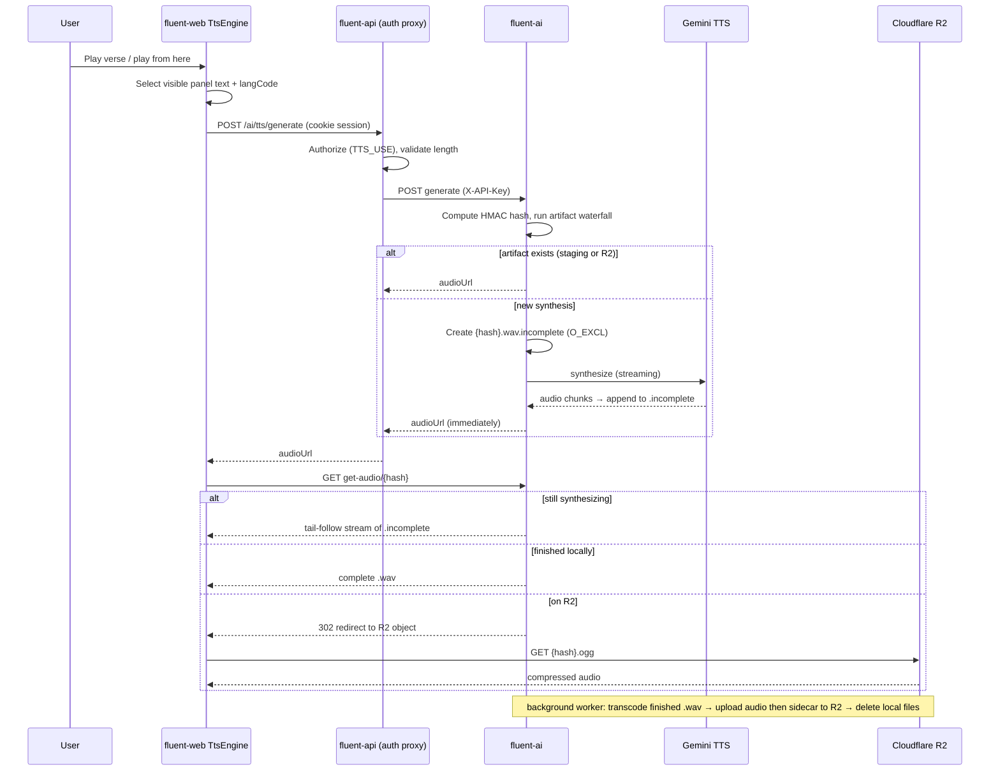

# Source-Text Text-to-Speech — Proposal

**Status:** Revised after engineering review (PR #356, kaseywright, 2026-07-15). Draft for re-review.

**Reviewer shortcut:** A condensed, stands-on-its-own summary lives in [`source-tts-summary.md`](source-tts-summary.md).

**Scope:** Add source-text listening to Fluent, beginning in the drafting grid. The user-facing controls belong to fluent-web; synthesis, artifact storage, and audio delivery belong to **fluent-ai**, with fluent-api keeping its established role as the authenticated passthrough for AI tooling. **This proposal intentionally lives in fluent-web only even though endpoints are implemented in fluent-ai and fluent-api**, so reviewers can evaluate the interaction and its supporting contract as one design.

## Revision history

Changes in response to the 2026-07-15 review (all three review comments addressed):

- **TTS synthesis moved from fluent-api into fluent-ai.** fluent-api no longer calls Gemini or holds a Google key; it keeps only the authenticated proxy hop it already provides for other AI tools. One place owns external AI integrations, as requested.
- **The Postgres cache is eliminated entirely.** Generated audio is now a content-addressed artifact: staged on fluent-ai's local filesystem during synthesis, then transcoded and uploaded to Cloudflare R2 for durable serving. No database table anywhere.
- **Cache identity refined per review:** the artifact hash is an HMAC over a canonical versioned recipe, and each provider declares which fields do not affect output bytes — for Gemini, `langCode` is normalized out of the hash input, so hinted and unhinted requests for the same text share one artifact and one billing event.
- **Transcoding:** a Python package bundling ffmpeg is the suggested path (pip wheels ship the binary); the team's planned containerized ffmpeg (klappy/transcode-mcp) is documented as a workable alternative. The former format-negotiation ladder is gone.
- **Gemini facts refreshed (2026-07-16):** the Interactions API is now **GA** (previously noted as Beta), and TTS streaming is verified available for models ≥ 3.1 including the proposed default.
- **Feature-flag semantics aligned with the repeated-word-check precedent:** the flag only hides frontend UI; the backend never disables the service; a hidden frontend override supports pre-release demos.

**Related work:**

- The Fluent project board contains an empty draft card titled **“Text to Speech”** (project item `PVTI_lADOB8vK1s4A34c5zgfByGU`). This proposal supplies the design substance for that item; the draft can be converted into implementation cards when the work is scheduled.
- [fluent-web#84 — Audio Recording](https://github.com/eten-tech-foundation/fluent-web/issues/84) is the existing placeholder for the target-side recording capability that should eventually mirror these source-side controls (§5.4, §13).
- fluent-mobile’s recording work (its R2 sync contract) establishes the team precedent this revision now follows: audio artifacts live in Cloudflare R2, not Postgres.

The proposal decisions are numbered **T1–T24**. Decisions revised in this round are marked **(revised)**; T21–T24 are new pillars introduced by the redesign.

---

## 1. Problem and design goals

Fluent translators often work from source scripture in a language of wider communication. Listening can reveal phrasing, rhythm, punctuation, and missed words that visual reading alone does not. A source-text TTS control should therefore be fast to reach, comfortable to repeat, useful on touch devices, and able to read either source text visible in Fluent’s drafting grid.

The target language is often low-resource and may not have a suitable hosted voice. Version 1 consequently reads **source text only**. The design still separates UI, transport, and provider concerns so a future custom target-language model can be added inside fluent-ai without rewriting fluent-web.

The governing principles are:

1. **Text, not scripture identity, is the backend resource.** The server synthesizes text and has no knowledge of projects, Bibles, books, chapters, or verses.
2. **The frontend owns playback sequencing.** Chapter and page behavior remain presentation concerns; the server stays one-text-in/one-clip-out.
3. **The protocol is much harder to change than the frontend presentation.** The first contract carries fields that future engines may need even when v1 exposes no corresponding knobs.
4. **Generated speech is a regenerable artifact, and the artifact either exists or it does not.** Content-addressed storage is the single source of truth; there is no tracking database whose state could disagree with the bytes. User recordings are irreplaceable media and require a different storage posture.
5. **The visible text is the authority.** Both source-panel texts can be spoken, and playback always uses the panel’s current text.
6. **AI integrations live in one place.** fluent-ai owns every external AI-service call; fluent-api remains an authenticated passthrough for AI tooling, per the established service split.

## 2. Scope

### 2.1 In scope

1. Two source-side playback actions per verse: **play this verse** and **play from here**.
2. Continuous verse-by-verse playback with synchronized active highlighting, auto-scroll, one-clip-ahead prefetch, stop, and an explicit chapter-boundary prompt.
3. Keyboard shortcuts acting on the active verse and touch-target-sized controls.
4. A reusable fluent-web TTS feature module with a frontend `TtsEngine` seam.
5. A `generate` endpoint in fluent-ai (reached through fluent-api’s existing authenticated AI proxy) and a `get-audio` endpoint in fluent-ai that serves or redirects to audio bytes.
6. Content-addressed artifact identity: an HMAC over a canonical, versioned synthesis recipe, with provider-declared normalization of non-byte-affecting fields.
7. Local filesystem staging in fluent-ai with atomic single-writer creation, streaming playback of in-progress synthesis, and a serving waterfall that falls back to R2.
8. An in-process compression worker in fluent-ai that transcodes finished WAV artifacts with ffmpeg and uploads them (plus a JSON metadata sidecar) to Cloudflare R2.
9. A narrow `sourceTts` frontend-visibility flag, a view-level `TTS_USE` permission alias on the fluent-api proxy, one generous text-length tripwire, and loading/error UX.
10. Design seams for recording, alternating review playback, browser-local speech, and custom fluent-ai models without implementing those roadmap items now.

### 2.2 Explicitly out of scope for v1

- Target-side TTS.
- Target-side audio recording or recording storage.
- A voice picker, synthesis-time speed/pacing control, or user-facing engine preference.
- Silent navigation across chapter/page boundaries in drafting.
- Per-user quotas or rate limiting beyond the maximum-text-length tripwire.
- Any Postgres/database storage for generated audio or its metadata.
- Artifact eviction or lifecycle deletion from R2 (growth is consciously accepted; §11.4).
- Adoption of a remote/shared transcoding service as a v1 dependency (documented as an alternative; §10).

---

## 3. Decisions summary

| #                 | Decision                                                                                                                                                                                                                                         | Short rationale                                                                                                               |
| ----------------- | ------------------------------------------------------------------------------------------------------------------------------------------------------------------------------------------------------------------------------------------------ | ----------------------------------------------------------------------------------------------------------------------------- |
| **T1**            | Render **play verse**, **play from here**, and a shared stop action while audio is active. Continuous mode advances verse by verse with synchronized highlight and auto-scroll.                                                                  | Matches the two listening tasks: inspect one verse or continue reviewing from a point.                                        |
| **T2**            | Make playback keyboard-first and use touch-target-sized controls. Shortcuts operate on the active verse.                                                                                                                                         | Playback is repetitive and must not depend on small pointer targets.                                                          |
| **T3**            | Place reusable controls and queue logic under `features/tts/`, not inside the Bible feature.                                                                                                                                                     | Other source-scripture surfaces should be able to adopt TTS later.                                                            |
| **T4**            | Reserve a symmetric target-side recording affordance using the same visual language and shared stop state; do not implement it in v1.                                                                                                            | Creates a coherent “listen here, record there” path aligned with fluent-web#84.                                               |
| **T5 (revised)**  | Gemini TTS is called from **fluent-ai**, which owns all external AI integrations. fluent-web reaches it through fluent-api’s existing authenticated AI proxy. A frontend `TtsEngine` seam still isolates the UI from transport.                  | Review outcome: one home for AI logic; fluent-api stays a passthrough; no duplicate Google key.                               |
| **T6 (revised)**  | The synthesis request is text-addressed. Artifact identity is an **HMAC (server secret) over a canonical, versioned recipe** of byte-affecting inputs; each provider declares which protocol fields do not affect bytes.                         | Keeps the backend domain-neutral, enables cross-project reuse, and prevents duplicate billing for equivalent requests.        |
| **T7**            | fluent-web owns continuous sequencing and prefetches the next verse while the current clip plays.                                                                                                                                                | The client already owns highlight, scroll, stop, and boundary behavior.                                                       |
| **T8 (revised)**  | `generate` returns a full `audioUrl`; the browser then performs an audio `GET` against fluent-ai’s `get-audio`, which streams in-progress synthesis, serves finished local files, or redirects to R2.                                            | Native `<audio>` playback plus immediate streaming of fresh synthesis; delivery location stays a server-side decision.        |
| **T9 (revised)**  | Synthesis stages uncompressed WAV locally; a background worker compresses once (Opus-in-Ogg preferred, MP3 fallback) and uploads to R2.                                                                                                          | The user hears audio immediately; compression happens off the request path; R2 stores only compressed bytes.                  |
| **T10 (revised)** | Serving is floated as two options (§7.3): (a) unauthenticated `get-audio` where **authentication is knowing the hash** (HMAC with a server secret makes URLs unguessable) — suggested; (b) fluent-api proxies all audio.                         | The artifact is generated scripture audio; worst case of a leaked URL is hearing scripture. Future recordings will need auth. |
| **T11**           | Expose no v1 synthesis knobs. Use one configured voice and client-side `playbackRate`; carry `voice`, optional `langCode`, and reserved pacing in the protocol.                                                                                  | One artifact serves all playback speeds while the protocol remains extensible.                                                |
| **T12 (revised)** | Add the narrow `sourceTts` flag backed by `EN_FEATURE_SOURCE_TTS`. The flag only tells the frontend to hide the UI; the backend never disables the service. A hidden frontend override shows the UI for pre-release demos.                       | Mirrors the repeated-word-check flag semantics; a missing provider key plus the override is itself a valid error-path test.   |
| **T13**           | Add `TTS_USE` as an alias of `project:view`, using the existing permission-alias pattern, enforced at the fluent-api proxy.                                                                                                                      | Hearing follows seeing; edit-level gating would exclude reviewers and future read-only review flows.                          |
| **T14**           | Enforce an env-configured maximum input length, proposed default 20,000 characters, returning a clear 400 error code. Defer rate limiting. Note: Gemini output caps near 655 seconds of audio, an effective provider ceiling below the tripwire. | The cap is a generous misuse/integration tripwire, not an ordinary verse limit.                                               |
| **T15 (revised)** | **No Postgres cache.** Generated clips are content-addressed artifacts: local staging during synthesis, Cloudflare R2 afterward. The artifact store is the only source of truth.                                                                 | Review outcome: eliminates a DB-ownership question and a whole class of tracking-state bugs; follows the team’s R2 direction. |
| **T16**           | At the last verse in drafting, pause and ask whether to continue on the next page; never navigate silently.                                                                                                                                      | Navigation can have commit/state side effects and needs conscious confirmation.                                               |
| **T17**           | Make both source-panel texts listenable: the project source and the selected reference Bible.                                                                                                                                                    | Either visible source may be the translator’s current reference, potentially in a different language.                         |
| **T18 (revised)** | Carry optional `langCode` from day one and send it whenever known. The provider declares whether it affects bytes; **Gemini normalizes it out of the hash input**, so it does not fragment artifact identity.                                    | Review outcome (K1): protocol keeps the field; identity ignores fields that cannot change the audio.                          |
| **T19**           | Keep the paired suggestion and summary proposal documents in fluent-web only; implementation spans fluent-web, fluent-api, and fluent-ai.                                                                                                        | One review surface presents the user experience and the contract that supports it.                                            |
| **T20 (revised)** | Transcoding runs in fluent-ai’s compression worker via ffmpeg — suggested packaging is a Python pip package that bundles the ffmpeg binary; the team’s containerized ffmpeg (klappy/transcode-mcp) is a workable alternative.                    | Review outcome (K3): the former probe-and-negotiate encoder ladder collapses; Python packaging effectively ships ffmpeg.      |
| **T21 (new)**     | **Single-writer staging lock:** `{hash}.wav.incomplete` is created with `O_EXCL`; the winner synthesizes, everyone else streams the same file. The lock is load-bearing as the guard against parallel duplicate provider billing.                | A double-clicked play button or duplicate React effect must never bill Gemini twice for the same artifact.                    |
| **T22 (new)**     | **Tail-follow streaming:** `get-audio` streams a `.incomplete` file as it grows (read to EOF → wait 250 ms → loop; rename/removal signals completion), using a streaming WAV header with `0xFFFFFFFF` sizes that is never backfilled.            | The user hears the first verse while the rest is still being synthesized; no torn header reads for concurrent listeners.      |
| **T23 (new)**     | **JSON sidecar as receipt and commit marker:** metadata (recipe fields, actual format, duration, sizes) travels with the artifact to R2 and is uploaded **last**; its presence means the artifact is complete. Never updated afterward.          | Resolves format ambiguity on R2, gives duration a home without a DB, and makes worker crashes idempotently retryable.         |
| **T24 (new)**     | **In-process compression worker:** an asyncio background task started from fluent-ai’s FastAPI lifespan, running ffmpeg through `asyncio.subprocess`. No new service, container, or startup change for fluent-ai.                                | Fits fluent-ai’s observed single-process `fastapi run` runtime as-is; transcoding never blocks the event loop.                |

---

## 4. End-to-end architecture



### 4.1 Repository responsibilities

| Repo                | Implementation responsibility                                                                                                                                                                                 |
| ------------------- | ------------------------------------------------------------------------------------------------------------------------------------------------------------------------------------------------------------- |
| **fluent-web**      | Controls, keyboard handling, active-verse behavior, queue/sequencing, prefetch, highlight/scroll, source-panel text selection, playback rate, chapter-boundary prompt, feature gating.                        |
| **fluent-api**      | Authenticated proxy for `generate` only: session cookie auth, `requirePermission(PERMISSIONS.TTS_USE)`, input-length validation, forward to fluent-ai with `X-API-Key`. No Google key, no audio bytes, no DB. |
| **fluent-ai**       | Everything AI and artifact: Gemini provider, HMAC recipe hashing, staging filesystem, `O_EXCL` locking, tail-follow streaming, `get-audio` waterfall, compression worker, R2 upload, sidecar receipts.        |
| **fluent-platform** | R2 bucket/credentials provisioning and fluent-ai env additions at deployment time; no new service and no fluent-ai startup change is required.                                                                |

The endpoint’s location does not change the document location: **the proposal pair is intentionally committed only to fluent-web** (T19). The feature is experienced and sequenced in fluent-web, while this document records the fluent-api and fluent-ai contracts reviewers must approve before implementation is split into repo-specific PRs.

---

## 5. UI and interaction model

### 5.1 Per-verse controls (T1, T2, T17)

Each visible source verse gains two accessible controls:

- **Play this verse** (`▶`) synthesizes or reuses one clip and stops at its end.
- **Play from here** (`▶▶`) starts a verse queue at the active row and continues through the chapter.
- While any clip is loading or playing, a clearly visible **Stop** action is available. Stop cancels the client queue, pauses the active audio element, clears prefetched intent, and removes the playback highlight.

The controls use normal buttons with descriptive accessible names rather than icon-only semantics. Their hit areas meet the project’s touch sizing conventions even when the visual icon remains compact. Keyboard shortcuts trigger play-verse, play-from-here, and stop against the active verse; the exact key assignments should be selected during implementation after checking existing editor shortcuts for collisions and then documented in the UI/help surface.

Controls read whichever source panel is visible:

- panel 1: the project source (`verse.text`) and project-source language code;
- panel 2: the selected reference Bible (`bibleVerseMap`) and that Bible’s own language code.

A missing panel-2 verse has no playable text, so controls are disabled or omitted for that row. Placement is an implementation detail: one control set in the source column that follows the selected panel is likely the least-wired design.

### 5.2 Loading, failure, and non-blocking behavior — proposed default for review

On a first-listen miss, synthesis begins streaming within a couple of seconds rather than waiting for the whole clip. The proposed default is:

- replace the activated play icon with a spinner until playback actually starts;
- keep target-text typing and navigation usable;
- allow Stop to cancel local playback intent even though aborting the HTTP request may not cancel billable provider work already underway;
- show synthesis/playback failures through the project’s established toast pattern, with a concise retryable message;
- return the control to its idle state after failure, without leaving a stale highlight.

This is a **proposed default for review**, not an operator-settled interaction detail.

### 5.3 Continuous mode and chapter boundary (T7, T16)

Continuous playback is a frontend queue of `{ verseRef, text, langCode, audioSource }` items. While verse N plays, fluent-web requests verse N+1. Queue state should distinguish at least `playing`, `buffered`, and `synthesizing`; prefetch depth can increase later if real network conditions produce audible gaps.

At each clip transition, fluent-web:

1. marks the verse as the playback-active row;
2. scrolls it into view when necessary;
3. starts its already-buffered clip or displays a brief loading state;
4. requests the following clip;
5. stops cleanly when text is absent or the user presses Stop.

At the final verse in drafting, playback pauses and asks **“Continue on the next page?”** Only confirmation triggers navigation. This rule is entirely frontend-owned: a future read-only source-Bible surface may choose cross-page continuation without changing the API.

### 5.4 Recording dovetail (T4)

The source-side control language should reserve a mirrored target-side recording location:

```text
Source text                         Target text
[▶ Play] [▶▶ From here]             [● Record]   (future)
                 [■ Stop]            shared active-session stop
```

Recording is not part of this implementation. The purpose is to avoid a TTS layout that later makes fluent-web#84 feel bolted on. Generated source audio and recorded target audio can share playback-state presentation and queue items while retaining different storage/lifecycle rules — and, notably, different access rules: recordings carry a user’s voice and will need authenticated serving, a tension §7.3 records explicitly.

---

## 6. fluent-web design

### 6.1 Frontend seam (T3, T5)

The control must depend on an engine interface rather than fetch or Web Speech directly:

```ts
interface TtsRequest {
  text: string;
  voice?: string;
  format: TtsFormat; // 'ogg-opus' | 'mp3'
  langCode?: string;
  pacing?: { mode?: string }; // reserved; no v1 UI
}

interface TtsClip {
  audioUrl: string;
  durationMs?: number; // known only once the artifact is complete
}

interface TtsEngine {
  synthesize(request: TtsRequest, signal?: AbortSignal): Promise<TtsClip>;
}
```

Proposed module shape:

```text
src/features/tts/
├── components/TtsVerseControls.tsx
├── engines/serverTtsEngine.ts
├── hooks/useTtsPlaybackQueue.ts
├── tts.types.ts
└── index.ts
```

`ServerTtsEngine` calls fluent-api’s `generate` proxy. A future `WebSpeechTtsEngine` can implement the same UI-facing role even if its internal behavior is streaming/local rather than URL-returning; if that mismatch proves material, the interface can return a generic playable source rather than exposing vendor concepts to the component. The key requirement is that buttons and queue orchestration do not know whether audio is browser-local, streamed from fluent-ai, or served from R2.

fluent-web selects `format` at runtime with `HTMLAudioElement.canPlayType()`: request `ogg-opus` when the browser reports confident support, otherwise `mp3`. The requested format is recorded in the artifact’s sidecar (§9.3) and honored by the compression worker, and it participates in artifact identity — an mp3 request is a separate artifact from an opus one (§9.1). Even if the v1 frontend only ever asks for one format in practice, keeping the field means supporting an older browser later (or any client that cannot play Opus) is a frontend-only change. The browser plays WAV while an artifact is fresh and the requested compressed format once it lives on R2, transparently; the response’s `Content-Type` always declares what was actually served.

### 6.2 Playback speed and duration (T11, T22)

Playback speed is applied through `audio.playbackRate`. It is deliberately absent from artifact identity and does not trigger new synthesis. The protocol reserves pacing for a future synthesis-time option where cadence itself must change.

While a clip is still being tail-follow streamed, its total duration is unknown and seeking is unavailable; the native `<audio>` element handles this gracefully (a growing progress position without a fixed end). Once the artifact is served from R2, ordinary `Content-Length` and HTTP Range behavior return and scrubbing works normally. For verse-sized clips the degraded window lasts seconds and only on the first listen.

### 6.3 Feature gate (T12, revised)

Add the camel-case wire flag `sourceTts`, backed by `EN_FEATURE_SOURCE_TTS`, to the existing feature registry and fail-closed frontend mirror. The flag follows the current four-edit discipline: fluent-api env schema, `FLAGS` registry, OpenAPI feature response, and `.env.example`, plus fluent-web’s named flag type/default.

The semantics mirror the repeated-word-check flag exactly:

- **The backend never disables the service.** fluent-api’s proxy and fluent-ai’s endpoints stay live regardless of the flag; the flag only tells the frontend whether to render the controls.
- **A hidden frontend override** (same mechanism the checks UI uses) can show the controls anyway, for demos before public enablement. If the deployment lacks a Gemini key, the override surfaces the resulting provider error — which is itself a valid error-path test rather than a misconfiguration to hide.

Proposed derived default: when `EN_FEATURE_SOURCE_TTS` is unset, publish `sourceTts: true` only when `FLUENT_AI_URL` and its API key are configured; otherwise publish false. An explicit flag value overrides the derived default. This is a **proposed default for review**.

---

## 7. Service contract

### 7.1 `generate` — fluent-web → fluent-api → fluent-ai (T5, T6, T8, T11, T14, T18)

The money path stays authenticated end to end. fluent-web calls fluent-api with the session cookie; fluent-api enforces `requirePermission(PERMISSIONS.TTS_USE)` and the length tripwire, then forwards to fluent-ai’s `generate` endpoint with the existing `X-API-Key` service credential — the same shape as the other AI-tool proxies.

```json
{
  "text": "In the beginning…",
  "format": "ogg-opus",
  "langCode": "eng",
  "pacing": null
}
```

Proposed request fields:

| Field      | Requirement         | Semantics                                                                                                                                                        |
| ---------- | ------------------- | ---------------------------------------------------------------------------------------------------------------------------------------------------------------- |
| `text`     | required, non-empty | Exact visible text to recite; rejected beyond `TTS_MAX_TEXT_LENGTH`.                                                                                             |
| `voice`    | optional            | Requested logical/provider voice; v1 frontend omits it and the configured default is used.                                                                       |
| `format`   | required            | Compressed format the worker should produce: `ogg-opus` or `mp3`. Chosen by the client via `canPlayType()`; participates in artifact identity (§9.1).            |
| `langCode` | optional            | Language hint sent whenever fluent-web knows it (ISO 639-3 codes are available for all Fluent source languages, and should be for targets). Advisory for Gemini. |
| `pacing`   | optional/reserved   | Accepted protocol slot for future synthesis-time pacing; v1 should reject unsupported non-null values or define a no-op policy explicitly before implementation. |

`format` is honored, not negotiated: the worker always has ffmpeg (§10), so a request for `mp3` produces an mp3 artifact — a distinct hash that does not collide with an opus artifact for the same text. Keeping the field in the protocol means a client that cannot play Opus (an older browser, a future non-web consumer) is served without any backend change, even though the v1 frontend may only ever request one format in practice.

On receiving the request, fluent-ai computes the artifact hash (§9.1) and runs the same waterfall `get-audio` uses (§7.2). If the artifact already exists in any form — in-progress, staged, or on R2 — no synthesis happens and the URL is returned immediately; this is the deduplication path. Otherwise fluent-ai creates the staging lock and starts Gemini synthesis (§8), returning the URL **without waiting for synthesis to finish** — the browser starts streaming right away.

Success response:

```json
{
  "audioUrl": "https://fluent-ai.example/tts/audio/9f2ac1d47b…e03",
  "durationMs": null
}
```

`durationMs` is populated only when the artifact is already complete (its sidecar exists); for fresh synthesis it is null because the stream’s length is genuinely unknown. `audioUrl` is a full URL, not a bare id, so the serving choice in §7.3 — and any later change to it — is entirely server-side.

Validation/error outline:

- `400 TTS_TEXT_TOO_LONG` with the configured maximum when `text` exceeds the tripwire (enforced at the fluent-api proxy);
- `400 TTS_INVALID_REQUEST` for malformed/empty input;
- `403` through existing permission middleware;
- `502 TTS_PROVIDER_UNAVAILABLE` when the provider fails after the bounded retry policy (§8.3), without exposing vendor detail.

The proposed default `TTS_MAX_TEXT_LENGTH=20000` is intentionally far above a verse. It catches accidental chapter/book submission or abuse without acting as a normal product limit. It is worth noting that Gemini itself caps generated output near 655 seconds of audio, so the provider is an effective ceiling below the tripwire for extreme inputs. Rate limiting and user quotas are deferred until usage data justifies them.

### 7.2 `get-audio` — the serving waterfall (T8, T15, T21–T23)

```http
GET /tts/audio/{hash}
```

fluent-ai resolves the hash through an ordered waterfall, attempting each open directly rather than checking existence first (avoids races with the worker moving files):

1. **`{hash}.wav.incomplete`** — synthesis in progress: tail-follow stream it (§7.2.1). If the file’s mtime is stale beyond the configured threshold, treat it as an abandoned write: delete it inline and continue down the waterfall (this replaces any separate janitor process).
2. **`{hash}.wav`** — finished locally, not yet transcoded: serve the complete file with real `Content-Length`.
3. **R2 `{hash}.ogg`**, then **R2 `{hash}.mp3`** — transcoded artifact: respond `302 Found` to the R2 object URL (option (a)) or proxy the bytes (option (b)); §7.3.
4. **`404`** — the artifact does not exist anywhere. fluent-web treats this as self-healing: repeat `generate`, which recreates the artifact and returns a fresh URL.

Serving behavior:

- correct `Content-Type` per representation (`audio/wav` staging, `audio/ogg`/`audio/mpeg` from R2);
- `Content-Length` and HTTP Range support whenever the representation is complete (local `.wav` and R2 objects); chunked transfer without length while tail-following;
- long-lived immutable cache headers on R2 responses (content-addressed names never change meaning); `no-store` on tail-follow streams;
- no synthesis side effect on GET — creation happens only through `generate`.

#### 7.2.1 Tail-follow streaming (T22)

While a `.incomplete` file grows, `get-audio` streams it live: read to EOF → wait 250 ms → if more bytes appeared, continue; if the file was renamed to `.wav` (or is gone), read any remainder from the renamed file and complete the stream. Multiple concurrent listeners can follow the same file; only the request that won the `O_EXCL` lock is synthesizing.

An overall timeout bounds the loop: if the writer stops making progress for the configured window, the stream completes with whatever bytes were delivered. A truncated clip is indistinguishable from a complete one to the player (there is no length header), which is an accepted v1 rough edge — the mtime-staleness rule in the waterfall deletes the abandoned `.incomplete` so the next play attempt regenerates cleanly.

The staged WAV begins with a **streaming WAV header whose RIFF/data sizes are `0xFFFFFFFF`**. Players and ffmpeg treat these as “very large; read to end of stream.” The header is written once and **never backfilled** after completion, so a concurrent reader can never observe a torn half-updated header; raw headerless PCM was rejected because `<audio>` cannot play it.

### 7.3 Serving and authentication — two options (T10, revised)

The `generate` path is always authenticated (cookie at fluent-api, `X-API-Key` to fluent-ai): it is the path that spends money. The question is `get-audio` and R2. Two coherent options, with (a) suggested:

**Option (a) — unauthenticated serving; authentication is knowing the hash (suggested).** The hash is an HMAC keyed by a server secret (§9.1), so URLs are unguessable without having already been authorized through `generate`; possessing one lets a client hear generated scripture audio — a deliberately accepted low-stakes outcome. `get-audio` is public on fluent-ai; R2 objects are public behind their content-addressed names; the `302` works natively and CDN caching comes free. This is the low-complication path.

**Option (b) — fluent-api proxies everything.** All audio flows fluent-web → fluent-api (cookie auth) → fluent-ai/R2. Uniform access control and no publicly reachable audio endpoints, at the cost of pushing every audio byte through two services, buffering concerns for the streaming path, and losing free CDN behavior.

**A tension to record either way:** future target-side _recordings_ carry a real user’s voice and will require authenticated serving. If option (a) is chosen for the TTS cache, recordings must not inherit it — the access postures of the two artifact classes are expected to diverge.

One deployment note for option (a): plain `<audio src>` playback is CORS-exempt, so cross-origin serving from fluent-ai or R2 works as-is; only a future Web Audio API consumer (waveforms, precise scheduling) would need CORS headers on the audio responses.

---

## 8. Provider seam and Gemini implementation (in fluent-ai)

### 8.1 Provider seam (T5, revised)

fluent-ai owns a small provider-neutral Python interface:

```python
@dataclass
class TtsProviderRequest:
    text: str
    voice: str
    model: str
    lang_code: str | None = None
    pacing: dict | None = None

class TtsProvider(Protocol):
    def synthesize_stream(
        self, request: TtsProviderRequest
    ) -> AsyncIterator[bytes]:
        """Yield PCM audio chunks as the provider produces them."""

    def non_byte_affecting_fields(self) -> set[str]:
        """Protocol fields this provider ignores for output bytes (§9.1)."""
```

Staging, hashing, and transcoding remain outside the provider. This keeps Gemini’s SDK types, model names, and streaming quirks inside one module; a future custom low-resource model is another `TtsProvider` selected by config or language routing, with no fluent-web or fluent-api change.

### 8.2 Current Gemini API facts (verified July 14–16, 2026)

Google documents Gemini TTS models as **Preview**, while the **Interactions API surface is now GA** (it was Beta when this proposal was first drafted). Current supported TTS names include:

- `gemini-3.1-flash-tts-preview` — current Flash TTS preview; single/multi-speaker; **streaming supported**; the model in Google’s current-surface examples;
- `gemini-2.5-flash-preview-tts` / `gemini-2.5-pro-preview-tts` — older previews on the Generate Content surface Google now labels Legacy; they do not stream.

The proposed v1 default is **`TTS_MODEL=gemini-3.1-flash-tts-preview`**, flagged for review. Published paid-tier pricing at verification is $1 per million text-input tokens and $20 per million audio-output tokens (audio bills at 25 tokens per second, ≈ $0.0005 per generated second before artifact reuse). Model names and prices are configuration and documentation, never protocol constants.

**Streaming is the primary path:** TTS models from 3.1 up support `stream: true` on Interactions, verified in current documentation. Chunks are appended to the staging file as they arrive, which is what makes tail-follow playback (§7.2.1) work. Two documented behaviors shape the implementation:

- the model occasionally emits text tokens into an audio response, which surfaces as a request failure — covered by the bounded retry in §8.3;
- generated output caps near **655 seconds of audio**, an effective per-request ceiling (see T14).

**Non-streaming fallback:** if a configured provider or model cannot stream, nothing structural changes — the `.incomplete` file still serves as the existence marker and single-writer lock; it simply receives the whole clip at once. `get-audio` waits for the rename and serves the complete file with a real `Content-Length`. Streaming is an experience optimization, not a correctness requirement.

The returned audio is raw 24 kHz, mono, 16-bit PCM; fluent-ai writes the streaming WAV header (§7.2.1) and appends decoded chunks. Language is usually auto-detected; `langCode` remains advisory input for Gemini and a first-class provider field because a future low-resource engine may require it.

### 8.3 Failure handling and retries (T21)

The Gemini call runs inside a try/except that owns the staging lock’s lifecycle:

1. On failure (including the text-token glitch), retry automatically a small bounded number of times (2–3) while continuing to hold the `.incomplete` lock — the file is truncated back to the header between attempts.
2. Only after final failure is the `.incomplete` deleted, releasing the hash for a later attempt, and the error surfaced as `502 TTS_PROVIDER_UNAVAILABLE`.
3. A crash that orphans a `.incomplete` (process kill, disk hiccup) is cleaned by the waterfall’s mtime-staleness rule (§7.2) on the next access — there is no separate janitor process to deploy or monitor.

### 8.4 Proposed environment additions — flagged for review

All TTS configuration lives in **fluent-ai** (which already holds the Google key for its other tools):

| Variable (fluent-ai)  | Proposed default/purpose                                                                                                                                               |
| --------------------- | ---------------------------------------------------------------------------------------------------------------------------------------------------------------------- |
| `TTS_MODEL`           | `gemini-3.1-flash-tts-preview`; configurable because preview names change.                                                                                             |
| `TTS_VOICE`           | `Kore`; one deployment-wide voice in v1.                                                                                                                               |
| `TTS_MAX_TEXT_LENGTH` | `20000`; generous tripwire (mirrored at the fluent-api proxy).                                                                                                         |
| `TTS_HASH_SECRET`     | New secret keying the artifact HMAC (§9.1).                                                                                                                            |
| `TTS_STAGING_DIR`     | Local staging directory for `.incomplete`/`.wav` files.                                                                                                                |
| `TTS_DEFAULT_FORMAT`  | Format used when a request omits `format` (`ogg-opus` proposed); requests normally choose.                                                                             |
| `TTS_R2_PREFIX`       | Folder path (key prefix) inside the R2 bucket for TTS artifacts, e.g. `tts/` — keeps them separate from other artifact classes (future recordings) sharing the bucket. |
| R2 credentials/bucket | Standard Cloudflare R2 binding for the worker’s uploads and `get-audio` redirects.                                                                                     |

fluent-api needs only what it already has for AI tools (`FLUENT_AI_URL`, service API key) plus the `EN_FEATURE_SOURCE_TTS` flag entry. **No Google key is added to fluent-api** — the previous draft’s duplicate-key argument (old §8.3) is withdrawn along with the architecture that required it.

---

## 9. Content-addressed artifact store (T6, T15, T21–T23, revised)

There is no database. An artifact exists on the staging filesystem, exists on R2, or does not exist — the store itself is the only record, so no tracking state can ever disagree with the bytes.

### 9.1 Identity: HMAC over a canonical recipe (T6, T18)

The artifact name is an HMAC (server secret `TTS_HASH_SECRET`, SHA-256) over a canonical recipe string with an explicit version prefix:

```text
v1:{text}\x1f{voice}\x1f{model}\x1f{format}\x1f{langCode-normalized}\x1f{pacing-normalized}
```

- **Version prefix** (`v1:`): injected server-side by fluent-ai when it builds the recipe — it is not a request field and never appears in the API. Any future change to the recipe’s composition (or any server-side change that should invalidate existing artifacts wholesale) bumps the version, cleanly separating old and new artifact namespaces. Costs nothing now; saves a migration headache later.
- **Provider-declared normalization:** each provider lists the protocol fields that cannot affect its output bytes (`non_byte_affecting_fields()`, §8.1); those are blanked to `-` in the recipe before hashing. For Gemini, `langCode` is normalized out — the hint is advisory and does not change the audio — so `en`, `eng`, and absent all resolve to the same artifact and the same single billing event. A future provider for which `langCode` _does_ change output simply omits it from the declaration and it participates in the hash. This mechanism keeps the protocol field (T18) while the identity tracks byte-level reality.
- **Format is in the hash.** The requested compressed format is part of what the client asked for, so an `mp3` request is a distinct artifact from an `ogg-opus` request for the same text — the two never collide, and each hash resolves to exactly one R2 object. (The staged WAV is a lifecycle stage of that one artifact, not a separate identity.)
- **HMAC, not a bare hash:** scripture text is public, so a plain content hash would be computable by anyone; the server secret is what makes “knowing the hash” meaningful as an access token under serving option (a) (§7.3).
- Spoken text is never trimmed, case-folded, or otherwise altered before hashing — only structurally absent optional fields normalize to a canonical placeholder.

### 9.2 Staging lifecycle (T21, T22)

```text
{hash}.wav.incomplete   created O_EXCL; streaming WAV header; Gemini chunks appended
        │ atomic rename on verified stream completion
{hash}.wav              complete, playable, awaiting transcode
        │ worker: transcode → upload audio → upload sidecar → delete local
R2: {hash}.ogg + {hash}.json      (or .mp3, per the request's format)
```

The `O_EXCL` create is **load-bearing and must not be simplified away**: it is the single-writer lock that prevents two simultaneous requests for the same text (a double-clicked play button, a duplicated React effect) from each paying Gemini for the same audio. Losers of the race — and all other listeners — stream the winner’s file.

The rename to `{hash}.wav` happens only after the provider stream terminates normally; an abnormal end follows §8.3 instead. Staging disk is transient (files leave after transcode), so a simple free-space guard that refuses new synthesis under pressure is an acceptable implementation addition; multi-replica deployments would at worst duplicate synthesis cost across replicas, never corrupt an artifact.

### 9.3 The JSON sidecar: receipt and commit marker (T23)

Each artifact gets a small JSON sidecar recording what it is:

```json
{
  "recipeVersion": "v1",
  "model": "gemini-3.1-flash-tts-preview",
  "voice": "Kore",
  "langCode": "eng",
  "format": "ogg-opus",
  "contentType": "audio/ogg",
  "durationMs": 4380,
  "sizeBytes": 31240,
  "createdAt": "2026-07-16T18:00:00Z"
}
```

- Locally, it carries the worker’s target-format hint alongside the finished `.wav`.
- On R2, the worker uploads the **audio object first, sidecar last** — the sidecar’s presence is the commit marker meaning “complete artifact here.” A worker crash between the two uploads leaves no sidecar, and the retried transcode/upload is idempotent (same content-addressed names, same bytes).
- It answers what would otherwise need a database row: which format this hash resolved to, its duration, and when it was made.
- It is a **receipt, never a ledger**: it is not updated afterward — in particular, not for access tracking, which would turn every read into a write for no v1 benefit.

### 9.4 No eviction (revised from LRU trimming)

v1 has **no eviction policy**. Compressed verse-sized clips are small; a whole Bible per voice/model lands in the hundreds of megabytes on R2, i.e. cents per month at R2 pricing. Unbounded growth is consciously accepted and revisited only if usage proves the arithmetic wrong. (The staging directory does not grow: the worker deletes local files after upload.) Generated clips remain reproducible for fractions of a cent; target recordings are irreplaceable human artifacts and must never inherit any future TTS deletion policy.

---

## 10. Compression worker and transcoding (T9, T20, T24, revised)

### 10.1 Worker model (T24)

The compression worker is an **asyncio background task started from fluent-ai’s FastAPI lifespan** — the service’s observed runtime is `fastapi run` (a single uvicorn async process), and the worker is designed to fit that as-is: no new process, container, queue, or startup change is asked of the fluent-ai owners.

Loop shape:

1. Poll `TTS_STAGING_DIR` for completed `{hash}.wav` files with a sidecar hint.
2. Transcode with ffmpeg via `asyncio.subprocess` (the subprocess does the CPU work; the event loop never blocks). Target format comes from the sidecar’s hint — i.e., what the client requested (`ogg-opus` or `mp3`), with `TTS_DEFAULT_FORMAT` covering requests that omitted it.
3. Upload the audio object to R2, then the sidecar (§9.3 commit ordering).
4. Delete the local `.wav` and local sidecar; sleep briefly; repeat.

Every step is idempotent under crash/restart: a half-done artifact is re-transcoded from the still-present `.wav`; a re-upload overwrites identical bytes at the same content-addressed key.

### 10.2 ffmpeg packaging (T20, revised)

- **Suggested: a Python package that bundles the ffmpeg binary.** Being in Python effectively gets ffmpeg for free — pip wheels ship platform binaries (e.g. the static-ffmpeg family), so the dependency is an ordinary `pyproject` entry with no image or hosting change. This keeps transcoding in-process-adjacent, with no network hop inside the pipeline.
- **Workable alternative: the team’s planned containerized ffmpeg** ([klappy/transcode-mcp](https://github.com/klappy/transcode-mcp/tree/main/container)), raised in review as a shared transcoding resource. If that service is provisioned and the team prefers one shared transcoder, the worker’s step 2 becomes a call to it instead of a local subprocess. The trade is a runtime dependency on an external service (latency, availability, auth) inside the artifact pipeline — reasonable once the service exists and is operated, but this proposal does not make v1 wait on it.

The previous draft’s format-negotiation ladder (probe native ffmpeg → `ffmpeg-static` → pure-JS MP3 floor → `ffmpeg.wasm`) is **gone**: it existed because a Node service couldn’t assume an encoder. The worker always has ffmpeg by construction, so both requestable formats (`ogg-opus`, `mp3`) are always encodable — the request’s `format` is honored as-is (§7.1), never renegotiated.

---

## 11. Authorization, rollout, and cost posture

### 11.1 View-level permission alias (T13)

Add a documented alias alongside `AI_TOOLS_USE` in fluent-api:

```ts
TTS_USE: 'project:view',
```

The `generate` proxy uses `PERMISSIONS.TTS_USE`. This names the capability at route call sites while reusing the existing RBAC row; promotion to a distinct permission later requires a new permission row/role mappings and one string-value change, not route rewrites.

The view-level alias is deliberate: anyone allowed to see source scripture should be allowed to hear it. Reusing `content:update` would exclude reviewers and undermine the planned alternating review mode.

`get-audio` authentication is the option (a)/(b) choice in §7.3 — under the suggested option (a) it is unauthenticated by design, with the HMAC-secret URL as the access token and generation (the money path) fully authenticated.

### 11.2 Security and abuse controls

- The Google key lives only in fluent-ai and is never exposed to fluent-web or fluent-api.
- `TTS_HASH_SECRET` must be treated as a secret: it is what makes artifact URLs unguessable under option (a).
- Validate text length at the fluent-api proxy before any fluent-ai work.
- Avoid logging full source text or provider payloads at ordinary log levels.
- Return stable Fluent error codes rather than raw SDK errors.
- The `O_EXCL` staging lock (T21) is the anti-double-billing guard; treat it as a security-adjacent invariant in review.
- Monitor artifact misses, generated seconds, provider failures/retries, transcode failures, and staging-disk usage.
- Defer rate limits until observed use warrants them; the 20,000-character cap is the only v1 request guardrail beyond normal auth.

### 11.3 Rollout

1. Merge implementation dark behind `sourceTts` (frontend-hide semantics; backend always live — §6.3).
2. Provision fluent-ai’s TTS env (§8.4) and the R2 bucket in a non-production environment.
3. Confirm streaming playback, waterfall fallbacks, and worker upload against real browsers.
4. Demo via the hidden frontend override before public enablement; a missing Gemini key with the override on is a valid error-path check, not a blocker.
5. Enable the flag broadly once provider behavior and R2 serving are accepted.

### 11.4 Cost posture

Synthesis costs fractions of a cent per verse and is paid once per artifact thanks to content addressing and the single-writer lock. R2 storage of compressed clips is cents per month even at whole-Bible scale (§9.4), and R2 egress is free. The conscious v1 trade is unbounded-but-tiny storage growth in exchange for zero lifecycle machinery.

---

## 12. Testing

### 12.1 fluent-web

| Area        | Representative cases                                                                                                                                           |
| ----------- | -------------------------------------------------------------------------------------------------------------------------------------------------------------- |
| Controls    | Both play actions use visible panel text; missing reference verse is not playable; spinner/stop/error states; accessible labels and touch targets.             |
| Keyboard    | Shortcuts act on active verse and do not collide with typing/editor shortcuts; stop is global to active playback.                                              |
| Queue       | Play-one stops; play-from-here advances, highlights, scrolls, prefetches; stop clears queue; network gap state; chapter-end confirmation/no silent navigation. |
| Engine seam | Server engine request includes known `langCode`; cancellation is local-safe; 404 audio triggers one re-`generate`.                                             |
| Playback    | WAV stream plays while synthesizing; Ogg/MP3 plays from R2 redirect; playback rate does not resynthesize; unknown-duration stream degrades gracefully.         |
| Flags       | `sourceTts=false` hides controls; hidden override shows them; loading/failure remains fail-closed.                                                             |

### 12.2 fluent-api (proxy)

| Area       | Representative cases                                                                                      |
| ---------- | --------------------------------------------------------------------------------------------------------- |
| Route/auth | 401 unauthenticated, 403 without view permission, input validation, stable errors, 20k-default boundary.  |
| Proxy      | Forwards to fluent-ai with `X-API-Key`; passes through `audioUrl`; maps fluent-ai errors to Fluent codes. |

### 12.3 fluent-ai

| Area        | Representative cases                                                                                                                                               |
| ----------- | ------------------------------------------------------------------------------------------------------------------------------------------------------------------ |
| Identity    | HMAC recipe stability across field orderings; version prefix present; Gemini `langCode` normalization (`en`/`eng`/absent → one hash); text never altered.          |
| Locking     | Concurrent `generate` for one text → exactly one `.incomplete` created (O_EXCL), one provider call; loser streams the winner’s file.                               |
| Waterfall   | Each rung resolves in order; attempt-open behavior under worker delete race; stale `.incomplete` (mtime) deleted inline and waterfall continues; total miss 404.   |
| Tail-follow | Stream grows with the file; rename mid-stream completes cleanly; writer stall hits timeout and completes with delivered bytes; FF-size WAV header never rewritten. |
| Provider    | Mock provider stream; text-token glitch → bounded retry (2–3) then `.incomplete` cleanup and 502; non-streaming provider fallback (whole-file then rename).        |
| Worker      | Transcode via subprocess; audio-then-sidecar upload order; crash between uploads → idempotent retry; local files deleted after commit; loop survives bad input.    |
| Serving     | Correct Content-Type per representation; Range on complete files; 302 target correctness; immutable cache headers on R2 path, `no-store` while streaming.          |

A provider integration smoke test should synthesize a short non-sensitive fixture against the configured preview model, verify streamed PCM arrives and the staged WAV plays, run one real transcode, and confirm the R2 round trip. It should be opt-in so ordinary tests never incur provider cost.

---

## 13. Future roadmap (designed for, not built)

1. **Target-side recording dovetail (fluent-web#84):** mirrored record controls, shared playback/recording stop presentation, and durable recording storage — R2 like the mobile precedent, but behind **authenticated serving**, since recordings carry a user’s voice (§7.3 tension).
2. **Alternating review mode:** queue source TTS verse 1 → recorded target verse 1 → source TTS verse 2 → recorded target verse 2. Queue items should therefore pair a verse reference with a generic audio source, not assume every item comes from `TtsEngine`.
3. **Browser-local Web Speech option:** a future per-user `server | local` preference can trade voice consistency for zero provider cost and better behavior on weak connections. Voice availability/quality remains device-dependent.
4. **Custom low-resource engine in fluent-ai:** another `TtsProvider` behind the same endpoints, selected by config or language; it declares its own byte-affecting fields (where `langCode` likely _does_ join the hash).
5. **Voice picker and synthesis-time pacing:** activate already-reserved request fields; both join the recipe when they affect generated bytes. Client `playbackRate` remains the cheap speed control.
6. **CDN in front of R2 / signed URLs:** content-addressed public objects are already CDN-friendly under option (a); signed URLs become relevant if the serving posture tightens or recordings share infrastructure.
7. **Read-only and source-Bible listening surfaces:** reuse `features/tts/`; those surfaces may choose continuous playback across page breaks because boundary policy is frontend-owned.
8. **Artifact lifecycle policy:** only if R2 growth ever escapes the cents-per-month arithmetic; age-based expiry via R2 lifecycle rules would be the natural tool (there is no LRU state to consult, by design).
9. **Rate limiting and budget controls:** add only with usage evidence, using metrics collected from v1 rather than guessing quotas now.

---

## 14. Review checklist

The design decisions T1–T24 are the recommended path. Review input is particularly valuable on:

| #      | Item for review        | Proposed resolution                                                                                                                                                                        |
| ------ | ---------------------- | ------------------------------------------------------------------------------------------------------------------------------------------------------------------------------------------ |
| **R1** | Serving/auth option    | Option (a): unauthenticated `get-audio`/public R2, HMAC-secret URLs as access token; option (b) full fluent-api proxy documented as the alternative (§7.3).                                |
| **R2** | Env/model/voice names  | fluent-ai: `TTS_MODEL=gemini-3.1-flash-tts-preview`, `TTS_VOICE=Kore`, `TTS_MAX_TEXT_LENGTH=20000`, `TTS_HASH_SECRET`, `TTS_STAGING_DIR`, `TTS_DEFAULT_FORMAT`, `TTS_R2_PREFIX`, R2 creds. |
| **R3** | Transcode packaging    | Python pip package bundling ffmpeg (suggested) vs the shared transcode-mcp container (workable alternative) (§10.2).                                                                       |
| **R4** | Loading/error UX       | Spinner until playback starts, persistent Stop for local intent, non-blocking editor, established toast on failure (§5.2).                                                                 |
| **R5** | Cost/growth acceptance | No eviction in v1; unbounded R2 growth consciously accepted at cents/month (§9.4, §11.4).                                                                                                  |

No PR should implement the roadmap items in §13 as part of v1. Review approval should confirm the service split, the content-addressed artifact design, the serving option, and the proposed defaults before repo-specific implementation cards/PRs are opened.

---

## 15. Verification sources

External facts in §§8 and 10 were rechecked on July 14 and July 16, 2026:

- [Google Gemini TTS documentation](https://ai.google.dev/gemini-api/docs/speech-generation) — Preview model status, supported model family, streaming support for ≥ 3.1 TTS models, raw PCM characteristics, and the ~655-second output cap.
- [Google Interactions API documentation](https://ai.google.dev/gemini-api/docs) — the Interactions surface, now **GA** (re-verified 2026-07-16; it was Beta at first drafting).
- [Google Generate Content TTS documentation](https://ai.google.dev/gemini-api/docs/generate-content/speech-generation) — the older `models.generateContent` TTS surface, now titled **Legacy**.
- [Google Gemini API pricing](https://ai.google.dev/gemini-api/docs/pricing) — current TTS token prices and the preview caveat.
- [klappy/transcode-mcp container](https://github.com/klappy/transcode-mcp/tree/main/container) — the team-referenced containerized ffmpeg alternative for transcoding (§10.2).
- [Cloudflare R2 documentation](https://developers.cloudflare.com/r2/) — object storage pricing model (free egress) and lifecycle-rule capability referenced in §9.4/§13.
- WAV/RIFF streaming convention — `0xFFFFFFFF` chunk sizes as the established “unknown length, read to EOF” streaming-header practice tolerated by players and ffmpeg (§7.2.1).

---

_Originally prepared 2026-07-14; revised 2026-07-16 after engineering review of PR #356. Author: Joshua Lansford._
