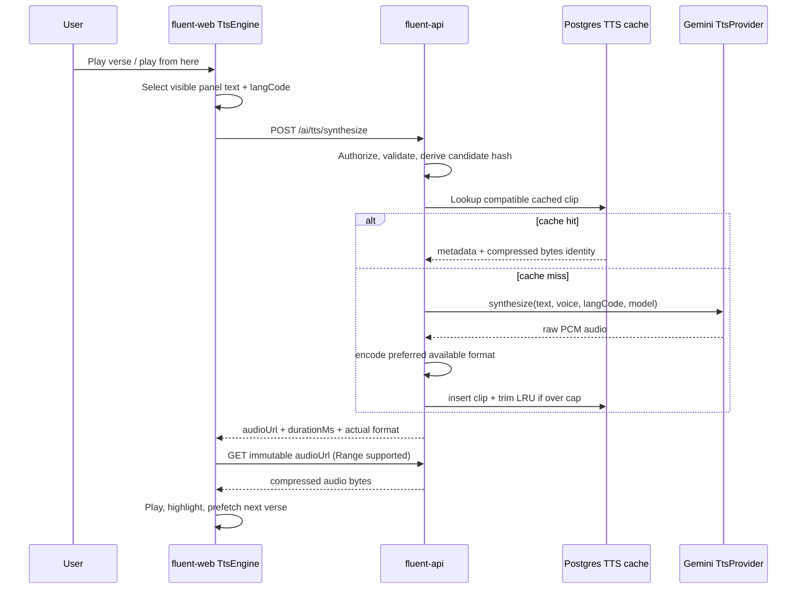

# Source-Text Text-to-Speech — Proposal

**Status:** Draft for product and engineering review.

**Reviewer shortcut:** A condensed, stands-on-its-own summary lives in [`source-tts-summary.md`](source-tts-summary.md).

**Scope:** Add source-text listening to Fluent, beginning in the drafting grid. The user-facing controls belong to fluent-web; synthesis, caching, and immutable audio delivery belong to fluent-api. **This proposal intentionally lives in fluent-web only even though the endpoint is implemented in fluent-api**, so reviewers can evaluate the interaction and its supporting contract as one design.

**Related work:**

- The Fluent project board contains an empty draft card titled **“Text to Speech”** (project item `PVTI_lADOB8vK1s4A34c5zgfByGU`). This proposal supplies the design substance for that item; the draft can be converted into implementation cards when the work is scheduled.
- [fluent-web#84 — Audio Recording](https://github.com/eten-tech-foundation/fluent-web/issues/84) is the existing placeholder for the target-side recording capability that should eventually mirror these source-side controls (§5.4, §13).

The proposal decisions are numbered **T1–T20**.

---

## 1. Problem and design goals

Fluent translators often work from source scripture in a language of wider communication. Listening can reveal phrasing, rhythm, punctuation, and missed words that visual reading alone does not. A source-text TTS control should therefore be fast to reach, comfortable to repeat, useful on touch devices, and able to read either source text visible in Fluent’s drafting grid.

The target language is often low-resource and may not have a suitable hosted voice. Version 1 consequently reads **source text only**. The design still separates UI, transport, and provider concerns so a future custom target-language model can be hosted in fluent-ai without rewriting fluent-web.

The governing principles are:

1. **Text, not scripture identity, is the backend resource.** The server synthesizes text and has no knowledge of projects, Bibles, books, chapters, or verses.
2. **The frontend owns playback sequencing.** Chapter and page behavior remain presentation concerns; the server stays one-text-in/one-clip-out.
3. **The protocol is much harder to change than the frontend presentation.** The first contract carries fields that future engines may need even when v1 exposes no corresponding knobs.
4. **Generated speech is a regenerable cache artifact.** User recordings are irreplaceable media and require a different storage posture.
5. **The visible text is the authority.** Both source-panel texts can be spoken, and playback always uses the panel’s current text.

## 2. Scope

### 2.1 In scope

1. Two source-side playback actions per verse: **play this verse** and **play from here**.
2. Continuous verse-by-verse playback with synchronized active highlighting, auto-scroll, one-clip-ahead prefetch, stop, and an explicit chapter-boundary prompt.
3. Keyboard shortcuts acting on the active verse and touch-target-sized controls.
4. A reusable fluent-web TTS feature module with a frontend `TtsEngine` seam.
5. A vendor-neutral fluent-api `TtsProvider` seam with Gemini TTS as the first provider.
6. `POST /ai/tts/synthesize` plus immutable, browser-cacheable audio `GET` delivery with HTTP Range support.
7. A standalone content-hash Postgres cache, storing compressed bytes and trimming least-recently-used entries beyond a configurable size cap.
8. Opus-in-Ogg preference, MP3 compatibility floor, and server-side format negotiation based on encoder capability.
9. A narrow `sourceTts` deployment flag, a view-level `TTS_USE` permission alias, one generous text-length tripwire, and loading/error UX.
10. Design seams for recording, alternating review playback, browser-local speech, fluent-ai custom models, and eventual R2/CDN storage without implementing those roadmap items now.

### 2.2 Explicitly out of scope for v1

- Target-side TTS.
- Target-side audio recording or recording storage.
- A voice picker, synthesis-time speed/pacing control, or user-facing engine preference.
- Silent navigation across chapter/page boundaries in drafting.
- Per-user quotas or rate limiting beyond the maximum-text-length tripwire.
- A fluent-ai dependency for the Gemini v1 provider.
- R2 storage, CDN delivery, signed URLs, or direct vendor delivery.
- Adoption of `ffmpeg.wasm` without a separate team decision.

---

## 3. Decisions summary

| #       | Decision                                                                                                                                                                                               | Short rationale                                                                                                               |
| ------- | ------------------------------------------------------------------------------------------------------------------------------------------------------------------------------------------------------ | ----------------------------------------------------------------------------------------------------------------------------- |
| **T1**  | Render **play verse**, **play from here**, and a shared stop action while audio is active. Continuous mode advances verse by verse with synchronized highlight and auto-scroll.                        | Matches the two listening tasks: inspect one verse or continue reviewing from a point.                                        |
| **T2**  | Make playback keyboard-first and use touch-target-sized controls. Shortcuts operate on the active verse.                                                                                               | Playback is repetitive and must not depend on small pointer targets.                                                          |
| **T3**  | Place reusable controls and queue logic under `features/tts/`, not inside the Bible feature.                                                                                                           | Other source-scripture surfaces should be able to adopt TTS later.                                                            |
| **T4**  | Reserve a symmetric target-side recording affordance using the same visual language and shared stop state; do not implement it in v1.                                                                  | Creates a coherent “listen here, record there” path aligned with fluent-web#84.                                               |
| **T5**  | Gemini TTS is called directly from fluent-api through `@google/genai`. A frontend `TtsEngine` and backend `TtsProvider` isolate the UI and vendor.                                                     | Avoids blocking on fluent-ai hosting and preserves a zero-web-change path to a future fluent-ai provider.                     |
| **T6**  | The synthesis request is text-addressed. The cache identity derives from normalized synthesis inputs, not verse/project IDs.                                                                           | Keeps the backend domain-neutral and enables cross-project cache hits.                                                        |
| **T7**  | fluent-web owns continuous sequencing and prefetches the next verse while the current clip plays.                                                                                                      | The client already owns highlight, scroll, stop, and boundary behavior.                                                       |
| **T8**  | `POST /ai/tts/synthesize` returns a full `audioUrl`, duration, and actual format; the browser then performs an immutable audio `GET` with Range support.                                               | Native `<audio>` playback, browser caching, seeking, and future CDN re-pointing come without returning large base64 payloads. |
| **T9**  | Compress once at synthesis time and store compressed bytes. Prefer Opus-in-Ogg; support MP3.                                                                                                           | Audio is substantially smaller than raw PCM, reducing Postgres cache pressure.                                                |
| **T10** | Keep same-origin cookie auth on the v1 audio GET, but do not make secrecy of the salted content URL a load-bearing control.                                                                            | The artifact is generated scripture audio; future signed/CDN URLs remain possible.                                            |
| **T11** | Expose no v1 synthesis knobs. Use one configured voice and client-side `playbackRate`; carry `voice`, `format`, optional `langCode`, and reserved pacing in the protocol.                              | One cached clip serves all playback speeds while the protocol remains extensible.                                             |
| **T12** | Add the narrow `sourceTts` flag backed by `EN_FEATURE_SOURCE_TTS`; ship dark until provider and encoder hosting are ready.                                                                             | Avoids an awkward generic `tts` flag that later conflicts with target TTS, recording, or local speech.                        |
| **T13** | Add `TTS_USE` as an alias of `project:view`, using the existing permission-alias pattern.                                                                                                              | Hearing follows seeing; edit-level gating would exclude reviewers and future read-only review flows.                          |
| **T14** | Enforce an env-configured maximum input length, proposed default 20,000 characters, returning a clear 400 error code. Defer rate limiting.                                                             | The cap is a generous misuse/integration tripwire, not an ordinary verse limit.                                               |
| **T15** | Store generated clips in a standalone Postgres cache and trim LRU entries beyond `TTS_CACHE_MAX_BYTES`.                                                                                                | TTS is cheap and regenerable; Postgres keeps v1 operationally simple. R2 remains a springable option.                         |
| **T16** | At the last verse in drafting, pause and ask whether to continue on the next page; never navigate silently.                                                                                            | Navigation can have commit/state side effects and needs conscious confirmation.                                               |
| **T17** | Make both source-panel texts listenable: the project source and the selected reference Bible.                                                                                                          | Either visible source may be the translator’s current reference, potentially in a different language.                         |
| **T18** | Carry optional `langCode` from day one and send it whenever known. Include it in cache identity.                                                                                                       | Gemini can treat it as a hint; a future custom provider may require it.                                                       |
| **T19** | Keep the paired suggestion and summary proposal documents in fluent-web only; implementation still spans fluent-web and fluent-api.                                                                    | One review surface presents the user experience and the contract that supports it.                                            |
| **T20** | Treat requested `format` as a preference. Probe native ffmpeg capability, fall back to a pure-JS MP3 encoder, and key/cache the actual format. Mention `ffmpeg.wasm` only as a development experiment. | Deployment capability must not turn a supported request into a dead feature.                                                  |

---

## 4. End-to-end architecture



### 4.1 Repository responsibilities

| Repo                | Implementation responsibility                                                                                                                                                                             |
| ------------------- | --------------------------------------------------------------------------------------------------------------------------------------------------------------------------------------------------------- |
| **fluent-web**      | Controls, keyboard handling, active-verse behavior, queue/sequencing, prefetch, highlight/scroll, source-panel text selection, format preference, playback rate, chapter-boundary prompt, feature gating. |
| **fluent-api**      | Auth/permission, provider configuration, Gemini SDK call, input cap, content hashing, encoder negotiation, Postgres cache/LRU, synthesis response, immutable audio GET/Range handling.                    |
| **fluent-ai**       | No v1 change. A later custom model can become another `TtsProvider` behind the same fluent-api endpoint.                                                                                                  |
| **fluent-platform** | Eventual secret/env and encoder packaging changes for deployment; no new service is required by the proposed architecture.                                                                                |

The endpoint’s location does not change the document location: **the proposal pair is intentionally committed only to fluent-web** (T19). The feature is experienced and sequenced in fluent-web, while this document records the fluent-api contract reviewers must approve before implementation is split into repo-specific PRs.

---

## 5. UI and interaction model

### 5.1 Per-verse controls (T1, T2, T17)

Each visible source verse gains two accessible controls:

- **Play this verse** (`▶`) synthesizes or reuses one clip and stops at its end.
- **Play from here** (`▶▶`) starts a verse queue at the active row and continues through the chapter.
- While any clip is loading or playing, a clearly visible **Stop** action is available. Stop cancels the client queue, pauses the active audio element, clears prefetched intent, and removes the playback highlight.

The controls use normal buttons with descriptive accessible names rather than icon-only semantics. Their hit areas meet the project’s touch sizing conventions even when the visual icon remains compact. Keyboard shortcuts trigger play-verse, play-from-here, and stop against the active verse; the exact key assignments should be selected during implementation after checking existing editor shortcuts for collisions and then documented in the UI/help surface.

Controls read whichever source panel is visible:

- panel 1: the project source (`verse.text`) and project-source language code;
- panel 2: the selected reference Bible (`bibleVerseMap`) and that Bible’s own language code.

A missing panel-2 verse has no playable text, so controls are disabled or omitted for that row. Placement is an implementation detail: one control set in the source column that follows the selected panel is likely the least-wired design.

### 5.2 Loading, failure, and non-blocking behavior — proposed default for review

On a cache miss, synthesis can take seconds. The proposed default is:

- replace the activated play icon with a spinner while synthesis resolves;
- keep target-text typing and navigation usable;
- allow Stop to cancel local playback intent even though aborting the HTTP request may not cancel billable provider work;
- show synthesis/playback failures through the project’s established toast pattern, with a concise retryable message;
- return the control to its idle state after failure, without leaving a stale highlight.

This is a **proposed default for review**, not an operator-settled interaction detail.

### 5.3 Continuous mode and chapter boundary (T7, T16)

Continuous playback is a frontend queue of `{ verseRef, text, langCode, audioSource }` items. While verse N plays, fluent-web requests verse N+1. Queue state should distinguish at least `playing`, `buffered`, and `synthesizing`; prefetch depth can increase later if real network conditions produce audible gaps.

At each clip transition, fluent-web:

1. marks the verse as the playback-active row;
2. scrolls it into view when necessary;
3. starts its already-buffered clip or displays a brief loading state;
4. requests the following clip;
5. stops cleanly when text is absent or the user presses Stop.

At the final verse in drafting, playback pauses and asks **“Continue on the next page?”** Only confirmation triggers navigation. This rule is entirely frontend-owned: a future read-only source-Bible surface may choose cross-page continuation without changing the API.

### 5.4 Recording dovetail (T4)

The source-side control language should reserve a mirrored target-side recording location:

```text
Source text                         Target text
[▶ Play] [▶▶ From here]             [● Record]   (future)
                 [■ Stop]            shared active-session stop
```

Recording is not part of this implementation. The purpose is to avoid a TTS layout that later makes fluent-web#84 feel bolted on. Generated source audio and recorded target audio can share playback-state presentation and queue items while retaining different storage/lifecycle rules.

---

## 6. fluent-web design

### 6.1 Frontend seam (T3, T5)

The control must depend on an engine interface rather than fetch or Web Speech directly:

```ts
interface TtsRequest {
  text: string;
  voice?: string;
  format: TtsFormat;
  langCode?: string;
  pacing?: { mode?: string }; // reserved; no v1 UI
}

interface TtsClip {
  audioUrl: string;
  durationMs: number;
  format: TtsFormat;
}

interface TtsEngine {
  synthesize(request: TtsRequest, signal?: AbortSignal): Promise<TtsClip>;
}
```

Proposed module shape:

```text
src/features/tts/
├── components/TtsVerseControls.tsx
├── engines/serverTtsEngine.ts
├── hooks/useTtsPlaybackQueue.ts
├── tts.types.ts
└── index.ts
```

`ServerTtsEngine` calls fluent-api. A future `WebSpeechTtsEngine` can implement the same UI-facing role even if its internal behavior is streaming/local rather than URL-returning; if that mismatch proves material, the interface can return a generic playable source rather than exposing vendor concepts to the component. The key requirement is that buttons and queue orchestration do not know whether audio is browser-local, fetched from Fluent, or ultimately produced by Gemini/fluent-ai.

### 6.2 Format preference and playback speed (T9, T11, T20)

At runtime, fluent-web selects a preferred request format using `HTMLAudioElement.canPlayType()`:

1. request `ogg-opus` when the browser reports confident support;
2. otherwise request `mp3`;
3. trust the response’s actual `format` and `Content-Type`, because format is negotiated rather than demanded.

Playback speed is applied through `audio.playbackRate`. It is deliberately absent from cache identity and does not trigger new synthesis. The protocol reserves pacing for a future synthesis-time option where cadence itself must change.

### 6.3 Feature gate (T12)

Add the camel-case wire flag `sourceTts`, backed by `EN_FEATURE_SOURCE_TTS`, to the existing feature registry and fail-closed frontend mirror. The flag follows the current four-edit discipline: fluent-api env schema, `FLAGS` registry, OpenAPI feature response, and `.env.example`, plus fluent-web’s named flag type/default.

Proposed derived default: when `EN_FEATURE_SOURCE_TTS` is unset, publish `sourceTts: true` only when `GOOGLE_AI_API_KEY` is non-empty; otherwise publish false. An explicit flag value overrides the derived default. This is a **proposed default for review** and lets deployments ship code safely before the secret and encoder story are ready.

---

## 7. fluent-api contract

### 7.1 `POST /ai/tts/synthesize` (T6, T8, T11, T14, T18, T20)

The endpoint is session-authenticated and guarded by `requirePermission(PERMISSIONS.TTS_USE)`. It accepts text rather than a verse identity:

```json
{
  "text": "In the beginning…",
  "format": "ogg-opus",
  "langCode": "en",
  "pacing": null
}
```

The example shows a v1 frontend request; the protocol additionally accepts the optional fields below.

Proposed request fields:

| Field      | Requirement         | Semantics                                                                                                                                                        |
| ---------- | ------------------- | ---------------------------------------------------------------------------------------------------------------------------------------------------------------- |
| `text`     | required, non-empty | Exact visible text to recite; rejected beyond `TTS_MAX_TEXT_LENGTH`.                                                                                             |
| `voice`    | optional            | Requested logical/provider voice; v1 frontend omits it and the configured default is used.                                                                       |
| `format`   | required            | Preference: `ogg-opus` or `mp3`; server may return another supported actual format.                                                                              |
| `langCode` | optional            | Language hint sent whenever fluent-web knows it; use a documented BCP-47/ISO-compatible representation.                                                          |
| `pacing`   | optional/reserved   | Accepted protocol slot for future synthesis-time pacing; v1 should reject unsupported non-null values or define a no-op policy explicitly before implementation. |

Success response:

```json
{
  "audioUrl": "https://fluent.example/ai/tts/audio/9f2ac1d47b…e03.ogg",
  "durationMs": 4380,
  "format": "ogg-opus",
  "contentType": "audio/ogg"
}
```

The response reports the **actual** encoded format. A requested `ogg-opus` may return MP3 when no Opus encoder is available. `audioUrl` is a full URL, not a bare database id, so later R2/CDN/fluent-ai delivery can be selected entirely server-side.

Validation/error outline:

- `400 TTS_TEXT_TOO_LONG` with the configured maximum when `text` exceeds the tripwire;
- `400 TTS_INVALID_REQUEST` for malformed/empty input;
- `403` through existing permission middleware;
- `502 TTS_PROVIDER_UNAVAILABLE` for provider failure after retry policy, without exposing vendor secrets;
- `500 TTS_ENCODING_FAILED` only if no supported encoder path succeeds (the pure-JS MP3 floor is intended to make this rare).

The proposed default `TTS_MAX_TEXT_LENGTH=20000` is intentionally far above a verse. It catches accidental chapter/book submission or abuse without acting as a normal product limit. Rate limiting and user quotas are deferred until usage data justifies them.

### 7.2 Immutable audio `GET` (T8, T10, T15)

The returned URL resolves to an immutable representation, for example:

```http
GET /ai/tts/audio/{opaqueContentToken}
```

Required behavior:

- same-origin cookie authentication in v1;
- `requirePermission(PERMISSIONS.TTS_USE)` where practical, while URL secrecy/auth is not treated as the sole protection boundary;
- correct `Content-Type` and `Content-Length`;
- `Accept-Ranges: bytes`, `206 Partial Content`, and valid `Content-Range` handling;
- long-lived immutable cache headers because the token identifies encoded content;
- `404` after eviction;
- no synthesis side effect on GET.

A stale URL is self-healing: fluent-web treats a 404 as an evicted cache entry, repeats the POST, and receives a current URL. The opaque token should be derived with a server-held salt/HMAC rather than exposing an unsalted hash of text inputs. Defeating it is still low impact—the result is listening to generated scripture—but signed URLs remain the designated future path for cross-origin/CDN delivery.

---

## 8. Provider seam and Gemini implementation

### 8.1 Backend seam (T5)

fluent-api owns a small provider-neutral interface:

```ts
interface TtsProviderRequest {
  text: string;
  voice: string;
  model: string;
  langCode?: string;
  pacing?: { mode?: string };
}

interface PcmAudio {
  bytes: Buffer;
  sampleRateHz: number;
  channels: number;
  bitDepth: number;
  providerMetadata?: Record<string, unknown>;
}

interface TtsProvider {
  synthesize(request: TtsProviderRequest): Promise<PcmAudio>;
}
```

Encoding and caching remain outside the provider. This prevents Gemini’s raw-audio shape, model names, and SDK types from leaking into route/cache code. A later `FluentAiTtsProvider` can call a custom fluent-ai endpoint and return the same internal PCM result; provider selection may then be config-based or language-routed with no fluent-web contract change.

### 8.2 Current Gemini API facts (verified July 14, 2026)

Google currently documents Gemini TTS as **Preview**. Preview models may change before stability and can carry more restrictive rate limits. Current supported TTS names include:

- `gemini-3.1-flash-tts-preview` — current Flash TTS preview; supports single/multi-speaker output and streaming; the model in Google’s current-surface examples;
- `gemini-2.5-flash-preview-tts` — cheaper Flash TTS preview, documented under the older Generate Content surface;
- `gemini-2.5-pro-preview-tts` — higher-cost Pro TTS preview, likewise on the older surface.

The proposed v1 default is **`TTS_MODEL=gemini-3.1-flash-tts-preview`**, flagged for review. Published paid-tier pricing at verification is **$1 per million text-input tokens and $20 per million audio-output tokens** (standard, non-batch; audio is billed at 25 tokens per second, ≈ $0.0005 per generated second before cache reuse). The older `gemini-2.5-flash-preview-tts` is cheaper ($0.50 input / $10 audio per million tokens) but lives on the API surface Google now labels Legacy (see the note below). The model name and prices are not protocol constants; operations must be able to change `TTS_MODEL` without a frontend release.

The recommended call uses Google’s current **Interactions API** surface of `@google/genai` (exact property casing should follow the SDK typings at implementation time):

```ts
const ai = new GoogleGenAI({ apiKey: env.GOOGLE_AI_API_KEY });

const interaction = await ai.interactions.create({
  model: env.TTS_MODEL, // gemini-3.1-flash-tts-preview
  input: request.text,
  response_format: { type: 'audio' },
  generation_config: {
    speech_config: [{ voice: request.voice }],
  },
});

const base64 = interaction.output_audio?.data;
```

The returned audio data is raw **24 kHz, mono, 16-bit PCM** encoded as base64. fluent-api must validate that the audio output exists, decode it to a `Buffer`, and pass explicit PCM metadata to the encoder.

**API-surface caveat found while verifying:** Google’s TTS documentation is mid-transition. The older Generate Content TTS surface (`models.generateContent` with `responseModalities: ['AUDIO']`) is now explicitly titled **Legacy**, and Google recommends the Interactions API “for access to all the latest features and models.” The Interactions surface is itself labeled **Beta**, so the recommendation above knowingly pairs a preview model with a beta API — acceptable for a flag-gated, non-critical feature, and this proposal does not build on a surface the vendor has already deprecated. Implementation should re-check the current documentation when the provider is built and follow whatever surface Google then recommends for the configured `TTS_MODEL`. This is exactly the kind of vendor churn the `TtsProvider` seam exists to absorb: the surface choice lives inside `GeminiTtsProvider` and never reaches the route, cache, or fluent-web.

Language is usually auto-detected. `langCode` remains advisory input for Gemini—potentially incorporated into a short instruction only where that does not compromise exact recitation—and remains a first-class provider field because a future low-resource engine may require it.

### 8.3 Why the Google key belongs on fluent-api in v1

This introduces `GOOGLE_AI_API_KEY` to fluent-api even though fluent-ai may also hold a Google key. That duplication is the cheaper and simpler side of the trade:

1. Routing v1 TTS through fluent-ai would block the feature on fluent-ai being hosted at all.
2. The extra service would add a pure HTTP-proxy hop with no Python-specific value.
3. Raw or encoded audio would have to be pushed through fluent-ai’s JSON `ToolJobResponse`-oriented path or require a second media contract there before TTS could ship.
4. The content cache belongs with the database owner. The Fluent Postgres schema is defined and migrated by fluent-api (drizzle); adding the `tts_audio_cache` table there is one ordinary migration. Placing the cache in fluent-ai would either tie a deliberately generic, multi-consumer service into a database whose schema another service controls, or require duplicating migration tooling on the Python side — both awkward couplings and best reserved for future complexity of a custom TTS model.
5. The same secret in two app settings is operationally small compared with another runtime dependency and audio proxy layer.
6. The `TtsProvider` seam preserves consolidation: once a custom model belongs in fluent-ai, fluent-api can switch providers without changing `POST /ai/tts/synthesize` or fluent-web. The cache and its drizzle-managed table stay in fluent-api either way, keeping fluent-ai stateless and consumer-agnostic.

The recommended path is therefore direct Gemini access from fluent-api for v1, not because fluent-ai is permanently excluded, but because requiring it now adds deployment and transport complexity without adding capability.

### 8.4 Proposed environment defaults — flagged for review

| Variable                | Proposed default/purpose                                                                   |
| ----------------------- | ------------------------------------------------------------------------------------------ |
| `GOOGLE_AI_API_KEY`     | New required secret when source TTS is enabled.                                            |
| `TTS_MODEL`             | `gemini-3.1-flash-tts-preview`; configurable because preview names can change.             |
| `TTS_VOICE`             | `Kore`; one deployment-wide voice in v1.                                                   |
| `TTS_MAX_TEXT_LENGTH`   | `20000`; generous tripwire.                                                                |
| `TTS_CACHE_MAX_BYTES`   | Deployment-selected byte cap; no universal number proposed without database capacity data. |
| `EN_FEATURE_SOURCE_TTS` | Optional explicit on/off; unset derives true only from a present Google key.               |

The model/env names above are **proposed defaults for operator and hosting review**, not settled external contracts.

---

## 9. Content-hash Postgres cache (T6, T9, T15, T18, T20)

### 9.1 Identity and lookup

The cache is standalone and has no foreign key to scripture tables. A canonical identity document should include all inputs that can change generated or encoded bytes:

```json
{
  "schemaVersion": 1,
  "text": "exact request text",
  "voice": "Kore",
  "model": "gemini-3.1-flash-tts-preview",
  "langCode": "en",
  "pacing": null,
  "actualFormat": "ogg-opus",
  "encoderProfile": "opus-speech-v1"
}
```

Hash a stable serialization with SHA-256 for internal lookup. Normalize only contractually irrelevant representation (for example, absent optional fields to a canonical null); do **not** trim, case-fold, or otherwise alter spoken text. Including `langCode` avoids treating differently hinted synthesis as identical and relies on fluent-web sending known language codes consistently.

Format negotiation means lookup may consider the preferred format first and the always-available MP3 representation second. The stored key is always based on **actual format**, not merely requested format. Multiple encodings may coexist for the same speech inputs.

### 9.2 Proposed table

```text
tts_audio_cache
- id / opaque token source
- content_hash (unique with actual format/profile)
- model
- voice
- lang_code nullable
- format
- content_type
- audio_bytes (bytea)
- duration_ms
- size_bytes
- last_accessed_at
- created_at
```

`last_accessed_at` updates on a successful POST cache hit and may also update on GET using a write-throttled strategy. Exact per-GET writes would create unnecessary database churn; implementation can coalesce touches (for example, update only when the stored timestamp is older than a threshold) while preserving approximate LRU ordering.

### 9.3 LRU trimming and concurrency

After insertion, trim oldest entries until total `size_bytes <= TTS_CACHE_MAX_BYTES`. The first implementation can perform bounded deletion in the request path or enqueue a lightweight cleanup without introducing another service. Insert races on the same hash use a unique constraint plus conflict-safe readback, so concurrent first requests pay at most an avoidable duplicate provider call but store one row.

Cache deletion is safe and self-healing. Generated clips cost money but are reproducible; target recordings are human-created, irreplaceable artifacts and must not inherit this eviction policy. R2 is a natural future destination for either a larger TTS cache or direct immutable delivery—especially alongside recording work—but Postgres is the recommended v1 simplification.

---

## 10. Encoding and format negotiation (T9, T20)

Gemini returns raw PCM, so a browser-efficient format must be produced before storage.

### 10.1 Capability order

At startup or first use, fluent-api probes encoder capability:

1. **Native/system ffmpeg:** execute an available binary and confirm the needed encoder/muxer rather than assuming installation. For Opus-in-Ogg, verify a usable Opus encoder (prefer `libopus`) and Ogg output.
2. **Packaged `ffmpeg-static`:** a possible deployment convenience if system ffmpeg is unavailable. It provides platform-specific static binaries, but package/binary licensing and target-platform packaging must be reviewed with hosting before adoption.
3. **Pure-JavaScript MP3 floor:** keep an encoder such as `lamejs` available so Node can encode mono PCM without a native binary. This is the reliability floor, not necessarily the preferred long-term library; maintenance/security suitability should be checked during implementation.
4. **`ffmpeg.wasm` reference-only experiment:** it demonstrates that FFmpeg can run through WebAssembly without a native install, but official project documentation describes browser-only support, slower-than-native performance, a substantial core payload, and codec-dependent licensing. It may be tested in development for broader Fluent audio needs, but is **not adopted by this proposal**.

### 10.2 Negotiation behavior

- If the client requests `ogg-opus` and native ffmpeg can produce the approved profile, encode/store/return Ogg Opus.
- If Opus is unavailable, encode/store/return MP3 silently through the available MP3 path.
- If the client requests MP3, use native ffmpeg or the pure-JS encoder according to the selected implementation policy.
- Declare the actual `format` and `Content-Type` in POST metadata and GET headers.
- Include encoder profile/version in cache identity when changing it could change bytes or compatibility.
- Log the detected encoder matrix at startup and expose it in diagnostics/health detail without leaking secrets.

The fallback is silent from the user’s perspective because both results satisfy “play this text.” It must not be silent operationally: logs and diagnostics should make an unexpected all-MP3 deployment visible.

---

## 11. Authorization, rollout, and cost posture

### 11.1 View-level permission alias (T13)

Add a documented alias alongside `AI_TOOLS_USE`:

```ts
TTS_USE: 'project:view',
```

Both POST and same-origin GET use `PERMISSIONS.TTS_USE`. This names the capability at route call sites while reusing the existing RBAC row. Promotion to a distinct permission later requires a new permission row/role mappings and one string-value change, not route rewrites.

The view-level alias is deliberate: anyone allowed to see source scripture should be allowed to hear it. Reusing `content:update` would exclude reviewers and undermine the planned alternating review mode.

### 11.2 Security and abuse controls

- Never expose `GOOGLE_AI_API_KEY` to fluent-web.
- Validate text length before hashing/provider work.
- Avoid logging full source text or provider payloads at ordinary log levels.
- Return stable Fluent error codes rather than raw SDK errors.
- Keep same-origin session auth in v1 and validate normal project access at the UI surface; the TTS route’s coarse permission remains view-level because the text-addressed backend intentionally has no project id.
- Monitor cache misses, generated seconds/bytes, provider failures, and encoder fallback rates.
- Defer rate limits until observed use warrants them; the 20,000-character cap is the only v1 request guardrail beyond normal auth.

### 11.3 Rollout

1. Merge implementation dark behind `sourceTts`.
2. Provision `GOOGLE_AI_API_KEY`, model/voice, and cache limits in a non-production environment.
3. Confirm actual encoder capability and browser playback across supported platforms.
4. Enable for internal testing and inspect latency, cache-hit rate, provider cost, and Postgres growth.
5. Enable more broadly only after preview-model behavior and hosting packaging are accepted.

---

## 12. Testing

### 12.1 fluent-web

| Area        | Representative cases                                                                                                                                           |
| ----------- | -------------------------------------------------------------------------------------------------------------------------------------------------------------- |
| Controls    | Both play actions use visible panel text; missing reference verse is not playable; spinner/stop/error states; accessible labels and touch targets.             |
| Keyboard    | Shortcuts act on active verse and do not collide with typing/editor shortcuts; stop is global to active playback.                                              |
| Queue       | Play-one stops; play-from-here advances, highlights, scrolls, prefetches; stop clears queue; network gap state; chapter-end confirmation/no silent navigation. |
| Engine seam | Server engine request includes format and known `langCode`; cancellation is local-safe; 404 audio triggers one re-POST.                                        |
| Format      | `canPlayType()` preference; actual response format accepted when different; playback rate does not resynthesize.                                               |
| Flags       | `sourceTts=false` hides controls; loading/failure remains fail-closed.                                                                                         |

### 12.2 fluent-api

| Area            | Representative cases                                                                                                                              |
| --------------- | ------------------------------------------------------------------------------------------------------------------------------------------------- |
| Route/auth      | 401 unauthenticated, 403 without view permission, input validation, stable errors, 20k-default boundary.                                          |
| Provider        | Mock `TtsProvider`; decode documented Gemini base64 PCM shape; absent/malformed candidate handling; secret never returned/logged.                 |
| Cache           | Canonical hash, cross-project same-text hit, language/model/voice/format separation, insert race, LRU order/trim, stale URL 404 and re-synthesis. |
| Negotiation     | Opus available, requested Opus unavailable→MP3, requested MP3, actual metadata/key correctness, total encoder failure.                            |
| Audio GET       | Correct MIME/length, immutable caching, valid/invalid/suffix Range requests, 206/416 behavior, no synthesis on GET.                               |
| Feature default | unset flag + key ⇒ on; unset + no key ⇒ off; explicit true/false wins.                                                                            |

A provider integration smoke test should synthesize a short non-sensitive fixture against the configured preview model, verify PCM metadata, encode both available output profiles, and play/probe the resulting files. It should be opt-in so ordinary tests never incur provider cost.

---

## 13. Future roadmap (designed for, not built)

1. **Target-side recording dovetail (fluent-web#84):** mirrored record controls, shared playback/recording stop presentation, and durable recording storage. Recordings should follow the mobile precedent toward R2, never the evictable TTS cache policy.
2. **Alternating review mode:** queue source TTS verse 1 → recorded target verse 1 → source TTS verse 2 → recorded target verse 2. Queue items should therefore pair a verse reference with a generic audio source, not assume every item comes from `TtsEngine`.
3. **Browser-local Web Speech option:** a future per-user `server | local` preference can trade voice consistency for zero provider cost and better behavior on weak connections. Voice availability/quality remains device-dependent.
4. **Custom low-resource engine in fluent-ai:** add `FluentAiTtsProvider`, select by config or language, retain the fluent-web contract and controls unchanged.
5. **Voice picker and synthesis-time pacing:** activate already-reserved request fields; both become cache-key inputs when they affect generated bytes. Client `playbackRate` remains the cheap speed control.
6. **R2/CDN/signed delivery:** move compressed bytes out of Postgres when scale or recordings infrastructure justifies it. Continue returning a full `audioUrl`; use signed URLs/CORS policy where direct cross-origin delivery requires them.
7. **Read-only and source-Bible listening surfaces:** reuse `features/tts/`; those surfaces may choose continuous playback across page breaks because boundary policy is frontend-owned.
8. **Gemini streaming:** the proposed 3.1 Flash TTS preview supports streaming. It may reduce first-audio latency later, but complicates immutable whole-clip caching and is not needed for the verse-sized v1 contract.
9. **Rate limiting and budget controls:** add only with usage evidence, using metrics collected from v1 rather than guessing quotas now.

---

## 14. Review checklist

The design decisions T1–T20 are the recommended path. Review input is particularly valuable on the two proposed-default areas and deployment feasibility:

| #      | Item for review                 | Proposed resolution                                                                                                                                                                                                                                                                 |
| ------ | ------------------------------- | ----------------------------------------------------------------------------------------------------------------------------------------------------------------------------------------------------------------------------------------------------------------------------------- |
| **R1** | Env/model/voice names           | `GOOGLE_AI_API_KEY`, `TTS_MODEL=gemini-3.1-flash-tts-preview`, `TTS_VOICE=Kore`, `TTS_MAX_TEXT_LENGTH=20000`, `TTS_CACHE_MAX_BYTES`.                                                                                                                                                |
| **R2** | Loading/error UX                | Spinner on activated play control, persistent Stop for local intent, non-blocking editor, established toast on failure.                                                                                                                                                             |
| **R3** | Native encoder availability     | Prefer probed system ffmpeg/libopus; evaluate `ffmpeg-static`; retain pure-JS MP3 as floor.                                                                                                                                                                                         |
| **R4** | New Google secret on fluent-api | Accept the duplicate app-setting placement for v1 because it avoids an unhosted service dependency, a proxy-only hop, and audio through a JSON tool envelope, and keeps the cache table with fluent-api’s drizzle-owned schema; preserve later consolidation through `TtsProvider`. |
| **R5** | Postgres cache capacity         | Hosting selects `TTS_CACHE_MAX_BYTES`; verify expected database/storage/back-up impact before enablement.                                                                                                                                                                           |

No PR should implement the roadmap items in §13 as part of v1. Review approval should confirm the core contract, seams, cache posture, and proposed defaults before repo-specific implementation cards/PRs are opened.

---

## 15. Verification sources

External facts in §§8 and 10 were rechecked while drafting on July 14, 2026:

- [Google Gemini TTS documentation](https://ai.google.dev/gemini-api/docs/speech-generation) — Preview status, supported model family, the Interactions API call shape shown in §8.2, voices, and raw PCM characteristics.
- [Google Generate Content TTS documentation](https://ai.google.dev/gemini-api/docs/generate-content/speech-generation) — the older `models.generateContent` TTS surface; the page is now titled **Legacy**, which is why this proposal recommends the Interactions API instead (see the §8.2 caveat).
- [Google Gemini API pricing](https://ai.google.dev/gemini-api/docs/pricing) — current TTS token prices for the 3.1 Flash and 2.5 Flash/Pro previews and the preview caveat.
- [`@google/genai` repository](https://github.com/googleapis/js-genai) — supported server-side SDK and API-key initialization.
- [`ffmpeg-static`](https://github.com/eugeneware/ffmpeg-static) — platform-specific packaged binary feasibility and licensing/packaging caveats.
- [`lamejs`](https://www.npmjs.com/package/lamejs) — pure-JavaScript Node/browser MP3 encoding feasibility.
- [`ffmpeg.wasm` documentation](https://ffmpegwasm.netlify.app/docs/overview/) — browser-focused WebAssembly option; its performance, installation, and licensing notes are why it remains reference-only.

---

_Prepared against fluent-web `main` and the current Gemini/encoding documentation on 2026-07-14. Author: Joshua Lansford._
