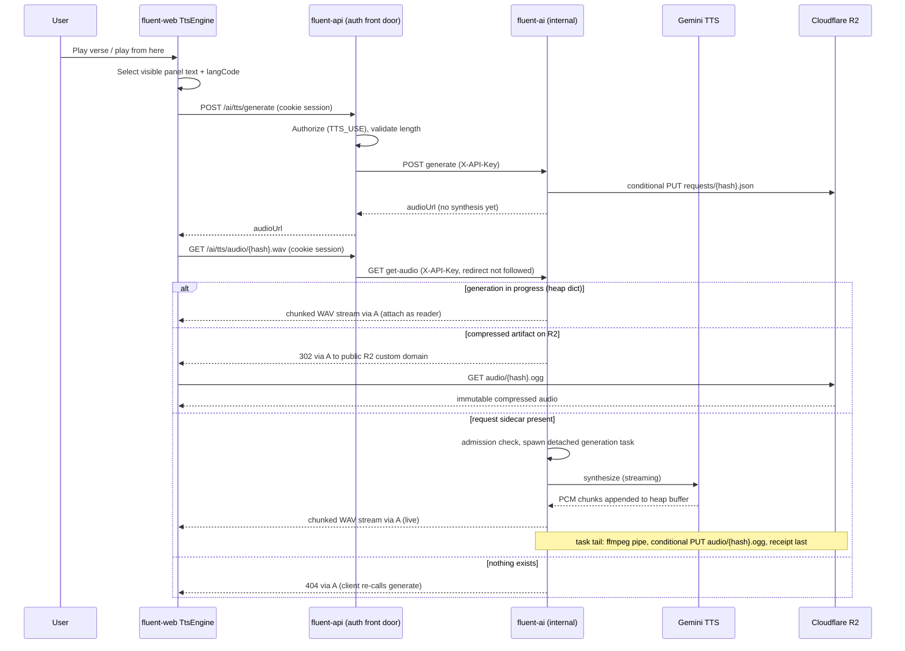

# Source-Text Text-to-Speech — Proposal

**Status:** Revised after the second engineering review round (PR #356, kaseywright, 2026-07-21). Draft for re-review.

**Reviewer shortcut:** A condensed, stands-on-its-own summary lives in [`source-tts-summary.md`](source-tts-summary.md).

**Scope:** Add source-text listening to Fluent, beginning in the drafting grid. The user-facing controls belong to fluent-web; synthesis, artifact storage, and audio delivery belong to **fluent-ai**, with fluent-api acting as the authenticated front door for both generation and audio fetches — fluent-ai itself stays an internal service. **This proposal intentionally lives in fluent-web only even though endpoints are implemented in fluent-ai and fluent-api**, so reviewers can evaluate the interaction and its supporting contract as one design.

## Revision history

**Changes in response to the 2026-07-23 CodeRabbit review (CB1–CB6, all six addressed):**

- **Client retries are bounded and cancellable.** The engine seam’s quiet retries get a stated cap (2 per failure class per clip, proposed default), `Retry-After`/fixed-backoff delays, and every retry timer is scheduled under the clip’s `AbortSignal`; exhaustion surfaces the toast + idle control. Alongside this, playback is pinned to **one uniform element-owned path** (prefetch = early element + `preload="auto"` + `load()`; element errors classified by a fetch HEAD re-probe), and continuous-mode prefetch depth is explicitly capped at 1–2 verses ahead (§5.2, §5.3, §6.1).
- **`format` is optional, resolved before hashing.** The request-table contradiction with `TTS_DEFAULT_FORMAT` is resolved: fluent-ai resolves the default before hashing and sidecar creation, so “omitted” never exists past the API edge; the v1 frontend omits `format` unless `canPlayType` reports no Opus support (§6.1, §7.1, §8.4, §10.1).
- **`audioUrl` is a sibling-relative URL reference.** fluent-ai returns `audio/{hash}.{ext}` relative to the request URL rather than minting a URL for a host it has no config for; resolution lands on whichever front door the caller used, and the mirrored-tail route convention becomes a stated contract requirement (§7.1, §12).
- **Identity is described as recipe-addressed.** Nondeterministic providers may render one recipe differently; the conditional PUT is first-writer-wins with defined losing-stream behavior, and the PUT pair is recast as storage-level dedup (provider-call dedup is the in-process dict + T26 routing) (§9.1, §10.1, §11.2).
- **Admission-semaphore sizing is stated.** Slots = ⌊`TTS_MAX_BUFFERED_BYTES` / per-clip ceiling⌋ (worst-case byte reservation) plus a per-append ceiling abort for misbehaving providers, with a cap-boundary test added (§9.2, §12.3).
- **The summary no longer overclaims fetch authorization** — the compressed R2 URL is described as a bearer capability (creation is authorized; reads are capability-gated), matching §7.3/§11.1.

**Changes in response to the 2026-07-21 review (RC1–RC6, all six addressed):**

- **Disk staging is gone; generation buffers live in heap RAM.** fluent-ai's production container has a read-only root filesystem, so the previous `.wav.incomplete` staging design had no writable home. Synthesis now buffers PCM in process memory under an **enforced** byte budget (`TTS_MAX_BUFFERED_BYTES` + admission control, §9.2) rather than an estimated disk/tmpfs footprint. No tmpfs mount, no container change, no janitor.
- **Generation is lazy and sidecar-driven.** `generate` no longer synthesizes: it writes an immutable **request sidecar** (the full synthesis recipe) to R2 and returns the audio URL. The first `get-audio` for that hash spawns the actual generation — and because any replica can regenerate from the sidecar, cross-replica serving self-heals instead of breaking.
- **One sidecar became two.** The old JSON sidecar's roles are split: `requests/{hash}.json` is the immutable capability/recipe; `receipts/{hash}.json` is best-effort metadata only. The audio object itself is self-certifying — nothing load-bearing depends on a receipt (a required commit marker would recreate a stuck-lock trap).
- **The serving default flips to option (b): fluent-api proxies `get-audio`.** fluent-ai keeps zero public ingress; the only public surface is the static R2 bucket domain, to which post-compression requests are 302-redirected so heavy bytes bypass both services. Option (a) direct serving is now the documented future path, priced honestly as a public-ingress deployment change.
- **Instance topology becomes a declared deployment requirement, not a solved coordination design: one fluent-ai instance, or static routing of `get-audio` requests to instances (hash/path).** The proposal does not presume knowledge of fluent-ai's current instance count or coordination facilities; it hands deployment the requirement plus a satisfaction ladder, and correctness never depends on it (the sidecar self-heal guarantees that) — an unmet requirement only costs duplicate synthesis. "Exactly one worker process per container" is a hard requirement. The former lifespan compression poller is gone — compression is the tail of each generation task — but workers=1 remains required for the per-process RAM budget and in-process dedup.
- **`durationMs` is dropped from the `generate` response.** A streaming first listen genuinely has no known duration; exact duration comes free from the compressed container afterward. The receipt keeps a best-effort copy.

**Changes in response to the 2026-07-15 review (K1–K3), retained from the previous revision:**

- **TTS synthesis moved from fluent-api into fluent-ai.** fluent-api no longer calls Gemini or holds a Google key; it keeps only the authenticated proxy role it already provides for other AI tools.
- **The Postgres cache is eliminated entirely.** Generated audio is a content-addressed artifact on Cloudflare R2; no database table anywhere.
- **Artifact identity is an HMAC over a canonical versioned recipe**, with providers declaring non-byte-affecting fields — for Gemini, `langCode` is normalized out of the hash input, so hinted and unhinted requests share one artifact and one billing event.
- **Transcoding uses ffmpeg via a Python package bundling the binary** (suggested); the team's containerized ffmpeg (klappy/transcode-mcp) is documented as a workable alternative.
- **Gemini facts refreshed (2026-07-16):** the Interactions API is now **GA**, and TTS streaming is verified available for models ≥ 3.1 including the proposed default.
- **Feature-flag semantics aligned with the repeated-word-check precedent:** the flag only hides frontend UI; the backend never disables the service.

**Related work:**

- The Fluent project board contains an empty draft card titled **“Text to Speech”** (project item `PVTI_lADOB8vK1s4A34c5zgfByGU`). This proposal supplies the design substance for that item; the draft can be converted into implementation cards when the work is scheduled.
- [fluent-web#84 — Audio Recording](https://github.com/eten-tech-foundation/fluent-web/issues/84) is the existing placeholder for the target-side recording capability that should eventually mirror these source-side controls (§5.4, §13).
- fluent-mobile’s recording work (its R2 sync contract) establishes the team precedent this revision follows: audio artifacts live in Cloudflare R2, not Postgres.

The proposal decisions are numbered **T1–T26**. Decisions changed in the first review round are marked **(revised 2026-07-16)**; decisions changed or introduced by the second round's heap/lazy-generation redesign are marked **(revised 2026-07-21)** or **(new 2026-07-21)**.

---

## 1. Problem and design goals

Fluent translators often work from source scripture in a language of wider communication. Listening can reveal phrasing, rhythm, punctuation, and missed words that visual reading alone does not. A source-text TTS control should therefore be fast to reach, comfortable to repeat, useful on touch devices, and able to read either source text visible in Fluent’s drafting grid.

The target language is often low-resource and may not have a suitable hosted voice. Version 1 consequently reads **source text only**. The design still separates UI, transport, and provider concerns so a future custom target-language model can be added inside fluent-ai without rewriting fluent-web.

The governing principles are:

1. **Text, not scripture identity, is the backend resource.** The server synthesizes text and has no knowledge of projects, Bibles, books, chapters, or verses.
2. **The frontend owns playback sequencing.** Chapter and page behavior remain presentation concerns; the server stays one-text-in/one-clip-out.
3. **The protocol is much harder to change than the frontend presentation.** The first contract carries fields that future engines may need even when v1 exposes no corresponding knobs.
4. **Generated speech is a regenerable artifact, and the artifact either exists or it does not.** Content-addressed storage is the single source of truth; there is no tracking database whose state could disagree with the bytes. User recordings are irreplaceable media and require a different storage posture.
5. **The visible text is the authority.** Both source-panel texts can be spoken, and playback always uses the panel’s current text.
6. **AI integrations live in one place.** fluent-ai owns every external AI-service call; fluent-api remains an authenticated passthrough for AI tooling, per the established service split — and fluent-ai itself acquires no public ingress.
7. **Correctness never depends on request routing.** Any replica can serve or regenerate any artifact from durable state; routing choices (affinity, hashing, replica count) only bound duplicate synthesis cost, never correctness.

## 2. Scope

### 2.1 In scope

1. Two source-side playback actions per verse: **play this verse** and **play from here**.
2. Continuous verse-by-verse playback with synchronized active highlighting, auto-scroll, one-clip-ahead prefetch, stop, and an explicit chapter-boundary prompt.
3. Keyboard shortcuts acting on the active verse and touch-target-sized controls.
4. A reusable fluent-web TTS feature module with a frontend `TtsEngine` seam.
5. A `generate` endpoint in fluent-ai (reached through fluent-api’s existing authenticated AI proxy) that records an immutable **request sidecar** on R2 and returns the audio URL, and a `get-audio` endpoint (also fronted by fluent-api) that streams in-progress synthesis or redirects to the compressed artifact.
6. Content-addressed artifact identity: an HMAC over a canonical, versioned synthesis recipe, with provider-declared normalization of non-byte-affecting fields.
7. Lazy, detached, **in-heap** generation in fluent-ai under an enforced per-process RAM budget with admission control, live streaming of in-progress synthesis, and a serving waterfall backed by R2.
8. Compression as the tail of each generation task: ffmpeg transcode of the heap buffer, conditional upload of the audio object plus a best-effort receipt sidecar to Cloudflare R2.
9. A narrow `sourceTts` frontend-visibility flag, a view-level `TTS_USE` permission alias on the fluent-api proxy, one generous text-length tripwire, and loading/error UX.
10. Design seams for recording, alternating review playback, browser-local speech, and custom fluent-ai models without implementing those roadmap items now.

### 2.2 Explicitly out of scope for v1

- Target-side TTS.
- Target-side audio recording or recording storage.
- A voice picker, synthesis-time speed/pacing control, or user-facing engine preference.
- Silent navigation across chapter/page boundaries in drafting.
- Per-user quotas or rate limiting beyond the maximum-text-length tripwire.
- Any Postgres/database storage for generated audio or its metadata.
- Any local-filesystem or tmpfs staging: fluent-ai’s container filesystem is read-only, and generation is heap-buffered by design (§9.2).
- Artifact eviction or lifecycle deletion from R2 (growth is consciously accepted; §11.4).
- Adoption of a remote/shared transcoding service as a v1 dependency (documented as an alternative; §10).

---

## 3. Decisions summary

| #                            | Decision                                                                                                                                                                                                                                                                                                                                                                                                                                                                                                                                                                           | Short rationale                                                                                                                                                                                                                                   |
| ---------------------------- | ---------------------------------------------------------------------------------------------------------------------------------------------------------------------------------------------------------------------------------------------------------------------------------------------------------------------------------------------------------------------------------------------------------------------------------------------------------------------------------------------------------------------------------------------------------------------------------- | ------------------------------------------------------------------------------------------------------------------------------------------------------------------------------------------------------------------------------------------------- |
| **T1**                       | Render **play verse**, **play from here**, and a shared stop action while audio is active. Continuous mode advances verse by verse with synchronized highlight and auto-scroll.                                                                                                                                                                                                                                                                                                                                                                                                    | Matches the two listening tasks: inspect one verse or continue reviewing from a point.                                                                                                                                                            |
| **T2**                       | Make playback keyboard-first and use touch-target-sized controls. Shortcuts operate on the active verse.                                                                                                                                                                                                                                                                                                                                                                                                                                                                           | Playback is repetitive and must not depend on small pointer targets.                                                                                                                                                                              |
| **T3**                       | Place reusable controls and queue logic under `features/tts/`, not inside the Bible feature.                                                                                                                                                                                                                                                                                                                                                                                                                                                                                       | Other source-scripture surfaces should be able to adopt TTS later.                                                                                                                                                                                |
| **T4**                       | Reserve a symmetric target-side recording affordance using the same visual language and shared stop state; do not implement it in v1.                                                                                                                                                                                                                                                                                                                                                                                                                                              | Creates a coherent “listen here, record there” path aligned with fluent-web#84.                                                                                                                                                                   |
| **T5 (revised 2026-07-16)**  | Gemini TTS is called from **fluent-ai**, which owns all external AI integrations. fluent-web reaches it through fluent-api’s existing authenticated AI proxy. A frontend `TtsEngine` seam still isolates the UI from transport.                                                                                                                                                                                                                                                                                                                                                    | Review outcome: one home for AI logic; fluent-api stays a passthrough; no duplicate Google key.                                                                                                                                                   |
| **T6 (revised 2026-07-16)**  | The synthesis request is text-addressed. Artifact identity is an **HMAC (server secret) over a canonical, versioned recipe** of byte-affecting inputs; each provider declares which protocol fields do not affect bytes.                                                                                                                                                                                                                                                                                                                                                           | Keeps the backend domain-neutral, enables cross-project reuse, and prevents duplicate billing for equivalent requests.                                                                                                                            |
| **T7**                       | fluent-web owns continuous sequencing and prefetches the next verse while the current clip plays.                                                                                                                                                                                                                                                                                                                                                                                                                                                                                  | The client already owns highlight, scroll, stop, and boundary behavior.                                                                                                                                                                           |
| **T8 (revised 2026-07-21)**  | `generate` does not synthesize: it writes an immutable **request sidecar** to R2 and returns an `audioUrl` reference resolved against the request URL (sibling-relative when fluent-ai references itself, §7.1). The first `get-audio` spawns the actual generation and streams it; once compressed, the URL answers a 302 to the immutable R2 object. `durationMs` is dropped from the response.                                                                                                                                                                                  | Lazy generation from durable state: any replica can produce the audio, the browser still hears it immediately, and repeated `generate` calls are idempotent no-ops.                                                                               |
| **T9 (revised 2026-07-21)**  | Synthesis buffers uncompressed WAV **in heap RAM**; the same task then pipes the buffer through ffmpeg (Opus-in-Ogg preferred; MP3 per request) and conditionally uploads to R2. Nothing touches local disk.                                                                                                                                                                                                                                                                                                                                                                       | The container filesystem is read-only (RC1); the user hears audio immediately; R2 stores only compressed bytes.                                                                                                                                   |
| **T10 (revised 2026-07-21)** | Serving default is **option (b)**: fluent-api proxies `get-audio` behind the session cookie (auth present but not load-bearing); post-compression requests answer a **302 to the public R2 custom domain**, so heavy bytes bypass both services. Option (a) direct serving is a documented future path.                                                                                                                                                                                                                                                                            | fluent-ai keeps zero public ingress (RC2); the proxy burden is a generate call, a tiny 302, and first-listen WAV only.                                                                                                                            |
| **T11**                      | Expose no v1 synthesis knobs. Use one configured voice and client-side `playbackRate`; carry `voice`, optional `langCode`, and reserved pacing in the protocol.                                                                                                                                                                                                                                                                                                                                                                                                                    | One artifact serves all playback speeds while the protocol remains extensible.                                                                                                                                                                    |
| **T12 (revised 2026-07-16)** | Add the narrow `sourceTts` flag backed by `EN_FEATURE_SOURCE_TTS`. The flag only tells the frontend to hide the UI; the backend never disables the service. A hidden frontend override shows the UI for pre-release demos.                                                                                                                                                                                                                                                                                                                                                         | Mirrors the repeated-word-check flag semantics; a missing provider key plus the override is itself a valid error-path test.                                                                                                                       |
| **T13**                      | Add `TTS_USE` as an alias of `project:view`, using the existing permission-alias pattern, enforced at the fluent-api proxy. This **deliberately diverges** from the sibling `AI_TOOLS_USE → content:update` level; §11.1 records why.                                                                                                                                                                                                                                                                                                                                              | Hearing follows seeing; edit-level gating would exclude reviewers and future read-only review flows.                                                                                                                                              |
| **T14**                      | Enforce an env-configured maximum input length, proposed default 20,000 characters, returning a clear 400 error code. Defer rate limiting. Note: Gemini output caps near 655 seconds of audio, an effective provider ceiling below the tripwire.                                                                                                                                                                                                                                                                                                                                   | The cap is a generous misuse/integration tripwire, not an ordinary verse limit.                                                                                                                                                                   |
| **T15 (revised 2026-07-21)** | **No Postgres cache.** Generated clips are content-addressed artifacts: heap-buffered during synthesis, Cloudflare R2 afterward. The artifact store plus the request sidecar is the only source of truth.                                                                                                                                                                                                                                                                                                                                                                          | Eliminates a DB-ownership question and a whole class of tracking-state bugs; follows the team’s R2 direction.                                                                                                                                     |
| **T16**                      | At the last verse in drafting, pause and ask whether to continue on the next page; never navigate silently.                                                                                                                                                                                                                                                                                                                                                                                                                                                                        | Navigation can have commit/state side effects and needs conscious confirmation.                                                                                                                                                                   |
| **T17**                      | Make both source-panel texts listenable: the project source and the selected reference Bible.                                                                                                                                                                                                                                                                                                                                                                                                                                                                                      | Either visible source may be the translator’s current reference, potentially in a different language.                                                                                                                                             |
| **T18 (revised 2026-07-16)** | Carry optional `langCode` from day one and send it whenever known. The provider declares whether it affects bytes; **Gemini normalizes it out of the hash input**, so it does not fragment artifact identity.                                                                                                                                                                                                                                                                                                                                                                      | Review outcome (K1): protocol keeps the field; identity ignores fields that cannot change the audio.                                                                                                                                              |
| **T19**                      | Keep the paired suggestion and summary proposal documents in fluent-web only; implementation spans fluent-web, fluent-api, and fluent-ai.                                                                                                                                                                                                                                                                                                                                                                                                                                          | One review surface presents the user experience and the contract that supports it.                                                                                                                                                                |
| **T20 (revised 2026-07-16)** | Transcoding runs via ffmpeg in fluent-ai — suggested packaging is a Python pip package that bundles the ffmpeg binary; the team’s containerized ffmpeg (klappy/transcode-mcp) is a workable alternative.                                                                                                                                                                                                                                                                                                                                                                           | Review outcome (K3): the former probe-and-negotiate encoder ladder collapses; Python packaging effectively ships ffmpeg.                                                                                                                          |
| **T21 (revised 2026-07-21)** | **Lazy detached in-heap generation:** when `get-audio` finds a request sidecar but no artifact, it spawns an **entry-owned `asyncio` task** that buffers PCM in RAM, detached from any request lifecycle. Entry state (`generating`/`complete`/`failed`) plus an `asyncio.Condition` coordinates concurrent readers; the in-process entry dict is the dedup guard.                                                                                                                                                                                                                 | No filesystem writes in a read-only container; a client disconnect cannot cancel a generation others are listening to; a double-clicked play never bills twice on one instance.                                                                   |
| **T22 (revised 2026-07-21)** | **Heap streaming with honest failure:** readers stream the growing buffer behind a streaming WAV header (`0xFFFFFFFF` sizes, never backfilled). On generation failure the stream **aborts as a network error**, never a clean EOF, and there is no server-side auto-retry — the client re-enters through admission. URLs are extension-swapped: `/{hash}.wav` streams, then answers a **302 (not 301)** to the immutable `.ogg`.                                                                                                                                                   | A cleanly truncated WAV would be indistinguishable from a short verse; aborted streams self-exclude from every cache layer; the URL suffix tells you which representation era you are in.                                                         |
| **T23 (revised 2026-07-21)** | **Two sidecars with opposite semantics:** `requests/{hash}.json` is the immutable capability + complete synthesis recipe (conditional PUT, so repeated `generate` calls are idempotent); `receipts/{hash}.json` is **best-effort metadata only** (no text, no user identifiers). The audio object is self-certifying: nothing load-bearing may depend on the receipt.                                                                                                                                                                                                              | Any replica can regenerate from the request sidecar; a required commit marker would recreate a stuck-lock failure mode.                                                                                                                           |
| **T24 (revised 2026-07-21)** | **Compression is the tail of each generation task:** HEAD the compressed object first, pipe raw PCM through ffmpeg under a small semaphore (default 1), upload with **conditional PUT** (`If-None-Match: *`), receipt last. No poller, no staging directory, no lock objects; each instance keeps its buffer until its own readers finish.                                                                                                                                                                                                                                         | Lock-free dedup that cannot strand an artifact; nothing scans shared state across processes.                                                                                                                                                      |
| **T25 (new 2026-07-21)**     | **Enforced RAM budget + admission control:** a byte-capped generation dict (`TTS_MAX_BUFFERED_BYTES`); new generations briefly wait for an admission slot, else **503 + Retry-After before any header bytes**. Accounting = primary dict + weak-reference draining set with a finalizer-decremented byte counter; the service’s own counter is the authoritative gate.                                                                                                                                                                                                             | The RAM budget is enforced rather than estimated (RC1); attaching readers, redirects, and 404s bypass the gate; RSS is never used as a wait signal.                                                                                               |
| **T26 (new 2026-07-21)**     | **Deployment topology requirement:** the platform must provide **either a single fluent-ai instance or static routing of `get-audio` requests to instances** (consistent hashing on the URL path is the natural key — the hash _is_ the content identity). Declared as a requirement on deployment rather than solved here; a ladder of acceptable satisfactions runs single replica (v1) → LB session affinity → consistent-hash-on-path → nothing (still correct; duplicate cost bounded by instance count). **Exactly one worker process per container is a hard requirement.** | Browsers issue several requests per clip, so unrouted multi-instance duplicates synthesis; correctness never depends on routing (sidecar self-heal); workers > 1 would multiply the per-process RAM budget and split in-process dedup (RC3, RC5). |

---

## 4. End-to-end architecture



### 4.1 Repository responsibilities

| Repo                | Implementation responsibility                                                                                                                                                                                                                                                       |
| ------------------- | ----------------------------------------------------------------------------------------------------------------------------------------------------------------------------------------------------------------------------------------------------------------------------------- |
| **fluent-web**      | Controls, keyboard handling, active-verse behavior, queue/sequencing, prefetch, highlight/scroll, source-panel text selection, playback rate, chapter-boundary prompt, feature gating, retry-on-503/abort in the engine seam.                                                       |
| **fluent-api**      | Authenticated front door for both endpoints: session cookie auth, `requirePermission(PERMISSIONS.TTS_USE)`, input-length validation on `generate`; pass-through of `get-audio` streams and 302s **without following redirects** (§7.3). No Google key, no audio persistence, no DB. |
| **fluent-ai**       | Everything AI and artifact: Gemini provider, HMAC recipe hashing, request/receipt sidecars, the in-heap generation dict, admission control, detached generation tasks, live heap streaming, the compression tail (ffmpeg), conditional R2 uploads, the `get-audio` waterfall.       |
| **fluent-platform** | R2 bucket/credentials and the public custom domain at deployment time; fluent-ai env additions (§8.4); pinning fluent-ai to exactly one worker process (§10.1). No new service.                                                                                                     |

The endpoint’s location does not change the document location: **the proposal pair is intentionally committed only to fluent-web** (T19). The feature is experienced and sequenced in fluent-web, while this document records the fluent-api and fluent-ai contracts reviewers must approve before implementation is split into repo-specific PRs.

---

## 5. UI and interaction model

### 5.1 Per-verse controls (T1, T2, T17)

Each visible source verse gains two accessible controls:

- **Play this verse** (`▶`) synthesizes or reuses one clip and stops at its end.
- **Play from here** (`▶▶`) starts a verse queue at the active row and continues through the chapter.
- While any clip is loading or playing, a clearly visible **Stop** action is available. Stop cancels the client queue, pauses the active audio element, clears prefetched intent, and removes the playback highlight.

The controls use normal buttons with descriptive accessible names rather than icon-only semantics. Their hit areas meet the project’s touch sizing conventions even when the visual icon remains compact. Keyboard shortcuts trigger play-verse, play-from-here, and stop against the active verse; the exact key assignments should be selected during implementation after checking existing editor shortcuts for collisions and then documented in the UI/help surface.

Controls read whichever source panel is visible:

- panel 1: the project source (`verse.text`) and project-source language code;
- panel 2: the selected reference Bible (`bibleVerseMap`) and that Bible’s own language code.

A missing panel-2 verse has no playable text, so controls are disabled or omitted for that row. Placement is an implementation detail: one control set in the source column that follows the selected panel is likely the least-wired design.

### 5.2 Loading, failure, and non-blocking behavior — proposed default for review

On a first-listen miss, synthesis begins streaming within a couple of seconds rather than waiting for the whole clip. The proposed default is:

- replace the activated play icon with a spinner until playback actually starts;
- keep target-text typing and navigation usable;
- allow Stop to cancel local playback intent even though aborting the HTTP request may not cancel billable provider work already underway;
- show synthesis/playback failures through the project’s established toast pattern, with a concise retryable message;
- return the control to its idle state after failure, without leaving a stale highlight.

Two failure shapes deserve honest documentation. When the service is at its RAM budget it answers `503` with `Retry-After` (§9.2); the engine seam retries quietly after the indicated delay rather than surfacing a toast for a transient condition. And when the provider fails **mid-stream**, the listener audibly loses the clip — the stream ends as a network error, never a silently truncated “short verse” (§7.2.1) — and the frontend restarts that clip from a fresh generation attempt. This residual UX is accepted for v1.

Neither quiet retry is unbounded. The engine seam caps retries (proposed default: **2 quiet retries per failure class per clip** — §6.1 defines the policy), schedules every retry timer under the clip’s `AbortSignal` so Stop, navigation, and queue advance cancel a _pending_ retry as immediately as they cancel playback, and on exhaustion surfaces the toast above and returns the control to idle rather than spinning further.

This is a **proposed default for review**, not an operator-settled interaction detail.

### 5.3 Continuous mode and chapter boundary (T7, T16)

Continuous playback is a frontend queue of `{ verseRef, text, langCode, audioSource }` items. While verse N plays, fluent-web requests verse N+1. Queue state should distinguish at least `playing`, `buffered`, and `synthesizing`; prefetch depth can increase later if real network conditions produce audible gaps — but it stays **capped at the next verse, at most two, ahead of the current play position, never chapter-wide fan-out**: a whole chapter of speculative requests multiplied by concurrent users invites admission-control pressure (§9.2) for audio that may never be heard, and shallow depth also respects constrained devices’ memory.

At each clip transition, fluent-web:

1. marks the verse as the playback-active row;
2. scrolls it into view when necessary;
3. starts its already-buffered clip or displays a brief loading state;
4. requests the following clip;
5. stops cleanly when text is absent or the user presses Stop.

At the final verse in drafting, playback pauses and asks **“Continue on the next page?”** Only confirmation triggers navigation. This rule is entirely frontend-owned: a future read-only source-Bible surface may choose cross-page continuation without changing the API.

### 5.4 Recording dovetail (T4)

The source-side control language should reserve a mirrored target-side recording location:

```text
Source text                         Target text
[▶ Play] [▶▶ From here]             [● Record]   (future)
                 [■ Stop]            shared active-session stop
```

Recording is not part of this implementation. The purpose is to avoid a TTS layout that later makes fluent-web#84 feel bolted on. Generated source audio and recorded target audio can share playback-state presentation and queue items while retaining different storage/lifecycle rules — and, notably, different access rules: recordings carry a user’s voice and will need authenticated serving, a tension §7.3 records explicitly.

---

## 6. fluent-web design

### 6.1 Frontend seam (T3, T5)

The control must depend on an engine interface rather than fetch or Web Speech directly:

```ts
interface TtsRequest {
  text: string;
  voice?: string;
  format?: TtsFormat; // 'ogg-opus' | 'mp3'; omitted unless the browser cannot play Opus (§7.1)
  langCode?: string;
  pacing?: { mode?: string }; // reserved; no v1 UI
}

interface TtsClip {
  audioUrl: string; // resolved against the response URL on receipt (§7.1); durationMs deliberately absent: duration is a property of the media (§6.2)
}

interface TtsEngine {
  synthesize(request: TtsRequest, signal?: AbortSignal): Promise<TtsClip>;
}
```

Proposed module shape:

```text
src/features/tts/
├── components/TtsVerseControls.tsx
├── engines/serverTtsEngine.ts
├── hooks/useTtsPlaybackQueue.ts
├── tts.types.ts
└── index.ts
```

`ServerTtsEngine` calls fluent-api’s `generate` proxy. A future `WebSpeechTtsEngine` can implement the same UI-facing role even if its internal behavior is streaming/local rather than URL-returning; if that mismatch proves material, the interface can return a generic playable source rather than exposing vendor concepts to the component. The key requirement is that buttons and queue orchestration do not know whether audio is browser-local, streamed from fluent-ai, or served from R2.

**One playback path, element-owned.** Every clip — whether it is playing now or being prefetched for later — is an element-owned stream: an `<audio>` element with `src` set to the clip URL. JavaScript never transports audio bytes (no fetch-to-blob, no MSE — MSE cannot accept WAV anyway, so element streaming is the only play-while-synthesizing path). A blob-prefetch variant was considered and dropped: two different audio source paths is asking for boundary-condition bugs at exactly the seams (mid-stream failure, replay, cancellation) where uniformity matters most. Prefetch is therefore just an **early element**: create it with `preload="auto"` and call `load()`, which downloads without producing sound — `play()` is the only audible trigger. Caveat: `preload` is a browser _hint_ (data-saver modes and iOS may defer it), and the degradation is invisible — an unprefetched transition simply streams like a normal first listen. Autoplay policies are satisfied because the initial play is a real user gesture, after which programmatic `play()` calls for queue advancement are generally permitted.

**Retries live in the engine’s fetch control plane, not in elements.** Media-element errors are opaque (no HTTP status), so when an element errors the engine classifies the failure with a **`fetch` HEAD re-probe** of the clip URL: `503` → quiet retry after the server’s `Retry-After` (§9.2); `200`/`302` → the artifact is fine, reset `src` and `load()` again (mid-stream abort case, §7.2.1); `404` → the request sidecar is missing, re-run `generate` and then reload. (`generate` itself is a normal fetch and never answers `503` — admission control gates `get-audio` only.) The retry policy is bounded, with numbers flagged as proposed defaults for review: **at most 2 quiet retries per failure class per clip**; delay = `Retry-After` for `503`, a short fixed backoff for mid-stream aborts; **every retry timer is scheduled under the clip’s `AbortSignal`**, so Stop, navigation, and queue advance cancel pending retries immediately; on exhaustion a playing clip surfaces the §5.2 toast and returns its control to idle, while an exhausted prefetch stays silent — the clip simply streams normally when its turn arrives. All of this stays invisible to the controls.

fluent-web **omits `format` by default**: the server’s `TTS_DEFAULT_FORMAT` (§8.4) governs, so administrators control the bulk format through configuration rather than every client restating a preference. The frontend sends `format: "mp3"` only when it _detects_ that Opus is unsupported — `HTMLAudioElement.canPlayType('audio/ogg; codecs="opus"')` is a synchronous local call, so the detection ships in v1 rather than waiting for a browser-compatibility complaint. Whether sent or defaulted, the format is resolved by fluent-ai **before hashing and sidecar creation** (§7.1), recorded in the request sidecar (§9.3), honored by the compression tail, and participates in artifact identity — an mp3 artifact is separate from an opus one (§9.1). The browser plays WAV while a clip is being generated and the compressed format once it lives on R2, transparently; the response’s `Content-Type` always declares what was actually served.

### 6.2 Playback speed and duration (T11, T22)

Playback speed is applied through `audio.playbackRate`. It is deliberately absent from artifact identity and does not trigger new synthesis. The protocol reserves pacing for a future synthesis-time option where cadence itself must change.

Duration is treated as an emergent property of the media rather than a protocol field. During a first listen the clip streams behind a WAV header with unknown-length sizes (§7.2.1), so the browser reports an indeterminate duration and the frontend renders an indeterminate timeline — honest UX, since seeking into audio that does not exist yet is impossible anyway. Once the artifact is served from R2, the Ogg/MP3 container header provides the exact duration for free, and ordinary `Content-Length` and HTTP Range behavior make scrubbing work normally. Continuous-mode sequencing is unaffected: it advances on the `ended` event, never on a duration countdown. For verse-sized clips the degraded window lasts seconds and only on the first listen.

### 6.3 Feature gate (T12, revised)

Add the camel-case wire flag `sourceTts`, backed by `EN_FEATURE_SOURCE_TTS`, to the existing feature registry and fail-closed frontend mirror. The flag follows the current four-edit discipline: fluent-api env schema, `FLAGS` registry, OpenAPI feature response, and `.env.example`, plus fluent-web’s named flag type/default.

The semantics mirror the repeated-word-check flag exactly:

- **The backend never disables the service.** fluent-api’s proxy and fluent-ai’s endpoints stay live regardless of the flag; the flag only tells the frontend whether to render the controls.
- **A hidden frontend override** (same mechanism the checks UI uses) can show the controls anyway, for demos before public enablement. If the deployment lacks a Gemini key, the override surfaces the resulting provider error — which is itself a valid error-path test rather than a misconfiguration to hide.

Proposed derived default: when `EN_FEATURE_SOURCE_TTS` is unset, publish `sourceTts: true` only when `FLUENT_AI_URL` and its API key are configured; otherwise publish false. An explicit flag value overrides the derived default. This is a **proposed default for review**.

---

## 7. Service contract

### 7.1 `generate` — fluent-web → fluent-api → fluent-ai (T5, T6, T8, T11, T14, T18)

The money path stays authenticated end to end. fluent-web calls fluent-api with the session cookie; fluent-api enforces `requirePermission(PERMISSIONS.TTS_USE)` and the length tripwire, then forwards to fluent-ai’s `generate` endpoint with the existing `X-API-Key` service credential — the same shape as the other AI-tool proxies.

```json
{
  "text": "In the beginning…",
  "langCode": "eng",
  "pacing": null
}
```

Proposed request fields:

| Field      | Requirement         | Semantics                                                                                                                                                                                                                                                                                                                                                                   |
| ---------- | ------------------- | --------------------------------------------------------------------------------------------------------------------------------------------------------------------------------------------------------------------------------------------------------------------------------------------------------------------------------------------------------------------------- |
| `text`     | required, non-empty | Exact visible text to recite; rejected beyond `TTS_MAX_TEXT_LENGTH`.                                                                                                                                                                                                                                                                                                        |
| `voice`    | optional            | Requested logical/provider voice; v1 frontend omits it and the configured default is used.                                                                                                                                                                                                                                                                                  |
| `format`   | optional            | Compressed format the compression tail should produce: `ogg-opus` or `mp3`. When omitted, fluent-ai resolves `TTS_DEFAULT_FORMAT` (§8.4) **before hashing and sidecar creation**, so “omitted” never exists past the API edge. The v1 frontend omits it unless `canPlayType()` reports no Opus support (§6.1); the resolved value participates in artifact identity (§9.1). |
| `langCode` | optional            | Language hint sent whenever fluent-web knows it (ISO 639-3 codes are available for all Fluent source languages, and should be for targets). Advisory for Gemini.                                                                                                                                                                                                            |
| `pacing`   | optional/reserved   | Accepted protocol slot for future synthesis-time pacing; v1 should reject unsupported non-null values or define a no-op policy explicitly before implementation.                                                                                                                                                                                                            |

`format` is honored, not negotiated: the compression tail always has ffmpeg (§10), so a request for `mp3` produces an mp3 artifact — a distinct hash that does not collide with an opus artifact for the same text. An **omitted** `format` is resolved from `TTS_DEFAULT_FORMAT` at the API edge, before hashing and sidecar creation — internally there is no “unspecified format” state, and an explicit request whose value equals the default hashes to the same artifact as an omitting one (correct dedup, not a collision). Keeping the field in the protocol means a client that cannot play Opus (an older browser, a future non-web consumer) is served without any backend change, even though the v1 frontend rarely sends it in practice (§6.1).

On receiving the request, fluent-ai computes the artifact hash (§9.1) and writes the **request sidecar** `requests/{hash}.json` to R2 with a conditional PUT (`If-None-Match: *`). The sidecar is the complete synthesis recipe — exact text, voice, model, normalized `langCode`, format, recipe version — everything needed to produce the audio with no other state (§9.3). If the sidecar already exists, the conditional PUT is a no-op, so repeated `generate` calls are idempotent. **No synthesis happens in `generate`** (T8): generation is lazy, deferred to the first `get-audio` for the hash. This makes `generate` nearly free — prefetch requests cost nothing until playback actually reaches them.

Success response:

```json
{
  "audioUrl": "audio/9f2ac1d47b….wav"
}
```

`audioUrl` is a **URL reference, resolved against the request URL** (`new URL(audioUrl, response.url)`), not a bare id — so the serving choice in §7.3, and any later change to it, remains entirely server-side. When fluent-ai references _itself_ it returns a **sibling-relative** reference as above: `generate` and `audio/{hash}` are siblings under one route prefix, so resolution lands on whichever host the caller actually used — the browser called fluent-api, so the audio fetch goes to fluent-api (§7.3), while a future direct consumer of fluent-ai would resolve to fluent-ai with zero contract change. fluent-ai never has to know any consumer’s public base URL, and fluent-api passes the response body through untouched. **This makes the existing mirrored-tail convention a stated contract requirement:** fluent-api exposes each fluent-ai route as `/ai` + the fluent-ai tail (cf. `/ai/tools/greek-room/repeated-words` ↔ `/tools/greek-room/repeated-words`), and `generate`/`audio/{hash}` must remain siblings under one prefix on **both** services for sibling-relative resolution to hold. (Root-relative would break today — the two services mount at different roots.) URLs referencing **R2** stay absolute, and appear only in the 302 `Location` at `get-audio` time, never in the `generate` body. There is deliberately no `durationMs` field: a streaming first listen has no knowable duration, and once the compressed artifact exists its container header carries the exact value (§6.2, T22). If the artifact was already compressed before this call, the same URL simply answers a redirect on first GET.

Validation/error outline:

- `400 TTS_TEXT_TOO_LONG` with the configured maximum when `text` exceeds the tripwire (enforced at the fluent-api proxy);
- `400 TTS_INVALID_REQUEST` for malformed/empty input;
- `403` through existing permission middleware;
- provider failures do **not** surface here — synthesis happens under `get-audio`, whose stream aborts on failure (§7.2.1); `503` with `Retry-After` appears there when the RAM budget is exhausted (§9.2).

The proposed default `TTS_MAX_TEXT_LENGTH=20000` is intentionally far above a verse. It catches accidental chapter/book submission or abuse without acting as a normal product limit. It is worth noting that Gemini itself caps generated output near 655 seconds of audio, so the provider is an effective ceiling below the tripwire for extreme inputs. Rate limiting and user quotas are deferred until usage data justifies them.

### 7.2 `get-audio` — the serving waterfall (T8, T15, T21–T23)

```http
GET /ai/tts/audio/{hash}.wav     (browser → fluent-api, session cookie)
GET /tts/audio/{hash}.wav        (fluent-api → fluent-ai, X-API-Key, redirects not followed)
```

fluent-ai resolves the hash through an ordered waterfall:

1. **In-heap generation entry** — a generation for this hash is in progress (or finished and still draining to its readers): attach as a reader and stream the WAV live (§7.2.1). Attaching to an existing entry bypasses admission control (§9.2).
2. **R2 compressed object** (`audio/{hash}.ogg` or `.mp3` — one hash resolves to exactly one artifact, because `format` is inside the hash) — answer **`302 Found`** whose `Location` is the immutable public R2 custom-domain URL. fluent-api forwards the 302 to the browser **without following it** (§7.3), and the browser fetches the bytes directly from Cloudflare.
3. **Request sidecar present** (`requests/{hash}.json`) — the artifact is authorized but not yet generated, or a replica died before uploading it: pass admission control (§9.2), spawn a **detached generation task** (§9.2), attach as its first reader, and stream. Any replica can do this — the sidecar carries the whole recipe, which is what makes multi-replica serving self-healing rather than broken (T26).
4. **`404`** — no sidecar: this hash was never authorized through `generate`. fluent-web treats this as self-healing: call `generate` (which re-creates the sidecar) and GET again.

Serving behavior:

- **Streaming era:** `Content-Type: audio/wav`, chunked transfer without `Content-Length`, no Range support; `Cache-Control: private` with a modest max-age — a browser may replay a _completed_ stream from its local cache (the user already paid for those bytes) while shared/edge caches stay excluded from the mutable URL. Two footnotes: browsers cache large chunked media responses inconsistently, so HTTP-cache replay is opportunistic — reliable replay belongs to the frontend holding the blob (§6.1); and because caches store only _complete_ responses, an aborted failure stream (§7.2.1) self-excludes from every cache layer, a compounding reason the abort-not-EOF rule is right.
- **Compressed era:** the 302 response is tiny; the R2 object itself carries a strong `ETag`, `Accept-Ranges: bytes`, and long-lived immutable cache headers (content-addressed names never change meaning).
- The redirect is deliberately **302, not 301**: the `.wav` URL means “whatever representation era this artifact is in right now,” and a cached permanent redirect would freeze that.
- A GET can spend provider money only on hashes an authenticated `generate` authorized (rung 3 requires the sidecar), and each hash is synthesized once; there is no synthesis side effect for unknown hashes.

#### 7.2.1 Live heap streaming and honest failure (T21, T22)

A generation entry owns a growing in-RAM buffer, a state field (`generating` → `complete` or `failed`), and an `asyncio.Condition`; the writer notifies on every append and state change. Each reader is a generator that yields the bytes it has not yet sent (snapshotting lengths rather than holding views into the growing buffer — the event loop’s flush pacing is natural backpressure), then waits on the condition at end-of-buffer. On `complete` it returns cleanly. On `failed` it **raises**, which closes the HTTP connection without a terminal chunk — the browser observes a network error. This is a deliberate contract: the streamed WAV header carries `0xFFFFFFFF` (unknown-length) sizes and is **never backfilled**, so a _cleanly ended_ truncated stream would be indistinguishable from a legitimately short verse; an abort is the only honest failure signal. Aborted responses are incomplete by definition, so every cache layer self-excludes them.

There is **no server-side auto-retry**: a failure marks the entry `failed`, wakes and aborts its readers, and drops the entry. The client’s retry (prompted by the abort; §6.1) re-enters through normal admission, which respects the RAM budget and lets the frontend pace attempts. A reader max-lifetime bounds how long a slow client can pin a finished buffer.

The URL scheme is an **extension swap**: during generation `/{hash}.wav` streams; after compression the same path answers only redirects to the immutable `.ogg`/`.mp3` object. The hazardous “rug swap” class — a client splicing Range responses across two representations of one URL — is dead by construction: a redirect cannot be spliced onto cached bytes, so a Range resume against the `.wav` URL receives the 302 and refetches the compressed object whole. (A constraint worth recording: Ogg and MP3 are safe to pipe to a non-seekable output, which also matters for §10; MP4-family containers are not, which constrains future format additions.)

### 7.3 Serving and authentication — proxy default (T10, revised)

The `generate` path is always authenticated (cookie at fluent-api, `X-API-Key` to fluent-ai): it is the path that authorizes spending money. For `get-audio`, the **default is option (b): fluent-api fronts it**. The browser never talks to fluent-ai — fluent-ai keeps zero public ingress, exactly as today — and the only new public surface is the **static R2 bucket custom domain**. Session-cookie authentication comes free on the audio path (present, though not load-bearing: the HMAC URL remains the real capability).

The proxy burden is small by construction: the `generate` call (an established proxy pattern), issuing tiny 302s, and streaming **first-listen WAV only** — roughly 48 KB/s per active first listener. Every post-compression byte flows browser ↔ Cloudflare directly via the 302. Two implementation requirements make this work:

- **Do not follow the internal redirect.** Node `fetch` defaults to `redirect: 'follow'`; fluent-api’s `get-audio` pass-through must use `redirect: 'manual'` and forward fluent-ai’s 302 to the browser. Auto-following would make fluent-api silently download and re-stream the compressed object — functional, but it two-hops immutable bytes and reopens the Range-consistency hazard the redirect design eliminates.
- **Unbuffered pass-through.** fluent-api must stream fluent-ai’s chunked WAV response without buffering it; verify the server framework’s streaming proxy behavior at implementation.

**Public bucket posture.** R2 public buckets are not listable (verified against Cloudflare documentation, 2026-07-21): fetching an object requires already knowing its key, so the HMAC naming carries the entire access story. Production access should use a **custom domain**, not the managed `r2.dev` subdomain (which is rate-limited and excluded from WAF/cache/access controls); a custom domain also puts Cloudflare’s edge cache in front of the audio for free. R2 offers no per-prefix ACLs, so an optional one-rule WAF block on `requests/*` from the public side is the cheap hardening line — fluent-ai keeps reading sidecars over the credentialed S3 API. A holder of a leaked hash could fetch the request sidecar and _read_ the text, but could equally fetch the audio and _hear_ it; for scripture the sidecar adds no marginal exposure. The revisit trigger is **content sensitivity** if future work speaks non-scripture text (T6’s “speak anything” future) — and it applies to the audio objects as much as the sidecars.

**Option (a) — direct serving (documented future path).** The browser GETs fluent-ai directly and R2 handles everything compressed. Its true cost is named plainly: fluent-ai would need a **public internet ingress** (hostname, TLS, edge configuration, and locking every other endpoint to `X-API-Key`) — a larger deployment change than it first appears, which is exactly why it is no longer the suggested default. It would also trade cookie auth for “authentication is knowing the hash” alone — acceptable only while there is no eviction (a synthesized hash is effectively a one-shot capability), and to be revisited if eviction ever lands.

**Full-proxy variant (door held open).** If hosting policy ever requires that the browser never contact the bucket directly, fluent-api can proxy even the compressed bytes. That variant two-hops all audio and makes strict `If-Range` handling (honor Range requests only when they carry the current strong ETag) load-bearing. It is not proposed — merely named, so a future hosting request has a design home.

**A tension to record either way:** future target-side _recordings_ carry a real user’s voice and will require authenticated serving. The public-bucket posture above applies to regenerable TTS artifacts only; recordings must not inherit it.

One CORS note: under the proxy default, streamed audio is same-origin with the app’s API, and the R2 leg serves plain `<audio src>` playback, which is CORS-exempt; only a future Web Audio API consumer (waveforms, precise scheduling) would need CORS headers on the bucket’s responses.

---

## 8. Provider seam and Gemini implementation (in fluent-ai)

### 8.1 Provider seam (T5, revised)

fluent-ai owns a small provider-neutral Python interface:

```python
@dataclass
class TtsProviderRequest:
    text: str
    voice: str
    model: str
    lang_code: str | None = None
    pacing: dict | None = None

class TtsProvider(Protocol):
    def synthesize_stream(
        self, request: TtsProviderRequest
    ) -> AsyncIterator[bytes]:
        """Yield PCM audio chunks as the provider produces them."""

    def non_byte_affecting_fields(self) -> set[str]:
        """Protocol fields this provider ignores for output bytes (§9.1)."""
```

Buffering, hashing, and transcoding remain outside the provider. This keeps Gemini’s SDK types, model names, and streaming quirks inside one module; a future custom low-resource model is another `TtsProvider` selected by config or language routing, with no fluent-web or fluent-api change.

### 8.2 Current Gemini API facts (verified July 14–16, 2026)

Google documents Gemini TTS models as **Preview**, while the **Interactions API surface is now GA** (it was Beta when this proposal was first drafted). Current supported TTS names include:

- `gemini-3.1-flash-tts-preview` — current Flash TTS preview; single/multi-speaker; **streaming supported**; the model in Google’s current-surface examples;
- `gemini-2.5-flash-preview-tts` / `gemini-2.5-pro-preview-tts` — older previews on the Generate Content surface Google now labels Legacy; they do not stream.

The proposed v1 default is **`TTS_MODEL=gemini-3.1-flash-tts-preview`**, flagged for review. Published paid-tier pricing at verification is $1 per million text-input tokens and $20 per million audio-output tokens (audio bills at 25 tokens per second, ≈ $0.0005 per generated second before artifact reuse). Model names and prices are configuration and documentation, never protocol constants.

**Verify at implementation — SDK surface and version.** fluent-ai’s existing Gemini client uses the Generate Content surface; this design is the codebase’s first use of **Interactions streaming**. `pyproject.toml` declares `google-genai>=1.73.1` — a version **floor, not a pin** — so the first implementation step is to confirm the resolved SDK version actually exposes `interactions` streaming for the configured TTS preview model, and bump the floor (a one-line change) if it does not.

**Streaming is the primary path:** TTS models from 3.1 up support `stream: true` on Interactions, verified in current documentation. Chunks are appended to the generation entry’s heap buffer as they arrive, which is what makes live streaming (§7.2.1) work. Illustrative shape of the detached task (Python SDK idioms; exact method names confirmed at implementation):

```python
async def generate_into(entry: GenerationEntry) -> None:
    """Detached task: synthesize into entry.buffer, then run the compression tail (S10.1)."""
    client = genai.Client()  # async surface via client.aio
    stream = await client.aio.interactions.create(
        model=settings.tts_model,
        input=entry.recipe.text,
        speech_config=entry.recipe.speech_config,  # voice from the recipe
        stream=True,
    )
    async for chunk in stream:              # raw 24 kHz mono 16-bit PCM
        entry.buffer.extend(chunk.audio_bytes)
        async with entry.cond:
            entry.cond.notify_all()          # wake attached readers (S7.2.1)
    entry.state = "complete"
    async with entry.cond:
        entry.cond.notify_all()
    await compress_and_upload(entry)         # the compression tail (S10.1)
```

An exception anywhere above propagates to the task’s **done-callback**, which flips `entry.state = "failed"` and wakes readers so their streams abort (§7.2.1). Wiring that callback is load-bearing: an unobserved task exception dies silently and would leave readers parked forever.

Two documented provider behaviors shape the implementation: the model occasionally emits text tokens into an audio response, which surfaces as a failed generation (§8.3); and generated output caps near **655 seconds of audio**, an effective per-request ceiling (see T14).

**Non-streaming fallback:** if a configured provider or model cannot stream, nothing structural changes — the whole clip arrives as a single append and readers receive everything at completion. Streaming is an experience optimization, not a correctness requirement.

The returned audio is raw 24 kHz, mono, 16-bit PCM; readers are served the streaming WAV header (§7.2.1) followed by the buffer. Language is usually auto-detected; `langCode` remains advisory input for Gemini and a first-class provider field because a future low-resource engine may require it.

### 8.3 Failure handling and shutdown (T21, T22, revised)

There is **no server-side in-place retry** (this supersedes the previous revision’s bounded-retry design). Two reasons: Gemini output is nondeterministic, so a second attempt’s bytes can never be spliced into streams that already delivered attempt one; and retrying inside the task would hold the RAM budget’s admission slot hostage during provider trouble. On failure the entry is marked `failed`, its readers are woken and their streams abort as network errors (§7.2.1), and the entry is dropped — the client’s retry re-enters through normal admission, so the frontend paces attempts (§6.1). If a generation fails before its first reader has received headers, that reader surfaces `502 TTS_PROVIDER_UNAVAILABLE` instead of an abort.

Task lifecycle requirements (stated explicitly because both are silent-failure footguns): asyncio holds only _weak_ references to tasks, so the generation task must be stored on its entry — which the primary dict holds strongly until upload completes — to stay alive; and the done-callback must retrieve the task exception (see §8.2). The entry-owned detached task is chosen over three rejected shapes: generating inline in the response generator (Starlette cancels it on client disconnect, resurrecting cancel-while-writing), Starlette’s `BackgroundTask` (runs only after the response completes, and is request-tied), and a bare `asyncio.shield` (still leaves task references hand-managed).

**Shutdown needs no drain logic.** A lifespan-owned registry (or task group) cancels outstanding generation tasks on SIGTERM; attached readers see abort-not-complete; and because the request sidecar survives on R2, the restarted process — or any other replica — regenerates on the next request (§7.2 rung 3).

### 8.4 Proposed environment additions — flagged for review

All TTS configuration lives in **fluent-ai** (which already holds the Google key for its other tools):

| Variable (fluent-ai)        | Proposed default/purpose                                                                                                                                                                                                                                                                                     |
| --------------------------- | ------------------------------------------------------------------------------------------------------------------------------------------------------------------------------------------------------------------------------------------------------------------------------------------------------------ |
| `TTS_MODEL`                 | `gemini-3.1-flash-tts-preview`; configurable because preview names change.                                                                                                                                                                                                                                   |
| `TTS_VOICE`                 | `Kore`; one deployment-wide voice in v1.                                                                                                                                                                                                                                                                     |
| `TTS_MAX_TEXT_LENGTH`       | `20000`; generous tripwire (mirrored at the fluent-api proxy).                                                                                                                                                                                                                                               |
| `TTS_HASH_SECRET`           | New secret keying the artifact HMAC (§9.1).                                                                                                                                                                                                                                                                  |
| `TTS_MAX_BUFFERED_BYTES`    | Byte cap for the in-heap generation dict (§9.2). Container memory should provide roughly ×1.5 headroom over this cap (ffmpeg subprocess, interpreter, fragmentation).                                                                                                                                        |
| `TTS_FFMPEG_CONCURRENCY`    | `1`; semaphore bounding concurrent compression tails (§10.1).                                                                                                                                                                                                                                                |
| `TTS_DEFAULT_FORMAT`        | Format resolved **before hashing/sidecar creation** when a request omits `format` (`ogg-opus` proposed). The v1 frontend normally omits, so this is the admin-controlled bulk format (§6.1, §7.1). Changing it later shifts which artifact omitting clients get — harmless, each format is its own artifact. |
| `TTS_R2_PREFIX`             | Key prefix inside the R2 bucket; `requests/`, `audio/`, and `receipts/` live beneath it (§9.3), keeping TTS separate from other artifact classes (future recordings).                                                                                                                                        |
| `TTS_PUBLIC_AUDIO_BASE_URL` | The public R2 custom-domain base used when composing 302 `Location` headers (§7.3).                                                                                                                                                                                                                          |
| R2 credentials/bucket       | Standard Cloudflare R2 binding for conditional PUTs, HEAD checks, and sidecar reads over the S3 API.                                                                                                                                                                                                         |

fluent-api needs only what it already has for AI tools (`FLUENT_AI_URL`, service API key) plus the `EN_FEATURE_SOURCE_TTS` flag entry. **No Google key is added to fluent-api** — the original draft’s duplicate-key argument is withdrawn along with the architecture that required it.

---

## 9. Content-addressed artifact store (T6, T15, T21–T23, revised)

There is no database — and no staging filesystem. An artifact exists in a generation entry’s heap buffer, exists on R2, or does not exist; alongside it, the immutable request sidecar (§9.3) records the authorization and recipe to (re)create it. The store itself is the only record, so no tracking state can ever disagree with the bytes.

### 9.1 Identity: HMAC over a canonical recipe (T6, T18)

The identity is **recipe-addressed**: the HMAC names the synthesis _recipe_, and the stored bytes are one render of that recipe. A nondeterministic provider may render the same recipe differently on different attempts — every render is an equally valid reading of the same text, and §10.1’s first-writer-wins conditional PUT selects which render becomes the durable artifact. The artifact name is an HMAC (server secret `TTS_HASH_SECRET`, SHA-256) over a canonical recipe string with an explicit version prefix:

```text
v1:{text}\x1f{voice}\x1f{model}\x1f{format}\x1f{langCode-normalized}\x1f{pacing-normalized}
```

- **Version prefix** (`v1:`): injected server-side by fluent-ai when it builds the recipe — it is not a request field and never appears in the API. Any future change to the recipe’s composition (or any server-side change that should invalidate existing artifacts wholesale) bumps the version, cleanly separating old and new artifact namespaces. Costs nothing now; saves a migration headache later.
- **Provider-declared normalization:** each provider lists the protocol fields that cannot affect its output bytes (`non_byte_affecting_fields()`, §8.1); those are blanked to `-` in the recipe before hashing. For Gemini, `langCode` is normalized out — the hint is advisory and does not change the audio — so `en`, `eng`, and absent all resolve to the same artifact and the same single billing event. A future provider for which `langCode` _does_ change output simply omits it from the declaration and it participates in the hash. This mechanism keeps the protocol field (T18) while the identity tracks exactly the fields that can affect the rendered output.
- **Format is in the hash.** The requested compressed format is part of what the client asked for, so an `mp3` request is a distinct artifact from an `ogg-opus` request for the same text — the two never collide, and each hash resolves to exactly one R2 object. (The in-flight WAV stream is a lifecycle stage of that one artifact, not a separate identity.)
- **HMAC, not a bare hash:** scripture text is public, so a plain content hash would be computable by anyone; the server secret is what makes “knowing the hash” meaningful as a capability on the public R2 domain (§7.3, §11.1).
- Spoken text is never trimmed, case-folded, or otherwise altered before hashing — only structurally absent optional fields normalize to a canonical placeholder.

### 9.2 Generation lifecycle: RAM budget, admission, accounting (T21, T25)

```text
R2: requests/{hash}.json    written by generate (conditional PUT; immutable capability)
        │ first get-audio: admission check → detached generation task (§7.2 rung 3)
heap: entry { state, buffer, cond, task }   PCM appended live; readers tee from the buffer
        │ task tail: HEAD check → ffmpeg pipe → conditional PUT (§10.1)
R2: audio/{hash}.ogg        immutable compressed artifact, publicly served
R2: receipts/{hash}.json    best-effort metadata, uploaded last (§9.3)
```

**Admission control (T25).** The generation dict is byte-capped by `TTS_MAX_BUFFERED_BYTES`. A request that would spawn a _new_ generation briefly waits for an admission slot (`asyncio.wait_for` on a semaphore, a couple of seconds — a short queue absorbs bursts) and otherwise receives **`503` + `Retry-After` before any header bytes** have been written, so the client can retry cleanly (§6.1). The cap gates new generations only: attaching to an existing entry, serving 302s, and 404s all bypass it. Per-clip memory is bounded (~31 MB at the 655-second provider ceiling; raw 24 kHz mono 16-bit PCM is ~48 KB/s), and a slot is released only when its buffer is truly released. **The semaphore is sized as a worst-case byte reservation:** slots = ⌊`TTS_MAX_BUFFERED_BYTES` / per-clip ceiling⌋, so concurrent generations cannot exceed the budget even if every clip hits the provider ceiling — a count semaphore _is_ the byte gate once each count is worth the ceiling. This is consciously conservative (verse clips run far below the ceiling); true byte-accounting admission was considered and rejected as v1 complexity. Belt-and-suspenders overflow policy: the buffer writer enforces the per-clip ceiling **per append** — a stream that exceeds the provider’s own output cap indicates a misbehaving provider, and that generation is aborted through the §7.2.1 honest-failure path and counted in monitoring. The authoritative byte counter (below) remains the accounting truth; the semaphore is the admission gate.

**Accounting.** Entries live in the primary dict until their compressed artifact is uploaded, then drop into a `WeakValueDictionary` **draining set** while remaining readers finish. `weakref.finalize(buffer, release, nbytes)` decrements the byte counter exactly when the last reference drops (CPython’s refcounting makes this prompt); entry objects must stay out of reference cycles (entry ↔ task) or release goes lazy. The lookup order is primary dict → draining set → R2 — with the rule that a new reader attaches to a draining entry **only if the compressed object does not exist yet**; once it does, the redirect wins (Range support, `Content-Length`, cacheability, and ~10× fewer bytes). The reader max-lifetime (§7.2.1) bounds the draining phase.

**Budget authority.** The service’s own byte counter is the authoritative gate. An optional secondary tripwire may compare cgroup `memory.current` against the container limit (what the OOM killer actually sees), but process RSS must never be used as a wait-until-it-improves signal: RSS over-reports live data after spikes (fragmentation, unreturned arenas) and would throttle the service permanently.

**Dedup scope.** The dict dedups perfectly within one process — a double-clicked play or duplicate React effect attaches to the same entry and bills once. Across instances, dedup is the routing ladder (T26) plus compression-time conditional PUT (§10.1); the worst multi-instance outcome is duplicated synthesis cost, never a corrupt artifact, and a replica dying mid-generation self-heals because the request sidecar lets any other instance regenerate.

### 9.3 Two sidecars: request and receipt (T23)

Keys under `TTS_R2_PREFIX`: `requests/{hash}.json`, `audio/{hash}.ogg` (or `.mp3`), `receipts/{hash}.json`. The `requests/` prefix is isolated so the optional WAF path-block (§7.3) stays a one-rule affair.

**The request sidecar is a capability plus a recipe.** Written by authenticated `generate` with a conditional PUT (`If-None-Match: *`), it is immutable and makes repeated `generate` calls idempotent no-ops. It contains the complete synthesis input — exact text, voice, model, normalized `langCode`, format, recipe version — so `get-audio` on any instance can regenerate the artifact with zero other state.

**The receipt is best-effort metadata only:**

```json
{
  "recipeVersion": "v1",
  "model": "gemini-3.1-flash-tts-preview",
  "voice": "Kore",
  "format": "ogg-opus",
  "contentType": "audio/ogg",
  "durationMs": 4380,
  "sizeBytes": 31240,
  "createdAt": "2026-07-23T18:00:00Z"
}
```

It carries **no text and no user identifiers** (it is publicly fetchable), and it is a receipt, never a ledger — written once, never updated. Crucially, the receipt is **not a commit marker**: R2 object PUTs are atomic, so the audio object’s presence is self-certifying, and both the serving waterfall (§7.2) and the compression HEAD check (§10.1) key on the audio object alone. A crash between the audio PUT and the receipt PUT is harmless — the artifact plays, and duration is recoverable client-side from the container header. The upload ordering rule stands (audio first, receipt last), but no serving or dedup logic may _require_ the receipt: a required marker would recreate exactly the stuck-lock failure mode this design eliminates.

### 9.4 No eviction (revised from LRU trimming)

v1 has **no eviction policy**. Compressed verse-sized clips are small; a whole Bible per voice/model lands in the hundreds of megabytes on R2, i.e. cents per month at R2 pricing. Unbounded growth is consciously accepted and revisited only if usage proves the arithmetic wrong. (Process memory does not grow with the store: entries leave the heap once uploaded and their readers finish.) No-eviction also underpins the access posture: a synthesized hash is effectively a one-shot capability — its request sidecar can only ever be “spent” once — so a leaked URL cannot be replayed into new provider spending; introducing eviction would reopen that regeneration window and is the trigger to revisit §7.3. Generated clips remain reproducible for fractions of a cent; target recordings are irreplaceable human artifacts and must never inherit any future TTS deletion policy.

---

## 10. Compression as the generation tail, and process topology (T9, T20, T24, T26, revised)

### 10.1 Task tail, not a worker (T24)

The previous draft ran a standing poller loop scanning a staging directory. That loop is **retired**: with nothing on disk to scan, compression is simply the tail of each generation task (§8.2’s `generate_into`), running after `state` flips to `complete` while readers keep streaming from the buffer. No new process, container, queue, or startup change is asked of the fluent-ai owners.

Tail shape:

1. Acquire the ffmpeg semaphore (`TTS_FFMPEG_CONCURRENCY`, default **1**) — verse-sized encodes take well under a second, so serializing them costs little and keeps worst-case CPU/RSS flat.
2. `HEAD` the target `audio/{hash}.{ext}` — if another instance already uploaded it, skip straight to draining.
3. Transcode with ffmpeg via `asyncio.subprocess`, **piping from the heap buffer** — no temp file. Recommended: skip the 44-byte WAV header and feed raw PCM with explicit parameters (`-f s16le -ar 24000 -ac 1 -i pipe:0`), which is self-describing and immune to header quirks; this is a recommendation, not load-bearing — writing the buffer as-is with `-f wav` also works. Both target containers (Ogg, MP3) are pipe-safe streaming formats; MP4-family containers would not be (they seek back to write metadata), which is one more reason `ogg-opus`/`mp3` are the only requestable formats (§7.1). Target format comes from the request sidecar, which always carries a concrete value — `TTS_DEFAULT_FORMAT` was resolved at `generate` time for requests that omitted `format` (§7.1), so the tail never sees an unspecified format.
4. Upload the compressed object with a **conditional PUT (`If-None-Match: *`)** — concurrent duplicate generations on different instances collapse harmlessly here, **first writer wins**: the first PUT fixes the canonical artifact, and a losing instance discards its own render. A nondeterministic provider means the losing render may differ byte-wise from the winner — both are valid renders of the same recipe (§9.1); the losing instance’s live readers simply finish hearing the render they started, and every later fetch serves the stored winner. Then upload the receipt (§9.3: audio first, receipt last, nothing may require the receipt).
5. Move the entry from the primary dict to the draining set (§9.2); remaining readers finish from the buffer, new readers get the 302.

Every step is idempotent under crash/restart: a process that dies anywhere in the tail leaves either no compressed object (the next `get-audio` finds the request sidecar and regenerates — provider cost, not correctness) or a complete one (the HEAD/conditional-PUT pair makes re-runs no-ops).

**Process topology (T26).** The generation dict is per-process state, so **fluent-ai must run a single application process** — uvicorn/gunicorn `workers=1` is a hard requirement (it is also the service’s observed current shape), pinned explicitly in deployment config (§11.3).

**Instance topology is a declared deployment requirement, not a coordination design.** Browsers legitimately issue more than one request per clip — a double-tapped play, a media-element probe followed by the real fetch, a Range re-request — so without routing constraints one clip’s generation can start concurrently on more than one fluent-ai instance. This proposal does not know, and deliberately does not assume, what instance count or coordination facilities fluent-ai’s deployment has today (there may be exactly one instance, or merely an open door to more). Rather than design distributed coordination against that unknown, it hands deployment a precise requirement: **provide either (1) a single fluent-ai instance, or (2) static routing of `get-audio` requests to instances** — consistent hashing on the URL path is the natural mechanism, because the hash _is_ the content identity. In practice this is a _satisfaction ladder_, in order of what platforms tend to offer: a single replica (the assumed v1 posture, trivially compliant) → load-balancer session affinity → consistent-hash-on-path → nothing. Every rung remains **correct** — the request sidecar lets any instance regenerate and the conditional PUT collapses duplicate uploads — so an unmet requirement degrades to duplicated synthesis cost, bounded by instance count, never to a wrong artifact. If fluent-ai is ever scaled beyond one instance, satisfying this requirement is the named problem to solve at that point.

### 10.2 ffmpeg packaging (T20, revised)

- **Suggested: a Python package that bundles the ffmpeg binary.** Being in Python effectively gets ffmpeg for free — pip wheels ship platform binaries (e.g. the static-ffmpeg family), so the dependency is an ordinary `pyproject` entry with no image or hosting change. This keeps transcoding in-process-adjacent, with no network hop inside the pipeline.
- **Workable alternative: the team’s planned containerized ffmpeg** ([klappy/transcode-mcp](https://github.com/klappy/transcode-mcp/tree/main/container)), raised in review as a shared transcoding resource. If that service is provisioned and the team prefers one shared transcoder, the tail’s transcode step becomes a call to it instead of a local subprocess. The trade is a runtime dependency on an external service (latency, availability, auth) inside the artifact pipeline — reasonable once the service exists and is operated, but this proposal does not make v1 wait on it.

The pre-review draft’s format-negotiation ladder (probe native ffmpeg → `ffmpeg-static` → pure-JS MP3 floor → `ffmpeg.wasm`) is **gone**: it existed because a Node service couldn’t assume an encoder. The compression tail always has ffmpeg by construction, so both requestable formats (`ogg-opus`, `mp3`) are always encodable — the request’s `format` is honored as-is (§7.1), never renegotiated.

---

## 11. Authorization, rollout, and cost posture

### 11.1 View-level permission alias (T13)

Add a documented alias alongside `AI_TOOLS_USE` in fluent-api:

```ts
TTS_USE: 'project:view',
```

Both TTS proxy routes (`generate` and `get-audio`) use `PERMISSIONS.TTS_USE`. This names the capability at route call sites while reusing the existing RBAC row; promotion to a distinct permission later requires a new permission row/role mappings and one string-value change, not route rewrites.

The view-level alias is deliberate: anyone allowed to see source scripture should be allowed to hear it. Reusing `content:update` would exclude reviewers and undermine the planned alternating review mode.

**Acknowledged divergence from D10 (raised in review as RC6).** Team decision D10 (2026-06-11) requires new API endpoints to be authenticated. Both endpoints the _application_ calls go through fluent-api and are fully authenticated, satisfying D10 where it binds. The divergence is one hop deeper: the compressed-artifact 302 target on the public R2 domain is capability-secured (HMAC-keyed unguessable URL, §9.1) rather than session-authenticated. This proposal treats that as an acceptable, explicitly-flagged posture for source-scripture audio — the source text itself is not access-restricted at this granularity, the URL space is unenumerable, and the money path (`generate`) is authenticated — but it is a **named review decision (R1)**, not a default silently assumed. If the team rules that D10 extends to the artifact bytes, the fallback is the full-proxy variant in §7.3 (fluent-api streams the R2 body instead of redirecting), which keeps every byte behind auth at the cost of egress through the API pod.

### 11.2 Security and abuse controls

- The Google key lives only in fluent-ai and is never exposed to fluent-web or fluent-api.
- `TTS_HASH_SECRET` must be treated as a secret: it is what makes artifact URLs unguessable — the capability half of the serving posture (§7.3, §11.1).
- Validate text length at the fluent-api proxy before any fluent-ai work.
- Avoid logging full source text or provider payloads at ordinary log levels.
- Return stable Fluent error codes rather than raw SDK errors.
- The public bucket must not be listable, and receipts must never contain source text or user identifiers (§9.3). Optionally add a WAF rule blocking `requests/*` on the public domain for defense-in-depth (§7.3).
- The request-sidecar conditional PUT plus the compression-tail conditional PUT are **storage-level dedup/idempotency guards** — they guarantee one durable object per identity, not one provider call. Provider-call dedup is the in-process generation dict (perfect within one instance) plus the T26 routing requirement across instances; per §9.2’s dedup-scope statement, the multi-instance worst case is duplicated synthesis _cost_, never a corrupt artifact. Treat all of these as security-adjacent invariants in review. The admission cap (T25) is the memory-exhaustion guard — a flood of distinct-hash requests degrades to `503`s, not an OOM kill.
- Monitor artifact misses, generated seconds, provider failures, buffered-bytes high-water mark and 503 admission rejections, transcode failures, and conditional-PUT conflicts.
- Defer rate limits until observed use warrants them; the 20,000-character cap and the RAM-budget gate are the v1 request guardrails beyond normal auth.

### 11.3 Rollout

1. Merge implementation dark behind `sourceTts` (frontend-hide semantics; backend always live — §6.3).
2. Provision fluent-ai’s TTS env (§8.4), the R2 bucket with its custom public domain (not `r2.dev` — §7.3), and pin fluent-ai to a single application process (`workers=1`, T26) in deployment config.
3. Confirm live heap streaming, the full waterfall (attach / 302 / lazy generation / 404), the fluent-api pass-through with `redirect: 'manual'`, and the compression tail against real browsers.
4. Demo via the hidden frontend override before public enablement; a missing Gemini key with the override on is a valid error-path check, not a blocker.
5. Enable the flag broadly once provider behavior and R2 serving are accepted.

### 11.4 Cost posture

Synthesis costs fractions of a cent per verse and is billed only when someone actually listens — `generate` writes a sidecar, not audio, so pre-generating UI affordances cost nothing (T8). Content addressing plus the conditional-PUT guards keep it to one paid synthesis per artifact per instance, and the routing ladder (T26) makes cross-instance duplication rare and bounded. R2 storage of compressed clips is cents per month even at whole-Bible scale (§9.4), and R2 egress is free — which is exactly why the heavy-bytes path 302s to R2 instead of proxying through service pods. The conscious v1 trade is unbounded-but-tiny storage growth in exchange for zero lifecycle machinery.

---

## 12. Testing

### 12.1 fluent-web

| Area        | Representative cases                                                                                                                                                                                                                                                                                                                                                                                                                                          |
| ----------- | ------------------------------------------------------------------------------------------------------------------------------------------------------------------------------------------------------------------------------------------------------------------------------------------------------------------------------------------------------------------------------------------------------------------------------------------------------------- |
| Controls    | Both play actions use visible panel text; missing reference verse is not playable; spinner/stop/error states; accessible labels and touch targets.                                                                                                                                                                                                                                                                                                            |
| Keyboard    | Shortcuts act on active verse and do not collide with typing/editor shortcuts; stop is global to active playback.                                                                                                                                                                                                                                                                                                                                             |
| Queue       | Play-one stops; play-from-here advances, highlights, scrolls, prefetches; stop clears queue; network gap state; chapter-end confirmation/no silent navigation.                                                                                                                                                                                                                                                                                                |
| Engine seam | Server engine request includes known `langCode`; sibling-relative `audioUrl` resolves against the response URL (§7.1); cancellation is local-safe; element error → HEAD re-probe classification (404 → one re-`generate` + reload; 503 + `Retry-After` → quiet delayed retry; 200/302 → src reset); retries capped per failure class; Stop/AbortSignal cancels a _pending_ retry timer; exhaustion → toast + idle for a playing clip, silence for a prefetch. |
| Playback    | WAV stream plays while synthesizing; Ogg/MP3 plays from the redirect; playback rate does not resynthesize; unknown-duration stream degrades gracefully.                                                                                                                                                                                                                                                                                                       |
| Flags       | `sourceTts=false` hides controls; hidden override shows them; loading/failure remains fail-closed.                                                                                                                                                                                                                                                                                                                                                            |

### 12.2 fluent-api (proxy)

| Area       | Representative cases                                                                                                                                                                                                                                                 |
| ---------- | -------------------------------------------------------------------------------------------------------------------------------------------------------------------------------------------------------------------------------------------------------------------- |
| Route/auth | 401 unauthenticated on both routes, 403 without view permission, input validation, stable errors, 20k-default boundary.                                                                                                                                              |
| Generate   | Forwards to fluent-ai with `X-API-Key`; passes the response body through unmodified (the sibling-relative `audioUrl` resolves against fluent-api’s own route because the route tails mirror — §7.1); maps fluent-ai errors to Fluent codes.                          |
| Get-audio  | Internal fetch uses `redirect: 'manual'` — a 302 from fluent-ai is relayed to the browser, never followed; streaming bodies pass through unbuffered (verified, not assumed); status/headers (`Content-Type`, `Cache-Control`, `Retry-After`) are relayed faithfully. |

### 12.3 fluent-ai

| Area             | Representative cases                                                                                                                                                                                                                                                                                                                                                                                                               |
| ---------------- | ---------------------------------------------------------------------------------------------------------------------------------------------------------------------------------------------------------------------------------------------------------------------------------------------------------------------------------------------------------------------------------------------------------------------------------- |
| Identity         | HMAC recipe stability across field orderings; version prefix present; Gemini `langCode` normalization (`en`/`eng`/absent → one hash); text never altered.                                                                                                                                                                                                                                                                          |
| Generate         | Writes request sidecar via conditional PUT; repeat `generate` is an idempotent no-op; no provider call ever made from `generate`; response carries no `durationMs`.                                                                                                                                                                                                                                                                |
| Admission        | Concurrent `get-audio` for one hash → one entry, one provider call, second request attaches; byte cap exceeded → brief wait then `503` + `Retry-After` before any body bytes; slot released only when the buffer is freed (finalizer accounting); concurrent clips at the cap boundary never exceed `TTS_MAX_BUFFERED_BYTES` (worst-case slot sizing); a stream exceeding the per-clip ceiling aborts via the honest-failure path. |
| Waterfall        | Each rung resolves in order (heap attach → 302 → sidecar-spawned generation → 404); draining-set entry serves attach only while the compressed object is absent.                                                                                                                                                                                                                                                                   |
| Live streaming   | Reader stream grows with the buffer via the Condition; `complete` mid-read finishes cleanly; `failed` mid-read aborts the connection (never a clean EOF); reader max-lifetime fires; FF-size WAV header never rewritten.                                                                                                                                                                                                           |
| Provider failure | Mock provider stream; mid-stream provider error → state `failed`, all readers abort, entry removed, **no server-side retry**; task done-callback logs unconsumed exceptions.                                                                                                                                                                                                                                                       |
| Compression tail | HEAD-present skips encode; ffmpeg fed by pipe from the buffer (no temp file); conditional-PUT conflict treated as success; audio-then-receipt upload order; entry moves to the draining set afterward.                                                                                                                                                                                                                             |
| Serving          | Correct Content-Type per representation; `302` (not `301`) with correct extension-swap target; strong ETag + immutable cache headers on the compressed path; `private`, short-lived caching while streaming.                                                                                                                                                                                                                       |

A provider integration smoke test should synthesize a short non-sensitive fixture against the configured preview model, verify streamed PCM arrives and the in-flight WAV stream plays, run one real transcode through the pipe, and confirm the R2 round trip (request sidecar, audio object, receipt). It should be opt-in so ordinary tests never incur provider cost.

---

## 13. Future roadmap (designed for, not built)

1. **Target-side recording dovetail (fluent-web#84):** mirrored record controls, shared playback/recording stop presentation, and durable recording storage — R2 like the mobile precedent, but behind **authenticated serving**, since recordings carry a user’s voice (§7.3 tension).
2. **Alternating review mode:** queue source TTS verse 1 → recorded target verse 1 → source TTS verse 2 → recorded target verse 2. Queue items should therefore pair a verse reference with a generic audio source, not assume every item comes from `TtsEngine`.
3. **Browser-local Web Speech option:** a future per-user `server | local` preference can trade voice consistency for zero provider cost and better behavior on weak connections. Voice availability/quality remains device-dependent.
4. **Custom low-resource engine in fluent-ai:** another `TtsProvider` behind the same endpoints, selected by config or language; it declares its own byte-affecting fields (where `langCode` likely _does_ join the hash).
5. **Voice picker and synthesis-time pacing:** activate already-reserved request fields; both join the recipe when they affect generated bytes. Client `playbackRate` remains the cheap speed control.
6. **CDN in front of R2 / signed URLs:** the custom public domain (§7.3) already puts Cloudflare in front of the compressed objects, so basic CDN caching is largely in place; signed URLs become relevant if the serving posture tightens (content-sensitivity trigger in §7.3, or eviction per §9.4) or recordings share infrastructure.
7. **Read-only and source-Bible listening surfaces:** reuse `features/tts/`; those surfaces may choose continuous playback across page breaks because boundary policy is frontend-owned.
8. **Artifact lifecycle policy:** only if R2 growth ever escapes the cents-per-month arithmetic; age-based expiry via R2 lifecycle rules would be the natural tool (there is no LRU state to consult, by design) — noting that any eviction reopens the regeneration window and forces the §7.3 access-posture revisit (§9.4).
9. **Rate limiting and budget controls:** add only with usage evidence, using metrics collected from v1 rather than guessing quotas now.

---

## 14. Review checklist

The design decisions T1–T26 are the recommended path. Review input is particularly valuable on:

| #      | Item for review        | Proposed resolution                                                                                                                                                                                                                                                                                              |
| ------ | ---------------------- | ---------------------------------------------------------------------------------------------------------------------------------------------------------------------------------------------------------------------------------------------------------------------------------------------------------------- |
| **R1** | Serving/auth posture   | Option (b) proxy as default: both endpoints authenticated behind fluent-api; compressed bytes 302 to capability-secured public R2. Divergence from D10 at the artifact-bytes hop is explicitly acknowledged (§7.3, §11.1); the full-proxy variant is the documented fallback if D10 is ruled to extend that far. |
| **R2** | Env/model/voice names  | fluent-ai: `TTS_MODEL=gemini-3.1-flash-tts-preview`, `TTS_VOICE=Kore`, `TTS_MAX_TEXT_LENGTH=20000`, `TTS_HASH_SECRET`, `TTS_MAX_BUFFERED_BYTES`, `TTS_FFMPEG_CONCURRENCY`, `TTS_DEFAULT_FORMAT`, `TTS_R2_PREFIX`, `TTS_PUBLIC_AUDIO_BASE_URL`, R2 creds.                                                         |
| **R3** | Transcode packaging    | Python pip package bundling ffmpeg (suggested) vs the shared transcode-mcp container (workable alternative) (§10.2).                                                                                                                                                                                             |
| **R4** | Loading/error UX       | Spinner until playback starts, persistent Stop for local intent, non-blocking editor, established toast on failure; mid-stream provider failure surfaces as an audible stop + one clip restart (§5.2).                                                                                                           |
| **R5** | Cost/growth acceptance | No eviction in v1; unbounded R2 growth consciously accepted at cents/month (§9.4, §11.4). RAM is bounded by `TTS_MAX_BUFFERED_BYTES` with 503 admission control (§9.2).                                                                                                                                          |

No PR should implement the roadmap items in §13 as part of v1. Review approval should confirm the service split, the content-addressed artifact design, the lazy heap-generation model, the serving posture, and the proposed defaults before repo-specific implementation cards/PRs are opened.

---

## 15. Verification sources

External facts in §§8 and 10 were rechecked on July 14 and July 16, 2026, with the serving/R2 facts re-verified on July 23, 2026:

- [Google Gemini TTS documentation](https://ai.google.dev/gemini-api/docs/speech-generation) — Preview model status, supported model family, streaming support for ≥ 3.1 TTS models, raw PCM characteristics, and the ~655-second output cap.
- [Google Interactions API documentation](https://ai.google.dev/gemini-api/docs) — the Interactions surface, now **GA** (re-verified 2026-07-16; it was Beta at first drafting).
- [Google Generate Content TTS documentation](https://ai.google.dev/gemini-api/docs/generate-content/speech-generation) — the older `models.generateContent` TTS surface, now titled **Legacy**.
- [Google Gemini API pricing](https://ai.google.dev/gemini-api/docs/pricing) — current TTS token prices and the preview caveat.
- [klappy/transcode-mcp container](https://github.com/klappy/transcode-mcp/tree/main/container) — the team-referenced containerized ffmpeg alternative for transcoding (§10.2).
- [Cloudflare R2 documentation](https://developers.cloudflare.com/r2/) — object storage pricing model (free egress), lifecycle-rule capability (§9.4/§13), atomic object PUT semantics and conditional writes (`If-None-Match`) relied on in §9.3/§10.1, and public-bucket serving: custom domains recommended for production, `r2.dev` rate-limited and not production-grade, no public list operation (§7.3).
- WAV/RIFF streaming convention — `0xFFFFFFFF` chunk sizes as the established “unknown length, read to EOF” streaming-header practice tolerated by players and ffmpeg (§7.2.1).

---

_Originally prepared 2026-07-14; revised 2026-07-16 and 2026-07-23 after the first and second engineering review rounds of PR #356, with a further 2026-07-23 pass addressing the CodeRabbit review (CB1–CB6). Author: Joshua Lansford._
